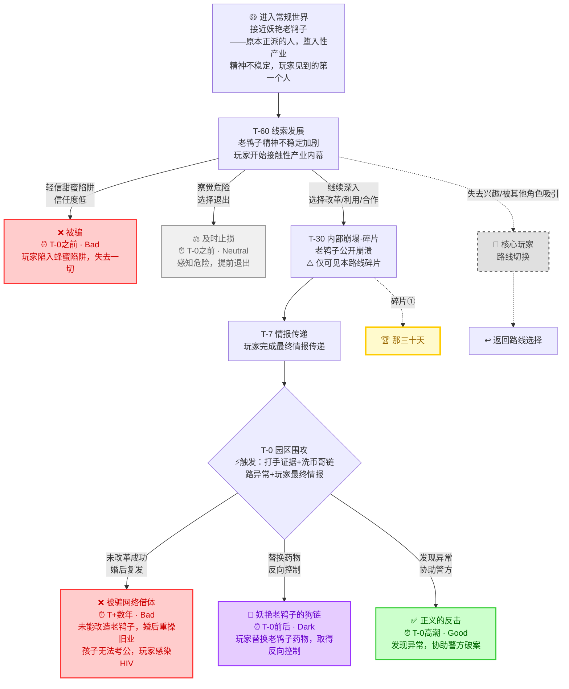
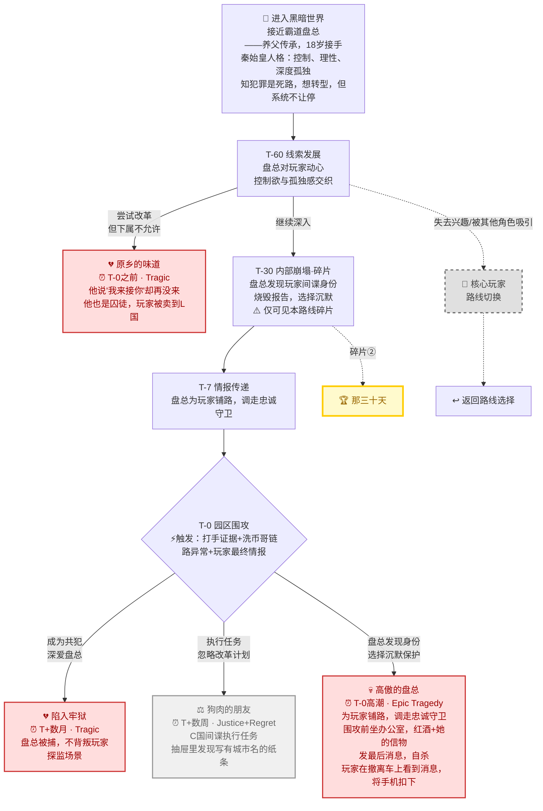
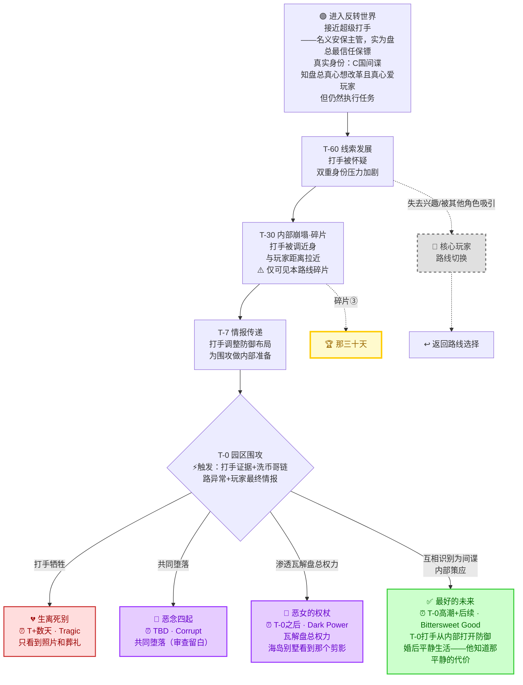
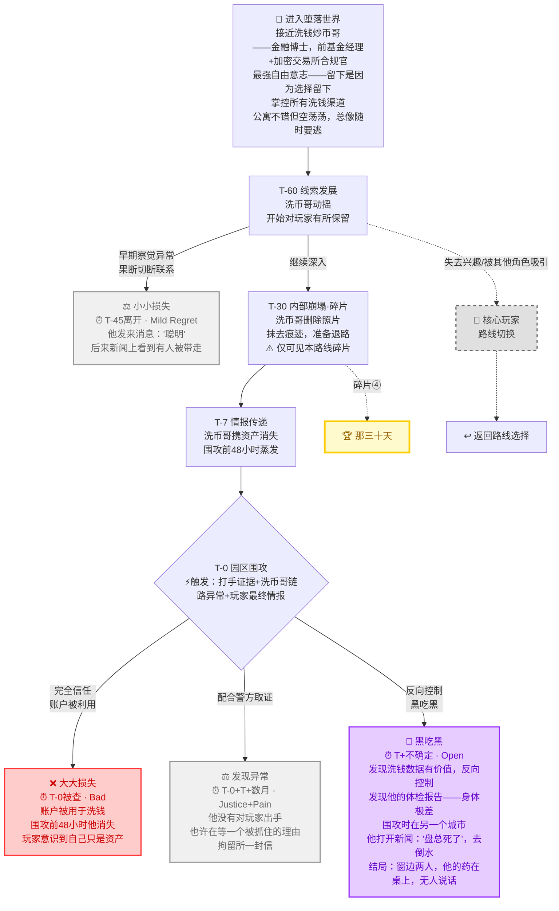
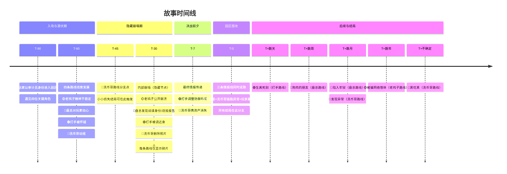
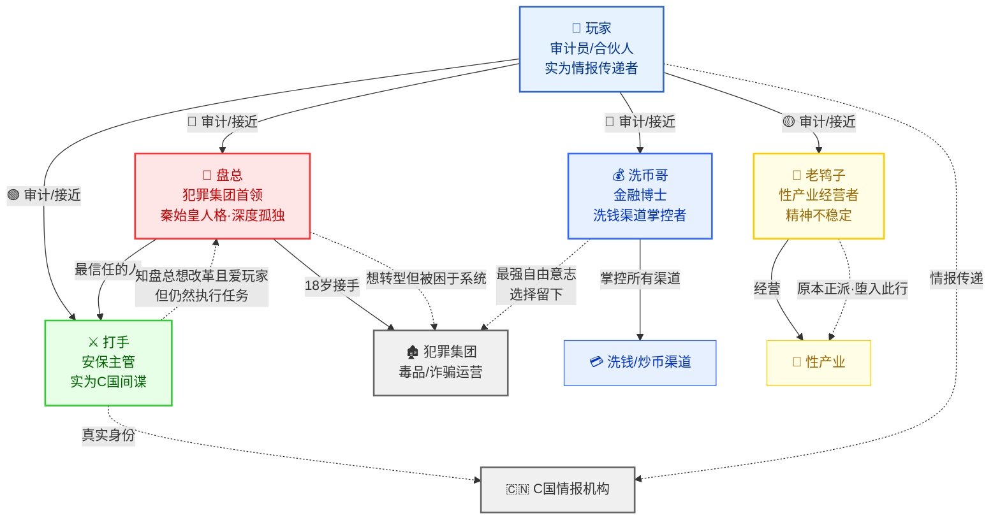

# 🎮 剧情流程图

## 📋 目录

1. [核心设定](#核心设定)
2. [触发条件与关键机制](#触发条件与关键机制)
3. [完整故事树流程图](#1-完整故事树流程图)
4. [老鸨子路线详细流程](#2-老鸨子路线详细流程)
5. [盘总路线详细流程](#3-盘总路线详细流程)
6. [打手路线详细流程](#4-打手路线详细流程)
7. [洗币哥路线详细流程](#5-洗币哥路线详细流程)
8. [时间线图](#6-时间线图)
9. [人物关系图](#7-人物关系图)
10. [全结局汇总表](#8-全结局汇总表)

---

## 核心设定

| 项目           | 内容                                                                                     |
| -------------- | ---------------------------------------------------------------------------------------- |
| **游戏类型**   | 乙女（恋爱）+ 恐怖（真相揭露）+ 合成（资源）+ VN（剧情推进）                             |
| **背景**       | 盘总在缅甸经营毒品/诈骗园区；洗币哥、打手、老鸨子为关键角色；玩家以审计员/合伙人身份进入 |
| **全局分水岭** | T-0 园区围攻，由三条情报线同时成熟触发                                                   |
| **隐藏机制**   | T-30 为隐藏节点，每条路线仅显示碎片；完成全部4条路线解锁隐藏成就「那三十天」             |
| **路线切换**   | 「核心玩家」结局允许玩家在路线间切换，四条路线互联互通                                   |

---

## 触发条件与关键机制

### 🎯 园区围攻（T-0）触发条件

三条情报线**同时**成熟时触发：

| 情报线   | 来源                 | 内容               |
| -------- | -------------------- | ------------------ |
| 情报线① | 打手（超级打手）     | 内部证据与防御布局 |
| 情报线② | 洗币哥（洗钱炒币哥） | 资金链路异常数据   |
| 情报线③ | 玩家（审计员）       | 最终情报传递       |

### 🔒 隐藏成就「那三十天」

- **解锁条件**：完成全部4条路线
- **机制**：T-30 为隐藏节点，每条路线仅显示该路线的碎片信息
  - 🟡 老鸨子路线碎片：老鸨子公开崩溃
  - 🔴 盘总路线碎片：盘总发现间谍身份，烧毁报告
  - 🟢 打手路线碎片：打手被调近身
  - 🔵 洗币哥路线碎片：洗币哥删除照片
- 集齐4个碎片方可看到 T-30 完整真相

### 🔄 路线切换机制

- 「核心玩家」结局在每条路线中均可触发
- 触发条件：玩家对当前角色失去兴趣 / 被其他角色吸引
- 效果：返回路线选择节点，可进入其他路线
- 四条路线通过此机制互联互通

### 📊 结局触发维度

每个结局的触发基于玩家的：

- **信任等级**：对角色的信任程度
- **选择倾向**：改革 / 利用 / 合作 / 退出

---

## 1. 完整故事树流程图

> 展示从 T-90 入场到全部 21 个结局的完整分支结构。
>
> **颜色图例**：🟡老鸨子 🔴盘总 🟢打手 🔵洗币哥 ｜ ❌Bad ✅Good 🔮Dark 💔Tragic ⚖️Neutral 🔄路线切换

```mermaid
flowchart TD
    START(["🎬 T-90 入场<br/>玩家以审计员身份进入园区"]) --> ROUTE_SEL{"🔄 路线选择<br/>选择接近哪位角色"}

    %% ===== 路线1: 老鸨子 =====
    subgraph R1["🟡 常规世界 — 妖艳老鸨子"]
        R1_T60["T-60 线索发展<br/>老鸨子精神不稳定"] --> R1_T30["T-30 内部崩塌·碎片<br/>老鸨子公开崩溃"] --> R1_T7["T-7 情报传递"] --> R1_T0{"T-0 园区围攻"}
        R1_T60 --> R1_E1["❌ 被骗<br/>T-0前 · Bad"]
        R1_T60 --> R1_E5["⚖️ 及时止损<br/>T-0前 · Neutral"]
        R1_T0 --> R1_E2["❌ 被骗网络借体<br/>T+数年 · Bad"]
        R1_T0 --> R1_E3["🔮 妖艳老鸨子的狗链<br/>T-0前后 · Dark"]
        R1_T0 --> R1_E4["✅ 正义的反击<br/>T-0高潮 · Good"]
        R1_CORE["🔄 核心玩家<br/>路线切换"]
    end

    %% ===== 路线2: 盘总 =====
    subgraph R2["🔴 黑暗世界 — 霸道盘总"]
        R2_T60["T-60 线索发展<br/>盘总对玩家动心"] --> R2_T30["T-30 内部崩塌·碎片<br/>盘总发现间谍身份/烧毁报告"] --> R2_T7["T-7 情报传递"] --> R2_T0{"T-0 园区围攻"}
        R2_T60 --> R2_E3["💔 原乡的味道<br/>T-0前 · Tragic"]
        R2_T0 --> R2_E1["💔 陷入牢狱<br/>T+数月 · Tragic"]
        R2_T0 --> R2_E2["⚖️ 狗肉的朋友<br/>T+数周 · Justice+Regret"]
        R2_T0 --> R2_E4["💀 高傲的盘总<br/>T-0高潮 · Epic Tragedy"]
        R2_CORE["🔄 核心玩家<br/>路线切换"]
    end

    %% ===== 路线3: 打手 =====
    subgraph R3["🟢 反转世界 — 超级打手"]
        R3_T60["T-60 线索发展<br/>打手被怀疑"] --> R3_T30["T-30 内部崩塌·碎片<br/>打手被调近身"] --> R3_T7["T-7 情报传递<br/>打手调整防御"] --> R3_T0{"T-0 园区围攻"}
        R3_T0 --> R3_E1["💔 生离死别<br/>T+数天 · Tragic"]
        R3_T0 --> R3_E2["🔮 恶念四起<br/>TBD · Corrupt"]
        R3_T0 --> R3_E3["🔮 恶女的权杖<br/>T-0后 · Dark Power"]
        R3_T0 --> R3_E4["✅ 最好的未来<br/>T-0高潮+后续 · Bittersweet Good"]
        R3_CORE["🔄 核心玩家<br/>路线切换"]
    end

    %% ===== 路线4: 洗币哥 =====
    subgraph R4["🔵 堕落世界 — 洗钱炒币哥"]
        R4_T60["T-60 线索发展<br/>洗币哥动摇"] --> R4_T30["T-30 内部崩塌·碎片<br/>洗币哥删除照片"] --> R4_T7["T-7 情报传递<br/>洗币哥携资产消失"] --> R4_T0{"T-0 园区围攻"}
        R4_T60 --> R4_E1["⚖️ 小小损失<br/>T-45离开 · Mild Regret"]
        R4_T0 --> R4_E2["❌ 大大损失<br/>T-0被查 · Bad"]
        R4_T0 --> R4_E3["⚖️ 发现异常<br/>T-0+T+数月 · Justice+Pain"]
        R4_T0 --> R4_E4["🔮 黑吃黑<br/>T+不确定 · Open"]
        R4_CORE["🔄 核心玩家<br/>路线切换"]
    end

    %% 路线入口连接
    ROUTE_SEL --> R1_T60
    ROUTE_SEL --> R2_T60
    ROUTE_SEL --> R3_T60
    ROUTE_SEL --> R4_T60

    %% 核心玩家 - 路线切换（虚线回到路线选择）
    R1_CORE -.->|"失去兴趣/被其他角色吸引"| ROUTE_SEL
    R2_CORE -.->|"失去兴趣/被其他角色吸引"| ROUTE_SEL
    R3_CORE -.->|"失去兴趣/被其他角色吸引"| ROUTE_SEL
    R4_CORE -.->|"失去兴趣/被其他角色吸引"| ROUTE_SEL

    %% 隐藏成就 - 那三十天
    HIDDEN(["🏆 隐藏成就：那三十天<br/>完成全部4条路线解锁<br/>T-30完整真相"])
    R1_T30 -.->|"碎片①"| HIDDEN
    R2_T30 -.->|"碎片②"| HIDDEN
    R3_T30 -.->|"碎片③"| HIDDEN
    R4_T30 -.->|"碎片④"| HIDDEN

    %% ===== 样式定义 =====
    classDef badEnd fill:#ffcccc,stroke:#ff3333,color:#cc0000,stroke-width:2px
    classDef goodEnd fill:#ccffcc,stroke:#33cc33,color:#006600,stroke-width:2px
    classDef darkEnd fill:#e6ccff,stroke:#9933ff,color:#6600cc,stroke-width:2px
    classDef tragicEnd fill:#ffdddd,stroke:#cc3333,color:#990000,stroke-width:2px
    classDef neutralEnd fill:#f0f0f0,stroke:#999999,color:#666666,stroke-width:2px
    classDef routeSwitch fill:#e0e0e0,stroke:#666666,color:#444444,stroke-width:2px,stroke-dasharray: 5 5
    classDef hiddenAchieve fill:#fffacd,stroke:#ffcc00,color:#996600,stroke-width:3px

    class R1_E1,R1_E2,R4_E2 badEnd
    class R1_E4,R3_E4 goodEnd
    class R1_E3,R3_E2,R3_E3,R4_E4 darkEnd
    class R2_E1,R2_E3,R2_E4,R3_E1 tragicEnd
    class R1_E5,R4_E1,R2_E2,R4_E3 neutralEnd
    class R1_CORE,R2_CORE,R3_CORE,R4_CORE routeSwitch
    class HIDDEN hiddenAchieve
```

---

## 2. 老鸨子路线详细流程

> **🟡 常规世界 — 妖艳老鸨子**
> 原本正派的人，堕入性产业，精神不稳定，玩家见到的第一个人。

### 老鸨子路线结局详解

| # | 结局名           | 时间点  | 类型        | 触发条件                | 描述                                                    |
| - | ---------------- | ------- | ----------- | ----------------------- | ------------------------------------------------------- |
| 1 | 被骗             | T-0之前 | ❌Bad       | 轻信甜蜜陷阱，信任度低  | 玩家陷入蜂蜜陷阱，失去一切                              |
| 2 | 被骗网络借体     | T+数年  | ❌Bad       | 未改革成功，婚后复发    | 未能改造老鸨子，婚后重操旧业，孩子无法考公，玩家感染HIV |
| 3 | 妖艳老鸨子的狗链 | T-0前后 | 🔮Dark      | 替换药物，反向控制      | 玩家替换老鸨子药物，取得反向控制权                      |
| 4 | 正义的反击       | T-0高潮 | ✅Good      | 发现异常，协助警方      | 发现异常，协助警方破案                                  |
| 5 | 及时止损         | T-0之前 | ⚖️Neutral | 察觉危险，选择退出      | 感知危险，提前退出                                      |
| 6 | 核心玩家         | —      | 🔄切换      | 失去兴趣/被其他角色吸引 | 切换至其他路线                                          |

---

## 3. 盘总路线详细流程

> **🔴 黑暗世界 — 霸道盘总**
> 养父传承，18岁接手。秦始皇人格：控制、理性、深度孤独。知犯罪是死路，想转型，但系统不让停。

### 盘总路线结局详解

| # | 结局名     | 时间点  | 类型               | 触发条件                   | 描述                                                                                                          |
| - | ---------- | ------- | ------------------ | -------------------------- | ------------------------------------------------------------------------------------------------------------- |
| 1 | 陷入牢狱   | T+数月  | 💔Tragic           | 成为共犯，深爱盘总         | 盘总被捕，不背叛玩家。探监场景                                                                                |
| 2 | 狗肉的朋友 | T+数周  | ⚖️Justice+Regret | 执行任务，忽略改革计划     | C国间谍执行任务，抽屉里发现写有城市名的纸条                                                                   |
| 3 | 原乡的味道 | T-0之前 | 💔Tragic           | 尝试改革，但下属不允许     | 他说"我来接你"却再没来——他也是囚徒，玩家被卖到L国                                                           |
| 4 | 高傲的盘总 | T-0高潮 | 💀Epic Tragedy     | 盘总发现身份，选择沉默保护 | 为玩家铺路，调走忠诚守卫。围攻前坐办公室，红酒+她的信物，发最后消息，自杀。玩家在撤离车上看到消息，将手机扣下 |
| 5 | 核心玩家   | —      | 🔄切换             | 失去兴趣/被其他角色吸引    | 切换至其他路线                                                                                                |

---

## 4. 打手路线详细流程

> **🟢 反转世界 — 超级打手**
> 名义安保主管，实为盘总最信任保镖。真实身份：C国间谍。知盘总真心想改革且真心爱玩家——但仍然执行任务。

### 打手路线结局详解

| # | 结局名     | 时间点       | 类型               | 触发条件                 | 描述                                                      |
| - | ---------- | ------------ | ------------------ | ------------------------ | --------------------------------------------------------- |
| 1 | 生离死别   | T+数天       | 💔Tragic           | 打手牺牲                 | 只看到照片和葬礼                                          |
| 2 | 恶念四起   | TBD          | 🔮Corrupt          | 共同堕落                 | 共同堕落（审查留白）                                      |
| 3 | 恶女的权杖 | T-0之后      | 🔮Dark Power       | 渗透瓦解盘总权力         | 瓦解盘总权力，海岛别墅看到那个剪影                        |
| 4 | 最好的未来 | T-0高潮+后续 | ✅Bittersweet Good | 互相识别为间谍，内部策应 | T-0打手从内部打开防御，婚后平静生活——他知道那平静的代价 |
| 5 | 核心玩家   | —           | 🔄切换             | 失去兴趣/被其他角色吸引  | 切换至其他路线                                            |

---

## 5. 洗币哥路线详细流程

> **🔵 堕落世界 — 洗钱炒币哥**
> 金融博士，前基金经理+加密交易所合规官。最强自由意志——留下是因为选择留下。掌控所有洗钱渠道。公寓不错但空荡荡，总像随时要逃。

### 洗币哥路线结局详解

| # | 结局名   | 时间点     | 类型             | 触发条件                   | 描述                                                                       |
| - | -------- | ---------- | ---------------- | -------------------------- | -------------------------------------------------------------------------- |
| 1 | 小小损失 | T-45离开   | ⚖️Mild Regret  | 早期察觉异常，果断切断联系 | 他发来消息"聪明"，后来新闻上看到有人被带走                                 |
| 2 | 大大损失 | T-0被查    | ❌Bad            | 完全信任，账户被利用       | 账户被用于洗钱，围攻前48小时他消失，玩家意识到自己只是资产                 |
| 3 | 发现异常 | T-0+T+数月 | ⚖️Justice+Pain | 配合警方取证               | 他没有对玩家出手——也许在等一个被抓住的理由，拘留所一封信                 |
| 4 | 黑吃黑   | T+不确定   | 🔮Open           | 反向控制，黑吃黑           | 发现体检报告——身体极差，围攻时在另一个城市，窗边两人，药在桌上，无人说话 |
| 5 | 核心玩家 | —         | 🔄切换           | 失去兴趣/被其他角色吸引    | 切换至其他路线                                                             |

---

## 6. 时间线图

> 展示从 T-90 入场到 T+数年的完整时间线，标注各路线关键事件。

### 时间线补充说明

- **T-30 隐藏节点**：结局不直接显示日期，通过环境细节暗示时间距离
- **T-0 触发**：三条情报线必须**同时**成熟，缺一不可
- **T-45**：仅洗币哥路线的「小小损失」结局在此时间点分支
- **T+不确定**：洗币哥路线「黑吃黑」结局的时间跨度不确定

---

## 7. 人物关系图

> 展示主要角色之间的关系网络，包含明面关系与隐藏关系。

### 人物关系说明

| 角色      | 明面身份       | 隐藏身份/特质        | 核心矛盾                               |
| --------- | -------------- | -------------------- | -------------------------------------- |
| 👤 玩家   | 审计员/合伙人  | 情报传递者           | 任务与感情的冲突                       |
| 👑 盘总   | 犯罪集团首领   | 想转型但被困的囚徒   | 控制欲 vs 孤独感 vs 改革愿望           |
| ⚔️ 打手 | 安保主管       | C国间谍              | 任务 vs 知情（盘总真心想改革且爱玩家） |
| 💰 洗币哥 | 洗钱渠道掌控者 | 最强自由意志的选择者 | 选择留下 vs 随时准备逃离               |
| 💄 老鸨子 | 性产业经营者   | 原本正派，堕入此行   | 精神不稳定 vs 生存需要                 |

---

## 8. 全结局汇总表

> 全部 21 个结局的完整汇总，按路线分组。

| #  | 路线     | 结局名           | 时间点       | 类型               | 触发条件                 | 简述                                               |
| -- | -------- | ---------------- | ------------ | ------------------ | ------------------------ | -------------------------------------------------- |
| 1  | 🟡老鸨子 | 被骗             | T-0之前      | ❌Bad              | 轻信甜蜜陷阱             | 玩家陷入蜂蜜陷阱，失去一切                         |
| 2  | 🟡老鸨子 | 被骗网络借体     | T+数年       | ❌Bad              | 未改革成功，婚后复发     | 婚后重操旧业，孩子无法考公，玩家感染HIV            |
| 3  | 🟡老鸨子 | 妖艳老鸨子的狗链 | T-0前后      | 🔮Dark             | 替换药物，反向控制       | 玩家替换老鸨子药物，取得反向控制权                 |
| 4  | 🟡老鸨子 | 正义的反击       | T-0高潮      | ✅Good             | 发现异常，协助警方       | 发现异常，协助警方破案                             |
| 5  | 🟡老鸨子 | 及时止损         | T-0之前      | ⚖️Neutral        | 察觉危险，选择退出       | 感知危险，提前退出                                 |
| 6  | 🟡老鸨子 | 核心玩家         | —           | 🔄切换             | 失去兴趣/被其他角色吸引  | 切换至其他路线                                     |
| 7  | 🔴盘总   | 陷入牢狱         | T+数月       | 💔Tragic           | 成为共犯，深爱盘总       | 盘总被捕不背叛玩家，探监场景                       |
| 8  | 🔴盘总   | 狗肉的朋友       | T+数周       | ⚖️Justice+Regret | 执行任务，忽略改革计划   | 抽屉里发现写有城市名的纸条                         |
| 9  | 🔴盘总   | 原乡的味道       | T-0之前      | 💔Tragic           | 尝试改革，下属不允许     | 他说"我来接你"却再没来，他也是囚徒，玩家被卖到L国  |
| 10 | 🔴盘总   | 高傲的盘总       | T-0高潮      | 💀Epic Tragedy     | 盘总发现身份，沉默保护   | 为玩家铺路后自杀，玩家在撤离车上看到消息将手机扣下 |
| 11 | 🔴盘总   | 核心玩家         | —           | 🔄切换             | 失去兴趣/被其他角色吸引  | 切换至其他路线                                     |
| 12 | 🟢打手   | 生离死别         | T+数天       | 💔Tragic           | 打手牺牲                 | 只看到照片和葬礼                                   |
| 13 | 🟢打手   | 恶念四起         | TBD          | 🔮Corrupt          | 共同堕落                 | 共同堕落（审查留白）                               |
| 14 | 🟢打手   | 恶女的权杖       | T-0之后      | 🔮Dark Power       | 渗透瓦解盘总权力         | 瓦解盘总权力，海岛别墅看到那个剪影                 |
| 15 | 🟢打手   | 最好的未来       | T-0高潮+后续 | ✅Bittersweet Good | 互相识别为间谍，内部策应 | 婚后平静生活——他知道那平静的代价                 |
| 16 | 🟢打手   | 核心玩家         | —           | 🔄切换             | 失去兴趣/被其他角色吸引  | 切换至其他路线                                     |
| 17 | 🔵洗币哥 | 小小损失         | T-45离开     | ⚖️Mild Regret    | 早期察觉异常，切断联系   | 他发来"聪明"，后来新闻上看到有人被带走             |
| 18 | 🔵洗币哥 | 大大损失         | T-0被查      | ❌Bad              | 完全信任，账户被利用     | 围攻前48小时他消失，玩家意识到自己只是资产         |
| 19 | 🔵洗币哥 | 发现异常         | T-0+T+数月   | ⚖️Justice+Pain   | 配合警方取证             | 他没有对玩家出手，拘留所一封信                     |
| 20 | 🔵洗币哥 | 黑吃黑           | T+不确定     | 🔮Open             | 反向控制，黑吃黑         | 窗边两人，他的药在桌上，无人说话                   |
| 21 | 🔵洗币哥 | 核心玩家         | —           | 🔄切换             | 失去兴趣/被其他角色吸引  | 切换至其他路线                                     |

### 结局类型统计

| 类型        | 数量 | 结局                                           |
| ----------- | ---- | ---------------------------------------------- |
| ❌Bad       | 3    | 被骗、被骗网络借体、大大损失                   |
| ✅Good      | 2    | 正义的反击、最好的未来                         |
| 🔮Dark      | 4    | 妖艳老鸨子的狗链、恶念四起、恶女的权杖、黑吃黑 |
| 💔Tragic    | 4    | 陷入牢狱、原乡的味道、高傲的盘总、生离死别     |
| ⚖️Neutral | 4    | 及时止损、狗肉的朋友、小小损失、发现异常       |
| 🔄路线切换  | 4    | 核心玩家×4                                    |

---

_本文档为游戏叙事结构的完整可视化参考，所有 Mermaid 图表均可在 VS Code Mermaid 插件、GitHub 或 [Mermaid Live Editor](https://mermaid.live/) 中渲染查看。_
