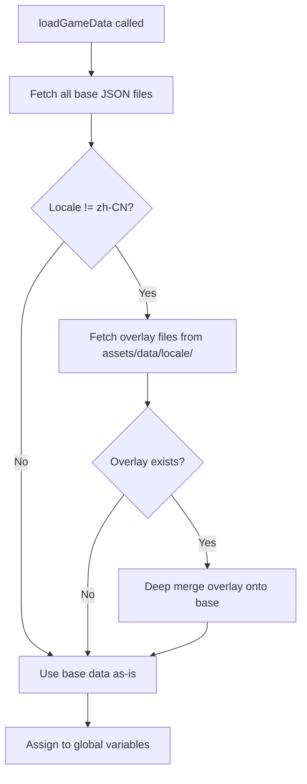
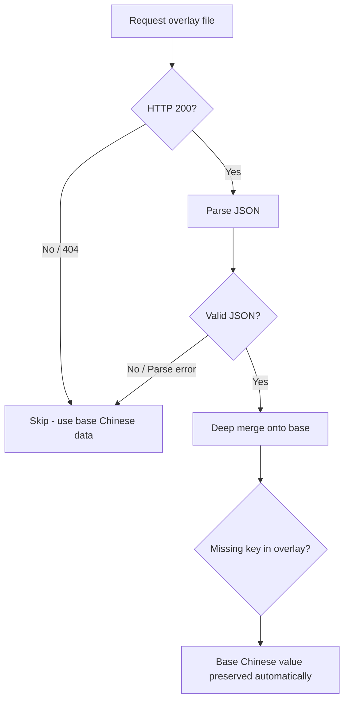

# B-03: i18n Data File Localization Architecture

## 1. Current State Analysis

### 1.1 Data Loading

All data JSONs load centrally in [`loadGameData()`](js/config.js:50) via `Promise.all()`, stored in global variables at top of [`js/config.js`](js/config.js:5). Init order in [`Game.init()`](js/main.js:29): `I18n.init()` → `loadGameData()` → `I18n.applyToDOM()`.

Language switching is **disabled** after initial selection ([`toggleLocale()`](js/i18n.js:86) logs warning only).

### 1.2 Current i18n System

[`I18n`](js/i18n.js:10) handles UI text via `I18n.t(key)` from `assets/i18n/{locale}.json`, emojis, config, and DOM binding. The existing `en.json` translates UI strings but **data file content remains Chinese-only**.

### 1.3 Data Consumer Map

| Module                                  | Globals Used                                        | Translatable Fields               |
| --------------------------------------- | --------------------------------------------------- | --------------------------------- |
| [`board.js`](js/board.js)               | `ITEMS`                                             | `item.name`                       |
| [`boss.js`](js/boss.js)                 | `ITEMS`, `LEVELS`, `LOOP_NARRATIVES`, `LOOP_EVENTS` | order names, dialogue, event text |
| [`achievements.js`](js/achievements.js) | `ACHIEVEMENT_DATA`                                  | `ach.name`, `ach.description`     |
| [`collection.js`](js/collection.js)     | `ITEMS`, `GACHA_POOL_V2`, `CG_STORIES`              | item/card names                   |
| [`daily-orders.js`](js/daily-orders.js) | `ITEMS`, `DAILY_ORDER_POOL`                         | order names, dialogue             |
| [`inventory.js`](js/inventory.js)       | `ITEMS`, `GACHA_POOL_V2`, `SHOP_ITEMS`              | item names in toasts              |
| [`gacha.js`](js/gacha.js)               | `ITEMS`, `CG_STORIES`                               | card names                        |
| [`fragment.js`](js/fragment.js)         | `ITEMS`, `CHAIN_NAMES`                              | chain names in toasts             |
| [`cg-album.js`](js/cg-album.js)         | `CG_STORIES`, `GACHA_POOL_V2`                       | story titles, male leads          |
| [`vn-reader.js`](js/vn-reader.js)       | `CG_STORIES`                                        | story text, speakers              |
| [`heroine.js`](js/heroine.js)           | `HEROINE_UPGRADES`, `SHOP_ITEMS`                    | upgrade names/descriptions/labels |
| [`main.js`](js/main.js)                 | `UI_TEXT`, `LOOP_NARRATIVES`                        | intro/complete/narrative text     |
| [`effects.js`](js/effects.js)           | `ITEMS`                                             | item names in merge effects       |

---

## 2. Translatable Fields Per Data File

| Data File                | Translatable Fields                                                                  | ~String Count |
| ------------------------ | ------------------------------------------------------------------------------------ | ------------- |
| `items.json`             | `name` per item                                                                      | ~64           |
| `generators.json`        | `name` per generator                                                                 | ~2            |
| `gacha_pool.json`        | `chainNames.*`, `gachaPoolV2[].name`                                                 | ~84           |
| `levels.json`            | `bossName`, `bossTitle`, `orders[].name`, `orders[].dialogue.*`, `orders[].failText` | ~46           |
| `achievements.json`      | `name`, `description` per achievement                                                | ~30           |
| `daily_orders.json`      | `name`, `dialogue` per order                                                         | ~120          |
| `loop_events.json`       | `text`, `playerText` per event                                                       | ~24           |
| `loop_narratives.json`   | `loopIntro`, `loopOutro`, `boss_X.intro`, `boss_X.defeatOutro`                       | ~64           |
| `cg_stories.json`        | `title`, `maleLead`, `stories[].title`, `stories[].lines[].text/speaker/expression`  | ~300          |
| `settings.json`          | `HEROINE_UPGRADES[].name/description/levels[].label`, `UI_TEXT.*`                    | ~26           |
| `loop_rules.json`        | `title` per loop                                                                     | ~8            |
| `SHOP_ITEMS` (hardcoded) | Already i18n'd via key mapping in [`heroine.js`](js/heroine.js:129)                  | 0             |
| **Total**                |                                                                                      | **~768**      |

---

## 3. Architecture Options Evaluation

### Option A: Separate Locale Overlay Files ⭐ RECOMMENDED

Create `assets/data/en/` with overlay JSONs containing **only translatable fields**. Base files remain unchanged. At load time, deep-merge overlays onto base data.

```
assets/data/items.json          ← base (Chinese, unchanged)
assets/data/en/items.json       ← English overlay (only name fields)
assets/data/en/levels.json      ← English overlay (only dialogue/name fields)
assets/data/en/cg_stories.json  ← English overlay (only text fields)
... (one overlay per data file that has translatable content)
```

**Pros:**

- Zero changes to base data files
- Overlay files are small — only translatable fields
- Deep merge = consumer code sees same data shape → **zero changes to 15+ JS consumer files**
- Fallback is automatic: missing overlay = base data used as-is
- Easy to audit: diff base vs overlay to find missing translations
- Consistent with existing i18n pattern (separate files per locale)

**Cons:**

- Must keep overlays in sync when base files change
- Slight runtime cost for merge (negligible for this data size)

### Option B: Embedded Locale Keys Within Existing Files

Restructure JSON to use `{ "zh-CN": "...", "en": "..." }` for translatable fields.

**Pros:** Single source of truth; no sync issues.

**Cons:** Massive restructuring of all JSON files; **every consumer** (50+ access points) must change from `item.name` to `item.name[locale]`; breaks save compatibility; increases file size.

### Option C: Single Merged Translation Overlay

One giant `assets/i18n/data-en.json` with all data translations keyed by file path.

**Pros:** Single file to manage.

**Cons:** Monolithic file (~768 entries) hard to maintain; custom key structure doesn't match data shape; complex merge logic; single point of failure.

### Decision: Option A

Option A wins because it requires **zero changes to consumer code** — the deep-merge ensures all JS modules continue accessing `ITEMS[id].name`, `LEVELS[i].bossName`, etc. exactly as before. The only code changes are in the loader itself.

---

## 4. Recommended Architecture

### 4.1 File Structure

```
assets/data/
  items.json              ← base (Chinese, unchanged)
  generators.json         ← base (Chinese, unchanged)
  gacha_pool.json         ← base (Chinese, unchanged)
  levels.json             ← base (Chinese, unchanged)
  achievements.json       ← base (Chinese, unchanged)
  daily_orders.json       ← base (Chinese, unchanged)
  loop_events.json        ← base (Chinese, unchanged)
  loop_narratives.json    ← base (Chinese, unchanged)
  cg_stories.json         ← base (Chinese, unchanged)
  settings.json           ← base (Chinese, unchanged)
  loop_rules.json         ← base (Chinese, unchanged)
  en/                     ← English overlays (NEW)
    items.json
    generators.json
    gacha_pool.json
    levels.json
    achievements.json
    daily_orders.json
    loop_events.json
    loop_narratives.json
    cg_stories.json
    settings.json
    loop_rules.json
```

### 4.2 Overlay File Format

Each overlay contains **only the translatable fields**, matching the exact structure of the base file. Non-translatable fields are omitted.

Example `assets/data/en/items.json`:

```json
{
  "lip_1": { "name": "Lip Balm" },
  "lip_2": { "name": "Color-Changing Lipstick" },
  "lip_3": { "name": "Matte Lip Glaze" }
}
```

Example `assets/data/en/levels.json`:

```json
[
  {
    "bossName": "Lin Mobai",
    "bossTitle": "The Aloof Heartthrob",
    "orders": [
      {
        "name": "Catch His Eye",
        "dialogue": { "npc": "...", "player": "..." }
      },
      {
        "name": "Close the Distance",
        "dialogue": { "npc": "...", "player": "..." }
      }
    ]
  }
]
```

### 4.3 Deep Merge Algorithm



The deep merge recursively overlays the English fields onto the Chinese base. For arrays (like `LEVELS`, `ACHIEVEMENT_DATA`, `DAILY_ORDER_POOL`), merge is done by index. For objects (like `ITEMS`, `CG_STORIES`), merge is done by key.

```javascript
function deepMerge(base, overlay) {
  if (Array.isArray(base) && Array.isArray(overlay)) {
    // Array: merge by index
    return base.map((item, i) =>
      i < overlay.length ? deepMerge(item, overlay[i]) : item,
    );
  }
  if (
    typeof base === "object" &&
    base !== null &&
    typeof overlay === "object" &&
    overlay !== null
  ) {
    // Object: merge by key
    const result = Object.assign({}, base);
    for (const key of Object.keys(overlay)) {
      if (key in result) {
        result[key] = deepMerge(result[key], overlay[key]);
      } else {
        result[key] = overlay[key];
      }
    }
    return result;
  }
  // Primitive: overlay wins
  return overlay;
}
```

### 4.4 Modified loadGameData

The key change is in [`loadGameData()`](js/config.js:50). After loading base data, if locale is not `zh-CN`, fetch and merge overlays:

```javascript
async function loadGameData() {
  // ... existing base fetch logic unchanged ...

  // After base data is loaded and assigned:
  const locale = I18n.getLocale();
  if (locale !== "zh-CN") {
    await applyLocaleOverlays(locale);
  }
}

async function applyLocaleOverlays(locale) {
  const overlayFiles = [
    "items",
    "generators",
    "gacha_pool",
    "levels",
    "achievements",
    "daily_orders",
    "loop_events",
    "loop_narratives",
    "cg_stories",
    "settings",
    "loop_rules",
  ];
  const cacheBust = "?v=" + Date.now();

  const results = await Promise.allSettled(
    overlayFiles.map((f) =>
      fetch("assets/data/" + locale + "/" + f + ".json" + cacheBust).then(
        (r) => (r.ok ? r.json() : null),
      ),
    ),
  );

  // Merge each overlay onto its base global
  const mergeMap = [
    [
      results[0],
      () => {
        ITEMS = deepMerge(ITEMS, results[0].value);
      },
    ],
    [
      results[1],
      () => {
        GENERATORS = deepMerge(GENERATORS, results[1].value);
      },
    ],
    [
      results[2],
      () => {
        /* merge gacha sub-fields */
      },
    ],
    [
      results[3],
      () => {
        LEVELS = deepMerge(LEVELS, results[3].value);
      },
    ],
    // ... etc for each data file
  ];

  for (const [result, apply] of mergeMap) {
    if (result.status === "fulfilled" && result.value) {
      apply();
    }
  }
}
```

### 4.5 Fallback Strategy



**Fallback rules:**

1. If overlay file doesn't exist (404) → use base data as-is (Chinese)
2. If overlay file has parse errors → skip overlay, log warning, use base data
3. If a specific key is missing from overlay → base value preserved (deep merge only overwrites present keys)
4. If `zh-CN` locale → skip overlay fetch entirely

This means partial translations are safe — you can translate `items.json` first and leave `cg_stories.json` for later, and the game still works.

---

## 5. Implementation Steps

### Step 1: Add `deepMerge` utility to `js/config.js`

- Add the recursive deep merge function before `loadGameData()`
- Handle both object and array merge strategies

### Step 2: Modify `loadGameData()` in `js/config.js`

- After base data is loaded and assigned to globals, check `I18n.getLocale()`
- If not `zh-CN`, call `applyLocaleOverlays(locale)`
- Use `Promise.allSettled()` so one missing overlay doesn't break others
- For `gacha_pool.json`, merge the sub-fields (`chainNames`, `gachaPoolV2[].name`) correctly
- For `settings.json`, merge `HEROINE_UPGRADES`, `UI_TEXT` sub-objects correctly

### Step 3: Create English overlay files in `assets/data/en/`

- Create `assets/data/en/` directory
- Create 11 overlay JSON files with only translatable fields
- Start with smaller files first: `generators.json`, `loop_rules.json`, `achievements.json`
- Then tackle `items.json`, `gacha_pool.json`, `levels.json`, `daily_orders.json`
- Largest files last: `loop_events.json`, `loop_narratives.json`, `cg_stories.json`
- For `settings.json`, only include `HEROINE_UPGRADES` and `UI_TEXT` sub-objects

### Step 4: Handle `SHOP_ITEMS` i18n properly

- `SHOP_ITEMS` is hardcoded in [`js/config.js`](js/config.js:42) with Chinese names/descriptions
- Already partially i18n'd via key mapping in [`heroine.js`](js/heroine.js:129)
- Ensure all shop item names/descriptions use i18n keys consistently
- Remove hardcoded Chinese from `SHOP_ITEMS` definition (use English as base, or use placeholder names)

### Step 5: Handle `loop_rules.json` title duplication

- `loop_rules.json` has `title` fields that duplicate `loop.title1`-`loop.title8` in `en.json`
- Decide: keep overlay for `loop_rules.json` OR refactor consumers to use `I18n.t('loop.title' + index)` instead
- Recommendation: use the overlay approach for consistency — avoids changing consumer code

### Step 6: Test and verify

- Load game in English locale — verify all data-driven text shows English
- Load game in Chinese locale — verify no change from current behavior
- Test with a missing overlay file — verify fallback to Chinese
- Test with a partially translated overlay — verify untranslated fields fall back to Chinese
- Verify save/load still works (saved data uses IDs, not names, so should be unaffected)

---

## 6. Risk Assessment

### Risk 1: Overlay drift from base files

**Severity:** Medium | **Mitigation:** Write a validation script that compares base file keys against overlay keys and reports missing/extra entries. Run in CI or pre-commit.

### Risk 2: Array index misalignment

**Severity:** High | **Mitigation:** Array-based files (`LEVELS`, `ACHIEVEMENT_DATA`, `DAILY_ORDER_POOL`, `GACHA_POOL_V2`) merge by index. If base array order changes, overlays misalign. **Solution:** For array overlays, include the `id` field as a sentinel and merge by matching `id` rather than by index. This requires a slightly smarter merge for arrays.

### Risk 3: Save compatibility

**Severity:** Low | **Mitigation:** Save system uses item IDs (like `lip_3`), not names. Locale overlay only changes display strings. Save data is unaffected.

### Risk 4: Performance of merge at load time

**Severity:** Low | **Mitigation:** Total data size is ~200KB. Deep merge of overlay (~50KB) onto base is negligible (<5ms). No performance concern.

### Risk 5: Partial translations showing Chinese mixed with English

**Severity:** Low | **Mitigation:** This is acceptable behavior — better to show Chinese than nothing. The fallback strategy ensures the game always works. Can be improved incrementally.

### Risk 6: `SHOP_ITEMS` hardcoded Chinese

**Severity:** Low | **Mitigation:** Already partially handled via i18n key mapping. Complete the mapping and use English placeholder names in the data structure.

---

## 7. Future Considerations

- **Locale switching at runtime**: Currently disabled. If re-enabled, `loadGameData()` would need to re-fetch base + overlay and re-initialize all systems. This is a larger refactor outside the scope of B-03.
- **Additional locales**: The overlay approach scales naturally — add `assets/data/ja/`, `assets/data/ko/`, etc.
- **Translation tooling**: Consider extracting translatable fields from base files automatically to generate overlay templates with empty strings, reducing manual work for translators.
