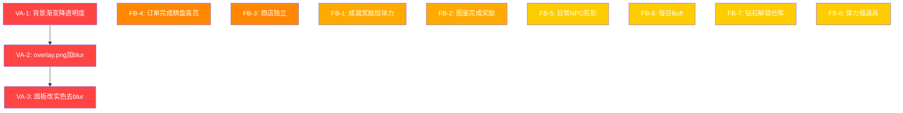

# Figma 重新审计：视觉色调 + 功能标注未实现项

> 日期：2026-05-22  
> 触发：用户反馈"整体色调和Figma差别很大，背景和面板颜色都不对"以及"Figma里有很多文字标注的交互/功能要求没有实现"

---

## 🔴 PART A：视觉色调问题（3项）

### VA-1. 背景渐变太不透明，完全遮盖了背景图片

**Figma 设计**：

- Layer 1: `Background 1` — 全屏食物图片，**完全可见**
- Layer 2: `image 3` — 叠加图片 + `LAYER_BLUR radius:9.1`，**模糊叠加**
- 渐变层：半透明暖色渐变覆盖在图片之上，**图片内容应清晰可见**

**当前代码** ([`css/style.css:140-143`](css/style.css:140)):

```css
background:
  linear-gradient(
    180deg,
    rgba(255, 225, 204, 0.85) 0%,
    rgba(255, 204, 172, 0.9) 50%,
    rgba(221, 170, 139, 0.95) 100%
  ),
  url("../assets/bg/overlay.png") center/cover no-repeat,
  url("../assets/bg/background.png") center/cover no-repeat;
```

**问题**：渐变层 opacity 高达 0.85~0.95，几乎完全不透明，把 `background.png` 和 `overlay.png` 完全遮盖了。Figma 设计中食物图片应该透过渐变层清晰可见。

**修复方案**：

- 降低渐变 opacity：从 0.85/0.9/0.95 → 0.3/0.35/0.45
- 这样背景图片（食物照片）能清晰显示，渐变只提供暖色调覆盖

---

### VA-2. overlay.png 缺少模糊滤镜

**Figma 设计**：`image 3` 节点有 `LAYER_BLUR radius:9.1` 效果

**当前代码**：`overlay.png` 作为普通 background-image 层，**没有任何模糊处理**

**修复方案**：使用 `::before` 伪元素单独渲染 overlay.png 并应用 `filter: blur(9px)`

```css
#game-container::before {
  content: "";
  position: absolute;
  inset: 0;
  background: url("../assets/bg/overlay.png") center/cover no-repeat;
  filter: blur(9px);
  z-index: 0;
}
```

然后 `#game-container` 自身只保留：

```css
background:
  linear-gradient(
    180deg,
    rgba(255, 225, 204, 0.3) 0%,
    rgba(255, 204, 172, 0.35) 50%,
    rgba(221, 170, 139, 0.45) 100%
  ),
  url("../assets/bg/background.png") center/cover no-repeat;
```

---

### VA-3. 面板/卡片仍使用毛玻璃效果，未改为实色暖色

**Figma 设计**：所有面板使用**实色**暖色填充，如 `rgb(255,204,172)` / `rgb(255,225,204)`，**无 backdrop-filter**

**当前代码**：17处仍使用 `backdrop-filter: blur()` + 半透明背景：

| 行号    | 元素                  | 当前样式                              | 应改为                             |
| ------- | --------------------- | ------------------------------------- | ---------------------------------- |
| 22-23   | `.lang-select-card`   | `rgba(255,255,255,0.65)` + blur(10px) | `rgb(255,225,204)` 实色，移除 blur |
| 309-310 | `#boss-header`        | `rgba(255,204,172,0.88)` + blur(6px)  | `rgb(255,204,172)` 实色，移除 blur |
| 525-526 | `.chain-tooltip`      | `rgba(255,255,255,0.95)` + blur(12px) | `rgb(255,255,255)` 实色，移除 blur |
| 887     | `.heroine-card`       | `rgba(255,255,255,0.7)`               | `rgb(255,225,204)` 实色            |
| 952     | `.daily-order-card`   | `rgba(255,255,255,0.7)`               | `rgb(255,225,204)` 实色            |
| 1013    | `.cg-preview-overlay` | blur(6px)                             | 移除 blur                          |
| 1091    | `.max-level-overlay`  | blur(8px)                             | 移除 blur                          |
| 1391    | ad popup              | blur(4px)                             | 移除 blur                          |
| 1495    | reward modal          | blur(8px)                             | 移除 blur                          |
| 1516    | reward card           | `rgba(255,255,255,0.95)` + blur(12px) | `rgb(255,255,255)` 实色            |
| 1547    | another card          | `rgba(255,255,255,0.95)` + blur(12px) | `rgb(255,255,255)` 实色            |
| 1717    | toast                 | `rgba(255,255,255,0.95)` + blur(10px) | `rgb(255,255,255)` 实色            |
| 2101    | VN overlay            | blur(8px)                             | 保留（深色主题覆盖层）             |
| 2316    | VN button             | `rgba(255,255,255,0.15)` + blur(10px) | 保留（VN是深色主题）               |
| 2329    | VN dialog             | `rgba(255,255,255,0.88)` + blur(12px) | 保留（VN是深色主题）               |
| 2384    | VN choice             | `rgba(255,255,255,0.15)` + blur(8px)  | 保留（VN是深色主题）               |
| 2398    | VN reader             | `rgba(15,12,41,0.95)` + blur(20px)    | 保留（VN是深色主题）               |
| 2731    | loop summary          | blur(6px)                             | 移除 blur                          |

**修复原则**：

- 游戏主界面相关面板：移除 `backdrop-filter`，改用实色暖色背景
- VN/剧情阅读器：保留深色毛玻璃（这是不同的视觉主题）
- Overlay 遮罩层（半透明黑色背景）：保留 blur（这是遮罩效果不是面板效果）

---

## 🟡 PART B：Figma 文字标注功能未实现（8项）

### FB-1. 成就奖励应包含体力，不只是钻石

**Figma 标注**：

> "成就奖励单一，只有钻石，真正稀缺的其实是体力"

**当前代码** ([`js/achievements.js`](js/achievements.js))：成就奖励只给钻石

**修复**：在成就奖励配置中增加体力奖励选项，部分成就同时给钻石+体力

---

### FB-2. 图鉴完成奖励缺失

**Figma 标注**：

> "图鉴完成的奖励"（当前缺失）

**当前代码** ([`js/collection.js`](js/collection.js))：收集完一条链没有奖励

**修复**：当一条合成链的所有物品都被发现时，给予奖励（钻石/体力/金币）

---

### FB-3. 金币商店应独立，不应放在女主养成面板内

**Figma 标注**：

> "商店独立出来，不应该放到成长里"

**当前代码**：金币商店在 `#heroine-sheet` 的底部

**修复**：

- 将金币商店从 heroine sheet 分离为独立的 `#shop-sheet`
- 在侧边按钮或顶部状态栏添加商店入口

---

### FB-4. 棋盘上已完成订单物品应显示粉色高亮+对号

**Figma 标注**：

> "棋盘里有完成的订单显示选中色和对号"
> "完成的订单自动变成选中色"

**当前代码** ([`js/boss.js:225-250`](js/boss.js:225))：`updateOrderHighlights()` 只在 quest card 内标记，棋盘格子没有高亮

**修复**：

- 在 `updateOrderHighlights()` 中，对棋盘上匹配当前订单且数量足够的格子添加 `.cell-highlight` 类
- 在高亮格子上显示 ✓ merge-badge

---

### FB-5. 日常订单NPC应为剪影/路人甲风格，立绘更小

**Figma 标注**：

> "日常订单npc为剪影类似路人甲，立绘更小"

**当前代码**：日常订单使用与主线相同的立绘风格和尺寸

**修复**：

- 日常订单图标改为剪影风格（灰色/深色轮廓，无细节）
- 缩小日常订单的 portrait 尺寸

---

### FB-6. 每日 Buff 功能

**Figma 标注**：

> "每日 Buff"

**当前代码**：完全缺失

**修复**：新增 `js/daily-buff.js`，每日随机一个增益效果（如：合成产出+1、体力消耗-50%等）

---

### FB-7. 钻石解锁仓库栏位

**Figma 标注**：

> "钻石解锁仓库栏位"

**当前代码** ([`js/inventory.js`](js/inventory.js))：仓库栏位固定，无扩展机制

**修复**：在背包面板添加"解锁栏位"按钮，花费钻石扩展容量

---

### FB-8. 体力瓶道具

**Figma 标注**：

> "体力瓶"

**当前代码**：无体力瓶道具

**修复**：

- 在物品数据中添加体力瓶道具
- 使用后恢复一定体力值
- 可通过成就/图鉴奖励/商店购买获得

---

## 📊 优先级排序



### 推荐修复顺序

1. **VA-1 + VA-2** → 背景渲染修复（影响最大，一眼可见的色调差异）
2. **VA-3** → 面板去毛玻璃改实色（全面统一视觉风格）
3. **FB-4** → 订单完成棋盘高亮（核心玩法视觉反馈）
4. **FB-3** → 商店独立（UI结构改动）
5. **FB-1 + FB-2** → 成就/图鉴奖励增强（经济循环完善）
6. **FB-5** → 日常NPC剪影（视觉区分）
7. **FB-6 + FB-7 + FB-8** → 新功能（每日Buff、仓库扩展、体力瓶）

---

## 🔧 VA-1 + VA-2 详细实现方案

### CSS 修改

**文件**: [`css/style.css`](css/style.css:137)

```css
/* 修改前 */
#game-container {
  background:
    linear-gradient(
      180deg,
      rgba(255, 225, 204, 0.85) 0%,
      rgba(255, 204, 172, 0.9) 50%,
      rgba(221, 170, 139, 0.95) 100%
    ),
    url("../assets/bg/overlay.png") center/cover no-repeat,
    url("../assets/bg/background.png") center/cover no-repeat;
}

/* 修改后 */
#game-container {
  background:
    linear-gradient(
      180deg,
      rgba(255, 225, 204, 0.3) 0%,
      rgba(255, 204, 172, 0.35) 50%,
      rgba(221, 170, 139, 0.45) 100%
    ),
    url("../assets/bg/background.png") center/cover no-repeat;
}

#game-container::before {
  content: "";
  position: absolute;
  inset: 0;
  background: url("../assets/bg/overlay.png") center/cover no-repeat;
  filter: blur(9px);
  z-index: 0;
  pointer-events: none;
}

/* 所有 #game-container 的子元素需要 position: relative; z-index: 1; 
   或者在 #game-container 上设置 z-index: 1 并创建新的 stacking context */
#game-container > * {
  position: relative;
  z-index: 1;
}
```

### 注意事项

- `::before` 伪元素会覆盖在背景之上、内容之下
- 需要确保所有 `#game-container` 的直接子元素有 `z-index: 1` 或更高
- `#particle-layer` 是 `position: fixed`，不受影响
- blur(9px) 会让 overlay.png 边缘溢出，需要 `overflow: hidden` 在 `#game-container` 上（已有）

---

## 🔧 VA-3 详细实现方案

需要修改的 CSS 规则（仅游戏主界面相关，VN/剧情阅读器保留）：

| 选择器                | 当前                                  | 改为                       |
| --------------------- | ------------------------------------- | -------------------------- |
| `.lang-select-card`   | `rgba(255,255,255,0.65)` + blur(10px) | `rgb(255,225,204)` 无 blur |
| `#boss-header`        | `rgba(255,204,172,0.88)` + blur(6px)  | `rgb(255,204,172)` 无 blur |
| `.chain-tooltip`      | `rgba(255,255,255,0.95)` + blur(12px) | `rgb(255,255,255)` 无 blur |
| `.heroine-card`       | `rgba(255,255,255,0.7)`               | `rgb(255,225,204)`         |
| `.daily-order-card`   | `rgba(255,255,255,0.7)`               | `rgb(255,225,204)`         |
| `.cg-preview-overlay` | blur(6px)                             | 移除 backdrop-filter       |
| `.max-level-overlay`  | blur(8px)                             | 移除 backdrop-filter       |
| ad popup backdrop     | blur(4px)                             | 移除 backdrop-filter       |
| reward modal backdrop | blur(8px)                             | 移除 backdrop-filter       |
| reward card           | `rgba(255,255,255,0.95)` + blur(12px) | `rgb(255,255,255)` 无 blur |
| toast                 | `rgba(255,255,255,0.95)` + blur(10px) | `rgb(255,255,255)` 无 blur |
| loop summary backdrop | blur(6px)                             | 移除 backdrop-filter       |
