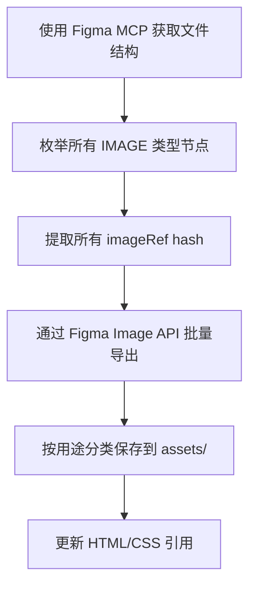
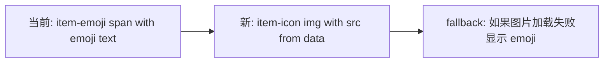
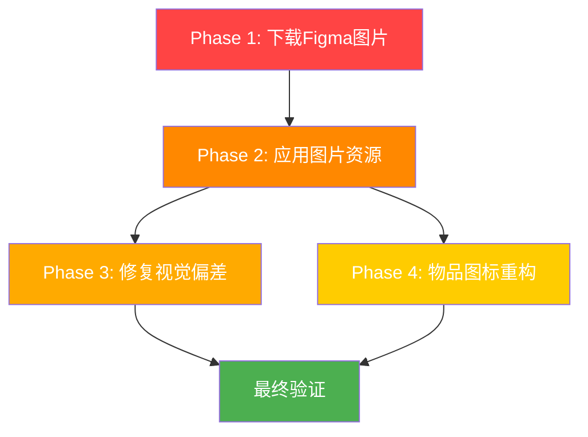

# Figma UI 完全重构计划 — 图片资源下载 + 视觉修正

> 日期：2026-05-22
> 目标：完全按照 Figma 设计稿重构 UI，下载并应用所有 Figma 图片源文件
> 新增要求：所有棋盘格子固定为正方形 52×52px，不随页面变化

---

## 📋 现状总结

### 已完成项（从之前迭代中）

| 项目                        | 状态 | 备注                            |
| --------------------------- | ---- | ------------------------------- |
| CSS 色板切换为暖色桃子/焦糖 | ✅   | `:root` 变量已更新              |
| 新拟态双阴影                | ✅   | `--shadow-neu-up/down` 已定义   |
| 底部导航栏隐藏              | ✅   | `#bottom-nav { display: none }` |
| 侧边功能按钮（左3右3）      | ✅   | Lucide 图标已替换 Emoji         |
| Boss 区域叠加在棋盘上       | ✅   | `position: absolute`            |
| 棋盘外框双层结构            | ✅   | `.board-frame` wrapper          |
| 底部信息栏                  | ✅   | `#item-info-bar` 已实现         |
| Rank 徽章                   | ✅   | `#rank-badge` 已添加            |
| Boss 紫色药丸名字           | ✅   | `#boss-header-name` 样式        |
| 心形图标                    | ✅   | `.boss-heart-icon`              |
| 金币格式化                  | ✅   | `formatGold()`                  |
| 卖出获金币                  | ✅   | `sellItemForGold()`             |
| 商店独立                    | ✅   | `#shop-sheet`                   |
| 每日 Buff                   | ✅   | `js/daily-buff.js`              |
| 日常 NPC 剪影               | ✅   | `.daily-npc-silhouette`         |
| 订单完成高亮                | ✅   | `.order-match`                  |
| Lucide 图标替换 Emoji       | ✅   | 顶部栏+侧边按钮+sheet 头        |
| 背景渐变降透明度            | ✅   | 0.3/0.35/0.45                   |
| overlay.png + blur          | ✅   | `::before` 伪元素               |

### 未完成项（本次需解决）

| #   | 项目                                      | 严重度      | 来源       |
| --- | ----------------------------------------- | ----------- | ---------- |
| 1   | **Figma 图片源文件未下载应用**            | 🔴 CRITICAL | 用户要求   |
| 2   | **棋盘格子非固定正方形（当前1fr响应式）** | 🔴 CRITICAL | 用户新要求 |
| 3   | **17处面板仍用 backdrop-filter blur**     | 🟠 HIGH     | VA-3       |
| 4   | **Boss 立绘尺寸 72px → 143px**            | 🟠 HIGH     | H-1        |
| 5   | **棋盘内边距不匹配 Figma**                | 🟡 MEDIUM   | L-2        |
| 6   | **遗留 DOM 元素未清理**                   | 🟢 LOW      | L-1        |

---

## 🖼️ Phase 1：下载 Figma 所有图片源文件

### 1.1 Figma 文件信息

| 文件     | File Key                 | 节点                   |
| -------- | ------------------------ | ---------------------- |
| mergeUI  | `jni5pRqGwFcXG7PDoNxwm2` | `1-122` iPhone 17 - 10 |
| Untitled | `dUCyt1gnAQdVIFTY8Kw2RG` | `1-121` 根画布         |

### 1.2 已知图片资源（从 figma_node2.json 提取）

| 节点 ID | 名称         | imageRef                                   | 用途       | 下载目标路径               |
| ------- | ------------ | ------------------------------------------ | ---------- | -------------------------- |
| `1:123` | Background 1 | `9e3f7c9ecd4f50f43d592217f25247f3e73c4b2e` | 全屏底图   | `assets/bg/background.png` |
| `1:124` | image 3      | `e6ac74dc94faf8e0f9f196989aed61e0ac63157f` | 模糊叠加图 | `assets/bg/overlay.png`    |

### 1.3 需要通过 Figma API 枚举的图片

Figma 设计稿中可能还有以下类型的图片资源需要下载：

1. **角色立绘图片** — Boss 区域的 143×143 角色图片
2. **3D 食物图标** — 棋盘上的合成物品图标（当前用 Emoji 替代）
3. **头像图片** — 顶部状态栏头像、Rank 头像
4. **NPC 立绘** — 日常订单的 NPC 图片
5. **装饰元素** — 可能的 UI 装饰图片

### 1.4 下载步骤



**具体操作**：

1. 使用 Figma MCP `get_file` 获取 `jni5pRqGwFcXG7PDoNxwm2` 完整节点树
2. 使用 Figma MCP `get_file` 获取 `dUCyt1gnAQdVIFTY8Kw2RG` 完整节点树
3. 递归遍历所有节点，找出 `type: IMAGE` 的 fills
4. 收集所有 `imageRef` hash 值
5. 使用 Figma MCP `get_image` 批量导出为 PNG @2x
6. 按用途保存到对应目录：
   - `assets/bg/` — 背景图
   - `assets/avatar/` — 角色立绘/头像
   - `assets/items/` — 食物/物品图标
   - `assets/ui/` — UI 装饰元素

---

## 🎨 Phase 2：应用下载的图片资源

### 2.1 背景图片

**当前状态**：`assets/bg/background.png` 和 `assets/bg/overlay.png` 已存在，但可能是旧版本或低分辨率。

**操作**：

- 用 Figma 导出的高清版本替换现有文件
- 确认 CSS 中的引用路径正确
- 验证 `::before` 伪元素的 blur(9px) 效果

**涉及文件**：[`css/style.css`](css/style.css:136) `#game-container` 和 `#game-container::before`

### 2.2 角色立绘图片

**当前状态**：`assets/avatar/` 目录有 8 个 webp 文件（daniel, leo, morven, vincent + 背景），但 Boss 区域的 `#boss-portrait` 使用 CSS 背景色 + Emoji，没有实际图片。

**操作**：

- 从 Figma 下载 Boss 角色立绘图片
- 在 `#boss-portrait` 中应用 `background-image`
- 调整尺寸从 72px → 143px（Figma 规格）
- 添加 `background-size: cover; background-position: center;`

**涉及文件**：

- [`css/style.css`](css/style.css:371) `#boss-portrait`
- [`js/boss.js`](js/boss.js) — 动态设置 portrait 背景

### 2.3 食物/物品 3D 图标

**当前状态**：棋盘物品使用 Emoji 显示（`.item-emoji`），Figma 设计稿使用 3D 食物图标。

**操作**：

- 从 Figma 下载所有食物/物品图标
- 创建 `assets/items/` 目录存放
- 修改物品渲染逻辑：Emoji → `` 标签
- 在 [`assets/data/items.json`](assets/data/items.json) 中添加 `icon` 字段指向图片路径
- 修改 [`js/board.js`](js/board.js) 的渲染方法

**这是最大的改动**，涉及数据格式和渲染逻辑的变更。

### 2.4 头像图片

**当前状态**：`#avatar-btn` 使用 Lucide `user` 图标，Figma 设计稿显示为圆形头像图片。

**操作**：

- 从 Figma 下载头像图片（如有）
- 替换 `#avatar-btn` 内容为 `` 或 `background-image`
- 保持 43×43 圆形裁剪

### 2.5 UI 装饰元素

**操作**：

- 检查 Figma 中是否有按钮背景、徽章装饰等图片资源
- 如有，下载并应用到对应 CSS

---

## 🔧 Phase 3：修复剩余视觉偏差

### 3.1 VA-3：移除所有游戏面板的 backdrop-filter blur

需要修改的 CSS 规则（17处）：

| 选择器                | 文件行号(约) | 当前                                   | 改为                     |
| --------------------- | ------------ | -------------------------------------- | ------------------------ |
| `.chain-tooltip`      | ~558         | `rgb(255,255,255)` 已改但需确认无 blur | 确认无 `backdrop-filter` |
| `.heroine-card`       | ~929         | `rgb(255,225,204)` 已改但需确认        | 确认无 `backdrop-filter` |
| `.daily-order-card`   | ~994         | `rgb(255,225,204)` 已改但需确认        | 确认无 `backdrop-filter` |
| `.cg-preview-overlay` | ~1013        | 需检查                                 | 移除 `backdrop-filter`   |
| `.max-level-overlay`  | ~1091        | 需检查                                 | 移除 `backdrop-filter`   |
| ad popup              | ~1391        | 需检查                                 | 移除 `backdrop-filter`   |
| reward modal          | ~1495        | 需检查                                 | 移除 `backdrop-filter`   |
| reward card           | ~1516        | 需检查                                 | 改为实色                 |
| toast                 | ~1717        | 需检查                                 | 改为实色                 |
| loop summary          | ~2731        | 需检查                                 | 移除 `backdrop-filter`   |

**注意**：VN/剧情阅读器的深色毛玻璃效果**保留**，这是不同的视觉主题。

### 3.2 Boss 立绘尺寸放大

**当前**：[`css/style.css`](css/style.css:371) `#boss-portrait { width: 72px; height: 72px }`  
**Figma**：143×143px

**修改**：

```css
#boss-portrait {
  width: 143px;
  height: 143px;
  /* 其余保持不变 */
}
```

同时需要调整 `#boss-info-row` 的布局，因为立绘变大后可能挤压右侧信息区。

### 3.3 棋盘格子固定为正方形（用户新要求 — CRITICAL）

**当前**：

- [`js/board.js`](js/board.js:37) `gridTemplateColumns = repeat(7, 1fr)` — 响应式，格子随容器拉伸
- [`css/style.css`](css/style.css:621) `.grid-cell { width: 100%; min-height: 0 }` — 非正方形

**Figma 规格**：每个格子 52×52px 固定正方形

**修改方案**：

1. **JS 修改** — [`js/board.js`](js/board.js:37)：

```js
// 修改前
this.gridEl.style.gridTemplateColumns = `repeat(${this.cols}, 1fr)`;
this.gridEl.style.gridTemplateRows = `repeat(${this.rows}, 1fr)`;
// 修改后
this.gridEl.style.gridTemplateColumns = `repeat(${this.cols}, 52px)`;
this.gridEl.style.gridTemplateRows = `repeat(${this.rows}, 52px)`;
```

2. **CSS 修改** — [`css/style.css`](css/style.css:621)：

```css
.grid-cell {
  width: 52px;
  height: 52px; /* 固定正方形，不随页面变化 */
}
```

3. **棋盘容器调整** — [`css/style.css`](css/style.css:609)：

```css
#game-grid {
  width: fit-content; /* 由格子数量决定宽度 */
  height: fit-content;
  margin: 0 auto; /* 居中 */
  max-width: 100%;
  max-height: 100%;
  overflow: auto; /* 屏幕太小时可滚动 */
}
```

4. **尺寸计算**：7列 × 52px + 6gap × 1px = 370px，9行 × 52px + 8gap × 1px = 476px

### 3.4 棋盘内边距调整

**当前**：[`css/style.css`](css/style.css:601) `.board-frame { padding: 15px 15px 8px 8px }`  
**Figma**：padding 15/15/8/8 ✅ 已匹配

**但内网格 padding**：

- 当前：`#game-grid { padding: 2px }`
- Figma：gap:1 隐含，需验证视觉效果

### 3.4 清理遗留 DOM 元素

移除以下 `display:none` 的遗留元素：

- `#energy-bar` + `#energy-bar-fill` + `#energy-text`
- `#gold-text`
- `#diamond-text`
- `#recycle-bin-left` + `#recycle-bin-right`

需先确认所有 JS 引用已迁移。

---

## 📐 Phase 4：物品图标系统重构（Emoji → 图片）

这是最复杂的改动，需要谨慎处理。

### 4.1 数据层变更

在 [`assets/data/items.json`](assets/data/items.json) 中为每个物品添加 `icon` 字段：

```json
{
  "id": "bread",
  "emoji": "🍞",
  "icon": "assets/items/bread.webp",
  "name": "面包",
  ...
}
```

### 4.2 渲染层变更

修改 [`js/board.js`](js/board.js) 中的物品渲染逻辑：



**具体修改**：

1. `.item-emoji` → `.item-icon`
2. 渲染时优先使用 ``
3. 添加 `onerror` fallback 到 emoji
4. CSS 调整：`.item-icon img { width: 100%; height: 100%; object-fit: contain; }`

### 4.3 图片资源映射

需要从 Figma 下载所有物品图标并建立映射关系。物品列表来自 [`assets/data/items.json`](assets/data/items.json)。

---

## 📊 实施优先级



### 推荐执行顺序

1. **Phase 1** — 使用 Figma MCP 枚举并下载所有图片（最关键，用户明确要求）
2. **Phase 2.1** — 替换背景图片（立即可见的效果）
3. **Phase 2.2** — 应用角色立绘 + 放大尺寸
4. **Phase 3** — 修复视觉偏差（blur 移除、尺寸调整）
5. **Phase 2.3 + Phase 4** — 物品图标系统重构（最复杂，需要数据+渲染联动）
6. **Phase 2.4-2.5** — 头像和装饰元素
7. **最终验证** — 对比 Figma 设计截图

---

## 📁 文件影响矩阵

| 文件                                               | 改动级别                                   | Phase         |
| -------------------------------------------------- | ------------------------------------------ | ------------- |
| `assets/bg/background.png`                         | 🔄 替换为 Figma 导出                       | 2.1           |
| `assets/bg/overlay.png`                            | 🔄 替换为 Figma 导出                       | 2.1           |
| `assets/avatar/*`                                  | 🆕 可能新增 Boss 立绘                      | 2.2           |
| `assets/items/*`                                   | 🆕 新目录，存放物品图标                    | 2.3           |
| `assets/ui/*`                                      | 🆕 可能新增 UI 装饰                        | 2.5           |
| [`css/style.css`](css/style.css)                   | 🟡 修改 portrait 尺寸、移除 blur、图标样式 | 2.2, 3.1, 4.2 |
| [`js/board.js`](js/board.js)                       | 🟡 物品渲染逻辑                            | 4.2           |
| [`js/boss.js`](js/boss.js)                         | 🟢 portrait 背景图                         | 2.2           |
| [`assets/data/items.json`](assets/data/items.json) | 🟡 添加 icon 字段                          | 4.1           |
| [`index.html`](index.html)                         | 🟢 清理遗留 DOM                            | 3.4           |

---

## ⚠️ 风险和注意事项

1. **Figma API 限流**：批量导出图片时需注意 API 速率限制
2. **图片格式**：Figma 导出 PNG，但项目使用 webp 优化体积，可能需要转换
3. **物品图标数量**：如果物品很多（50+），手动下载和映射工作量大
4. **Emoji fallback**：物品图标从 Emoji 切换到图片时，必须保留 fallback 机制
5. **VN 阅读器**：深色主题的毛玻璃效果不应被移除
6. **Boss 立绘放大**：143px 在小屏幕上可能过大，需要响应式调整
