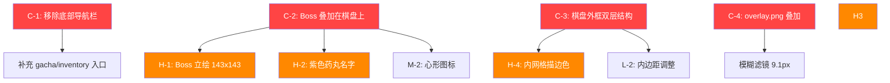

# Figma 设计稿 vs 当前代码 — 全面偏差审计报告

> 审计日期：2026-05-22  
> 对照文件：`figma_node2.json` + `figma_design2.png` + `plans/figma-design-analysis.md`  
> 审计范围：主游戏界面（iPhone 17 - 10 画布）

---

## 🔴 CRITICAL — 结构性偏差（与设计稿根本不符）

### C-1. 底部导航栏 `#bottom-nav` 仍然存在

| 维度     | Figma 设计稿                    | 当前代码                  |
| -------- | ------------------------------- | ------------------------- |
| 存在性   | **不存在** — 主界面无底部导航栏 | 5标签导航栏仍完整保留     |
| 导航方式 | 4个侧边圆形按钮（左2+右2）      | 底部5标签 + 侧边4按钮并存 |

**当前代码**（[`index.html:221-248`](index.html:221)）：

```html
<nav id="bottom-nav">
  <button class="nav-item" data-tab="inventory">...</button>
  <button class="nav-item" data-tab="heroine">...</button>
  <button class="nav-item" data-tab="gacha">...</button>
  <button class="nav-item" data-tab="collection">...</button>
  <button class="nav-item" data-tab="achievement">...</button>
</nav>
```

**问题**：Figma 设计稿中主界面**没有底部导航栏**。导航功能由侧边按钮承担。当前代码同时保留了底部导航和侧边按钮，造成功能重复和视觉冗余。

**注意**：移除底部导航后，**背包(inventory)** 和 **扭蛋(gacha)** 入口将丢失，需要在其他位置补充入口。

**修复方案**：

1. 隐藏或移除 `#bottom-nav`
2. 在侧边按钮中补充 gacha 入口（或在顶部状态栏添加）
3. 背包入口可放在头像按钮点击菜单中
4. 清理 [`js/main.js`](js/main.js:515) 中 `setupBottomNav()`、`handleNavClick()`、`setActiveNav()` 相关逻辑

---

### C-2. Boss 区域未叠加在棋盘上

| 维度     | Figma 设计稿                      | 当前代码                         |
| -------- | --------------------------------- | -------------------------------- |
| 布局方式 | `position: absolute` 浮在棋盘上方 | 独立 flex 子元素，占据自己的空间 |
| 视觉效果 | 角色立绘与棋盘融为一体            | Boss 区域和棋盘是两个分离的区块  |

**当前代码**（[`css/style.css:286-292`](css/style.css:286)）：

```css
#boss-header {
  display: flex;
  align-items: center;
  gap: 10px;
  padding: 6px 12px;
  flex-shrink: 0;
  background: var(--cream);
  border-bottom: 1px solid var(--pale-peach);
  box-shadow: var(--shadow-neu-down);
}
```

**Figma 规格**：Boss 区域应叠加在棋盘顶部，包含：

- 角色立绘 143×143 r:12
- 名字紫色药丸徽章
- HP 条 + 计时器
- 伤害弹出数字

**修复方案**：

1. `#boss-header` 改为 `position: absolute`，定位在 `.grid-container` 内部顶部
2. 背景改为半透明 `rgba(255,204,172,0.85)`
3. 调整 z-index 使其在棋盘上方
4. 角色立绘尺寸从 80×80 增大到 143×143

---

### C-3. 棋盘缺少外框（双层结构未实现）

| 维度 | Figma 设计稿                         | 当前代码         |
| ---- | ------------------------------------ | ---------------- |
| 结构 | 双层：外框(salmon) + 内网格(caramel) | 单层：只有内网格 |

**Figma 规格**：

- **外框**：386×493, `rgb(255,204,172)` 填充, `rgb(254,218,178)` 描边, r:12, gap:10, padding:15/15/8/8
- **内网格**：370×476, `rgb(221,170,139)` 填充, `rgb(227,176,132)` 描边, r:6, gap:1

**当前代码**（[`css/style.css:510-519`](css/style.css:510)）：

```css
#game-grid {
  background: var(--board-bg); /* #DDAA8B — 只有内网格色 */
  border: 1px solid var(--board-border); /* #FEDAB2 — 描边色偏浅 */
  border-radius: 6px;
  padding: 2px;
}
```

**修复方案**：

1. 在 `#game-grid` 外层添加一个 `.board-frame` wrapper
2. `.board-frame`：背景 `var(--salmon)` / `#FFCCAC`，描边 `var(--pale-peach)` / `#FEDAB2`，r:12，padding:15/15/8/8
3. `#game-grid`：保持 `var(--board-bg)` / `#DDAA8B`，描边改为 `#E3B084`（当前 `--board-border` 值 `#FEDAB2` 太浅），r:6，padding 调整

---

### C-4. 背景叠加图片 `overlay.png` 未使用

| 维度   | Figma 设计稿                                | 当前代码                    |
| ------ | ------------------------------------------- | --------------------------- |
| 背景层 | 2层图片：Background 1 + image 3（模糊叠加） | 仅1层 background.png + 渐变 |

**Figma 节点**：

- `1:123` "Background 1" — 全屏底图
- `1:124` "image 3" — 叠加图片，**LAYER_BLUR radius:9.1**

**当前代码**（[`css/style.css:139-141`](css/style.css:139)）：

```css
background:
  linear-gradient(
    180deg,
    rgba(255, 225, 204, 0.85) 0%,
    rgba(255, 204, 172, 0.9) 50%,
    rgba(221, 170, 139, 0.95) 100%
  ),
  url("../assets/bg/background.png") center/cover no-repeat;
```

**问题**：`assets/bg/overlay.png` 已下载但未在 CSS 中使用。Figma 设计中 "image 3" 是一张模糊叠加图，应覆盖在 background.png 之上。

**修复方案**：

```css
background:
  linear-gradient(
    180deg,
    rgba(255, 225, 204, 0.85) 0%,
    rgba(255, 204, 172, 0.9) 50%,
    rgba(221, 170, 139, 0.95) 100%
  ),
  url("../assets/bg/overlay.png") center/cover no-repeat,
  url("../assets/bg/background.png") center/cover no-repeat;
```

或使用 `::before` 伪元素叠加 overlay.png 并应用 `filter: blur(9px)`。

---

## 🟠 HIGH — 显著视觉偏差

### H-1. Boss 角色立绘尺寸过小

| 维度 | Figma   | 当前代码 |
| ---- | ------- | -------- |
| 尺寸 | 143×143 | 80×80    |

**当前代码**（[`css/style.css:295`](css/style.css:295)）：

```css
#boss-portrait {
  width: 80px;
  height: 80px;
  border-radius: 12px;
}
```

**修复**：改为 `width: 143px; height: 143px;`（或按比例缩放适配屏幕）

---

### H-2. Boss 名字缺少紫色药丸徽章样式

| 维度 | Figma                                                           | 当前代码             |
| ---- | --------------------------------------------------------------- | -------------------- |
| 样式 | 紫色药丸背景 `rgb(163,140,204)` + 薰衣草文字 `rgb(227,218,255)` | 普通文字，无特殊背景 |

**当前代码**（[`css/style.css:356-360`](css/style.css:356)）：

```css
#boss-name {
  font-size: 13px;
  font-weight: 900;
  color: var(--text-heading);
}
#boss-title {
  font-size: 9px;
  color: rgba(0, 0, 0, 0.5);
}
```

**修复**：

```css
#boss-header-name {
  background: var(--accent-purple); /* #A38CCC */
  border-radius: 999px;
  padding: 2px 10px;
}
#boss-name {
  color: #e3daff;
} /* 薰衣草色文字 */
```

---

### H-3. 顶部状态栏缺少 Rank 元素

| 维度 | Figma                           | 当前代码 |
| ---- | ------------------------------- | -------- |
| Rank | "Rank" 文字 + 圆形头像含"1"徽章 | 完全缺失 |

**修复**：在 `#top-status-bar` 末尾添加 Rank 元素：

```html
<div id="rank-badge">
  <span>Rank</span>
  <div class="rank-avatar"><span>1</span></div>
</div>
```

---

### H-4. 内网格描边颜色偏浅

| 维度       | Figma                          | 当前代码                              |
| ---------- | ------------------------------ | ------------------------------------- |
| 内网格描边 | `rgb(227,176,132)` = `#E3B084` | `--board-border: #FEDAB2`（偏浅桃色） |

**当前代码**（[`css/style.css:112`](css/style.css:112)）：

```css
--board-border: #fedab2;
```

**修复**：`--board-border: #E3B084;`（`#FEDAB2` 应仅用于外框描边）

---

## 🟡 MEDIUM — 中等偏差

### M-1. 底部面板中仍有 Emoji 未替换为 Lucide 图标

以下位置仍使用 Emoji：

| 位置                 | 当前 Emoji    | 应替换为            |
| -------------------- | ------------- | ------------------- |
| Collection tabs: 📦  | `📦 物品图鉴` | Lucide `package`    |
| Collection tabs: 🎁  | `🎁 卡牌图鉴` | Lucide `gift`       |
| Collection tabs: 🧩  | `🧩 碎片`     | Lucide `puzzle`     |
| Inventory header: 🎒 | `🎒 背包`     | Lucide `backpack`   |
| CG Album header: 📖  | `📖 CG回忆录` | Lucide `book-image` |
| Shop header: 🏪      | `🏪 金币商店` | Lucide `store`      |

这些 Emoji 在 [`index.html:467-525`](index.html:467) 的 bottom sheet 内容中。

---

### M-2. Boss 名字旁缺少心形图标

| 维度 | Figma                                 | 当前代码 |
| ---- | ------------------------------------- | -------- |
| 心形 | 💗 `rgb(243,86,131)` 粉色心形在名字旁 | 无       |

**修复**：在 `#boss-header-name` 中添加 `<i data-lucide="heart" style="stroke:var(--accent-pink)"></i>`

---

### M-3. 伤害弹出样式需验证

| 维度 | Figma 规格              | 需检查项                         |
| ---- | ----------------------- | -------------------------------- |
| 背景 | `rgba(0,0,0,0.62)` r:6  | 当前 boss 伤害弹出的背景色和圆角 |
| 内容 | "+1020 💎 +10" 白色文字 | 伤害数字格式和图标               |

需检查 [`js/boss.js`](js/boss.js) 中的伤害弹出实现。

---

### M-4. 任务轮播在 Figma 主界面中不可见

| 维度           | Figma                            | 当前代码                       |
| -------------- | -------------------------------- | ------------------------------ |
| Quest Carousel | 主界面不可见（可能在其他面板中） | `#quest-carousel` 占据顶部空间 |

Figma 主界面布局中，Boss 区域直接叠加在棋盘上，没有 quest carousel。当前 quest carousel 占据了宝贵的垂直空间。可能需要将 quest 功能移到其他入口（如侧边按钮或 Boss 区域内）。

---

## 🟢 LOW — 小偏差 / 清理项

### L-1. 隐藏的遗留 DOM 元素

以下元素以 `display:none` 隐藏，仅用于 JS 兼容性：

| 元素                 | 位置                               | 用途                                   |
| -------------------- | ---------------------------------- | -------------------------------------- |
| `#energy-bar`        | [`index.html:120`](index.html:120) | 旧能量条，被新 `#energy-value` 替代    |
| `#gold-text`         | [`index.html:124`](index.html:124) | 旧金币文字，被新 `#gold-value` 替代    |
| `#diamond-text`      | [`index.html:125`](index.html:125) | 旧钻石文字，被新 `#diamond-value` 替代 |
| `#recycle-bin-left`  | [`index.html:194`](index.html:194) | 旧左侧回收栏                           |
| `#recycle-bin-right` | [`index.html:202`](index.html:202) | 旧右侧回收栏                           |

**建议**：确认所有 JS 引用已迁移后，移除这些元素以减少 DOM 节点数。

---

### L-2. 棋盘内边距与 Figma 不匹配

| 维度           | Figma                             | 当前代码       |
| -------------- | --------------------------------- | -------------- |
| 外框 padding   | 15/15/8/8 (top/right/bottom/left) | 无外框         |
| 内网格 padding | 隐含在 gap:1 中                   | `padding: 2px` |

需在添加外框后调整。

---

### L-3. 单元格描边颜色

| 维度       | Figma                          | 当前代码                           |
| ---------- | ------------------------------ | ---------------------------------- |
| 单元格描边 | `rgb(255,211,180)` = `#FFD3B4` | `--cell-border: #FFD3B4` ✅ 已正确 |

此项已正确实现，无需修改。

---

## 📊 偏差汇总表

| #   | 级别        | 偏差项                        | 涉及文件                                    | 状态      |
| --- | ----------- | ----------------------------- | ------------------------------------------- | --------- |
| C-1 | 🔴 CRITICAL | 底部导航栏未移除              | `index.html`, `css/style.css`, `js/main.js` | ❌ 待修   |
| C-2 | 🔴 CRITICAL | Boss 区域未叠加在棋盘上       | `css/style.css`, `index.html`               | ❌ 待修   |
| C-3 | 🔴 CRITICAL | 棋盘缺少外框双层结构          | `css/style.css`, `index.html`               | ❌ 待修   |
| C-4 | 🔴 CRITICAL | 背景叠加图 overlay.png 未使用 | `css/style.css`                             | ❌ 待修   |
| H-1 | 🟠 HIGH     | Boss 立绘尺寸过小 80→143      | `css/style.css`                             | ❌ 待修   |
| H-2 | 🟠 HIGH     | Boss 名字缺紫色药丸样式       | `css/style.css`                             | ❌ 待修   |
| H-3 | 🟠 HIGH     | 状态栏缺 Rank 元素            | `index.html`, `css/style.css`               | ❌ 待修   |
| H-4 | 🟠 HIGH     | 内网格描边颜色偏浅            | `css/style.css`                             | ❌ 待修   |
| M-1 | 🟡 MEDIUM   | 底部面板 Emoji 未替换         | `index.html`                                | ❌ 待修   |
| M-2 | 🟡 MEDIUM   | Boss 名旁缺心形图标           | `index.html`, `css/style.css`               | ❌ 待修   |
| M-3 | 🟡 MEDIUM   | 伤害弹出样式待验证            | `js/boss.js`, `css/style.css`               | ❌ 待验证 |
| M-4 | 🟡 MEDIUM   | Quest Carousel 在主界面不可见 | `index.html`, `css/style.css`               | ❌ 待讨论 |
| L-1 | 🟢 LOW      | 隐藏遗留 DOM 元件待清理       | `index.html`                                | ❌ 待修   |
| L-2 | 🟢 LOW      | 棋盘内边距不匹配              | `css/style.css`                             | ❌ 待修   |

---

## 🔄 修复优先级建议



### 推荐修复顺序

1. **C-4** → 背景叠加（独立，不影响其他布局）
2. **C-3** → 棋盘外框（为 C-2 铺路）
3. **C-2 + H-1 + H-2 + M-2** → Boss 叠加布局（一组关联改动）
4. **C-1** → 移除底部导航 + 补充入口（影响最大，需谨慎）
5. **H-3** → Rank 元素（独立新增）
6. **H-4** → 内网格描边色（一行 CSS 变量修改）
7. **M-1** → 底部面板 Emoji 替换
8. **M-3 + M-4** → 验证伤害弹出 + Quest Carousel 处理
9. **L-1 + L-2** → 清理和微调
