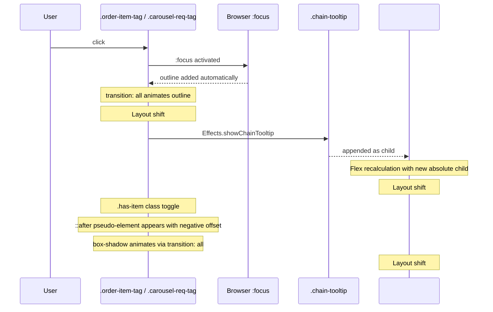

# Fix: order-item-tag 点击时 UI 整体上移 Bug

## 1. 根因分析

经过对 [`css/style.css`](css/style.css)、[`js/effects.js`](js/effects.js)、[`js/boss.js`](js/boss.js)、[`js/daily-orders.js`](js/daily-orders.js) 的深入分析，确认该 Bug 由 **多个因素叠加** 导致，按严重程度排序如下：

---

### 根因 #1：`transition: all` 触发非预期属性动画（主因）

**位置：** [`css/style.css:454`](css/style.css:454) 和 [`css/style.css:522`](css/style.css:522)

```css
.order-item-tag {
  transition: all var(--transition-fast); /* ← 问题所在 */
}
.carousel-req-tag {
  transition: all var(--transition-fast); /* ← 同样的问题 */
}
```

`transition: all` 会对 **所有可动画属性** 生效，包括：

- 浏览器 `:focus` 伪类自动添加的 `outline`
- `.has-item` / `.fulfilled` 状态切换时的 `box-shadow`、`border-color`、`background`
- 任何 JS 动态修改的 inline style

当用户点击 tag 时，浏览器赋予 `:focus` 状态，`transition: all` 将 outline 的出现动画化。outline 不占据文档流但会改变视觉边界，在 flex 容器中可能触发布局重算，导致整个 `#quest-carousel` 区域发生位移。

---

### 根因 #2：`.has-item::after` 伪元素溢出父容器

**位置：** [`css/style.css:3663-3680`](css/style.css:3663)

```css
.order-item-tag.fulfilled::after,
.carousel-req-tag.has-item::after {
  content: '✓';
  position: absolute;
  bottom: -0.6cqw;   /* ← 负值溢出 */
  right: -0.6cqw;     /* ← 负值溢出 */
  width: 2.2cqw;
  height: 2.2cqw;
  ...
}
```

伪元素通过负定位溢出父元素边界。虽然 `position: absolute` 不影响文档流，但父元素设置了 `position: relative`（[`css/style.css:3647`](css/style.css:3647)），且 `#quest-carousel` 设置了 `overflow: visible !important`（[`css/style.css:3386`](css/style.css:3386)），这意味着溢出内容会被计入滚动区域，改变容器的 `scrollHeight`，进而影响 flex 布局计算。

---

### 根因 #3：Chain Tooltip 插入 `#game-container` 触发重排

**位置：** [`js/effects.js:214`](js/effects.js:214)

```js
container.appendChild(tooltip); // container = #game-container
```

`showChainTooltip()` 将 `.chain-tooltip` 作为子节点插入 `#game-container`。虽然 tooltip 是 `position: absolute`，但 `#game-container` 是 `display: flex; flex-direction: column` 的容器。在 flex 容器中，`position: absolute` 的子元素仍会参与 **初始布局计算**（仅后续被移出流），这会导致一帧的布局抖动。

---

### 根因 #4：`overflow: visible !important` 破坏滚动约束

**位置：** [`css/style.css:3386`](css/style.css:3386)

```css
#quest-carousel {
  overflow: visible !important;
}
```

正常情况下 `overflow: hidden` 会创建 BFC（Block Formatting Context），隔离内部布局变化对外部的影响。`overflow: visible` 破坏了这一隔离，使得内部任何尺寸变化（伪元素溢出、shadow 扩展）都会传播到父级。

---

### 根因 #5：`:focus` 伪类缺少显式重置

当前代码中没有任何针对 `.order-item-tag` 或 `.carousel-req-tag` 的 `:focus` 样式重置。浏览器默认会在 `:focus` 时添加 `outline: 2px solid` 或类似样式，配合 `transition: all` 产生动画化偏移。

---

## 2. 交互流程图



---

## 3. 修复方案

### Fix 1：将 `transition: all` 替换为精确属性列表

**文件：** [`css/style.css`](css/style.css:454) 和 [`css/style.css`](css/style.css:522)

```css
/* Before (有 Bug) */
.order-item-tag {
  transition: all var(--transition-fast);
}
.carousel-req-tag {
  transition: all var(--transition-fast);
}

/* After (修复) */
.order-item-tag {
  transition:
    background var(--transition-fast),
    border-color var(--transition-fast);
}
.carousel-req-tag {
  transition:
    background var(--transition-fast),
    border-color var(--transition-fast);
}
```

同时更新 Consolidated Layout Pass 中的覆盖（如果有的话）。

---

### Fix 2：添加 `:focus` 样式重置，阻止 outline 动画

**文件：** [`css/style.css`](css/style.css) — 在 `.order-item-tag` 规则后新增

```css
.order-item-tag:focus,
.carousel-req-tag:focus {
  outline: none;
  box-shadow: none;
}
```

> 注意：为了无障碍访问，建议保留 focus 可见性，改用 `:focus-visible` 仅在键盘导航时显示：
>
> ```css
> .order-item-tag:focus-visible,
> .carousel-req-tag:focus-visible {
>   outline: 2px solid var(--accent-pink);
>   outline-offset: 2px;
> }
> .order-item-tag:focus:not(:focus-visible),
> .carousel-req-tag:focus:not(:focus-visible) {
>   outline: none;
> }
> ```

---

### Fix 3：为 `.has-item::after` 伪元素添加 `pointer-events: none` 并限制溢出影响

**文件：** [`css/style.css`](css/style.css:3663)

```css
/* Before */
.order-item-tag.fulfilled::after,
.carousel-req-tag.has-item::after {
  content: '✓';
  position: absolute;
  bottom: -0.6cqw;
  right: -0.6cqw;
  ...
}

/* After — 添加 overflow: hidden 到父元素 + pointer-events: none */
.order-item-tag.fulfilled::after,
.carousel-req-tag.has-item::after {
  content: '✓';
  position: absolute;
  bottom: -0.6cqw;
  right: -0.6cqw;
  pointer-events: none;       /* ← 防止交互干扰 */
  ...
}

/* 父元素添加 overflow: hidden 阻止伪元素影响滚动计算 */
.order-item-tag.fulfilled,
.carousel-req-tag.has-item {
  overflow: hidden;            /* ← 裁剪溢出的 ::after */
}
```

> **替代方案**：如果 `overflow: hidden` 裁剪了需要保留的 `box-shadow`，可以改用 `clip-path`：
>
> ```css
> .order-item-tag.fulfilled,
> .carousel-req-tag.has-item {
>   clip-path: inset(-8px -8px -8px -8px); /* 保留 shadow 空间 */
> }
> ```

---

### Fix 4：将 Chain Tooltip 挂载到 `#particle-layer` 而非 `#game-container`

**文件：** [`js/effects.js`](js/effects.js:209-214)

```js
// Before
const container = document.getElementById('game-container');
...
container.appendChild(tooltip);

// After — 挂载到独立的 fixed 层，避免触发 flex 重排
const container = document.getElementById('particle-layer') || document.body;
...
container.appendChild(tooltip);
```

`#particle-layer` 是 `position: fixed; pointer-events: none; z-index: 600` 的独立层，不会影响 `#game-container` 的 flex 布局计算。tooltip 需要相应调整定位计算（使用 `pageX` / `pageY` 或 `getBoundingClientRect` 相对于 viewport）。

---

### Fix 5：恢复 `#quest-carousel` 的 `overflow-x: auto` 并用 `clip` 替代 `visible`

**文件：** [`css/style.css`](css/style.css:3386)

```css
/* Before */
#quest-carousel {
  overflow: visible !important;
}

/* After — 仅水平方向可滚动，垂直方向裁剪 */
#quest-carousel {
  overflow-x: auto !important;
  overflow-y: clip !important; /* clip 不创建 BFC 但阻止内容溢出 */
}
```

> `overflow: clip` 与 `overflow: hidden` 的区别：`clip` 不创建新的格式化上下文，因此不会影响 `position: sticky` 等特性，但仍然裁剪溢出内容。

---

## 4. 防止布局抖动的最佳实践

### 4.1 永远不要使用 `transition: all`

```css
/* ❌ 错误 */
.button {
  transition: all 0.15s;
}

/* ✅ 正确 — 明确列出需要动画的属性 */
.button {
  transition:
    background 0.15s,
    transform 0.15s,
    opacity 0.15s;
}
```

`transition: all` 的问题：

- 对浏览器隐式添加的属性（outline、box-shadow 变化）也会动画化
- 性能差：浏览器需要监听所有属性的变化
- 难以调试：不可预期的属性动画导致布局抖动

### 4.2 为所有可交互元素重置 `:focus` 样式

```css
/* 全局重置 — 仅对鼠标点击隐藏 outline，键盘导航保留 */
*:focus:not(:focus-visible) {
  outline: none;
}

/* 或针对特定组件 */
.interactive-element:focus {
  outline: none;
}
.interactive-element:focus-visible {
  outline: 2px solid var(--accent-pink);
  outline-offset: 2px;
}
```

### 4.3 使用 `position: fixed` 挂载浮层/Tooltip

```js
// ❌ 错误 — 插入 flex 容器触发重排
gameContainer.appendChild(tooltip);

// ✅ 正确 — 插入独立的 fixed 层
particleLayer.appendChild(tooltip);
// 或
document.body.appendChild(tooltip);
```

### 4.4 伪元素溢出必须 `pointer-events: none`

```css
.badge::after {
  content: "✓";
  position: absolute;
  bottom: -4px;
  right: -4px;
  pointer-events: none; /* 必须添加 */
}
```

### 4.5 在 flex 容器中避免 `overflow: visible`

```css
/* ❌ 错误 — 破坏 BFC 隔离 */
.carousel {
  overflow: visible;
}

/* ✅ 正确 — 保持滚动约束 */
.carousel {
  overflow-x: auto;
  overflow-y: clip;
}
```

### 4.6 使用 `contain: layout` 隔离布局边界

```css
.quest-card {
  contain: layout; /* 告诉浏览器此元素内部布局不影响外部 */
}
```

`contain: layout` 创建独立的格式化上下文，浏览器可以优化重排范围，内部变化不会传播到父级。

### 4.7 固定尺寸元素使用 `will-change: transform` 提升为合成层

```css
.order-item-tag {
  will-change: transform; /* 提升为 GPU 合成层，transform 变化不触发重排 */
}
```

> 注意：不要滥用 `will-change`，仅在确实需要频繁动画的元素上使用。

---

## 5. 实施步骤清单

- [ ] **Fix 1**: 替换 `transition: all` 为精确属性列表（2处：`.order-item-tag` + `.carousel-req-tag`）
- [ ] **Fix 2**: 添加 `:focus` / `:focus-visible` 样式重置
- [ ] **Fix 3**: 为 `.has-item::after` 添加 `pointer-events: none`，父元素添加 `overflow: hidden` 或 `clip-path`
- [ ] **Fix 4**: 修改 `showChainTooltip` 挂载目标为 `#particle-layer`
- [ ] **Fix 5**: 修改 `#quest-carousel` 的 overflow 策略
- [ ] **验证**: 在 iPhone 15 (393×874) 和桌面端测试点击 tag 后无布局位移
- [ ] **验证**: 确认 tooltip 仍然正确显示在 tag 下方
- [ ] **验证**: 确认 `.has-item` 的 ✓ 徽章仍然可见
- [ ] **验证**: 确认键盘导航时 `:focus-visible` outline 正常显示
