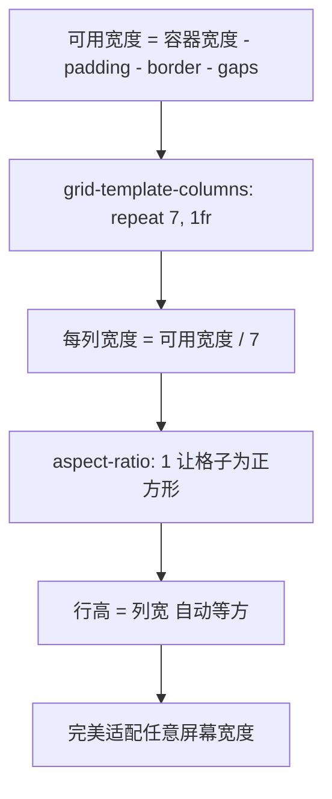

# iPhone 15 固定尺寸棋盘格适配方案

## 目标

将棋盘格改为固定尺寸，完美适配 iPhone 15 屏幕（逻辑分辨率 393×852pt），严格禁止横向滚动，预留安全区域边距。

---

## 当前问题分析

### 盒模型溢出计算

当前 7×9 棋盘从外到内的宽度累加：

| 层级     | 元素                        | 水平占用                 |
| -------- | --------------------------- | ------------------------ |
| 1        | `#game-container` max-width | 500px ❌                 |
| 2        | `.grid-container` padding   | 6px × 2 = 12px           |
| 3        | `.board-frame` padding      | 15px + 8px = 23px        |
| 4        | `.board-frame` border       | 1px × 2 = 2px            |
| 5        | `#game-grid` padding        | 2px × 2 = 4px            |
| 6        | `#game-grid` border         | 1px × 2 = 2px            |
| 7        | 7 cells × 52px              | 364px                    |
| 8        | 6 gaps × 1px                | 6px                      |
| **总计** |                             | **413px ❌ 超出 393pt!** |

### 其他问题

- [`#game-grid`](css/style.css:672) 使用 `overflow: auto`，允许横向滚动
- [`viewport`](index.html:18) meta 缺少 `viewport-fit=cover`，无法使用安全区域
- 全局无 `env(safe-area-inset-*)` 安全区域适配
- [`.grid-cell`](css/style.css:676) 硬编码 `52px`，无法自适应
- [`buildGrid()`](js/board.js:37) 硬编码 `52px`，与 CSS 重复定义

---

## 适配后盒模型计算

### 目标宽度分配（393pt）

| 层级             | 元素                      | 调整后水平占用                           | 说明                         |
| ---------------- | ------------------------- | ---------------------------------------- | ---------------------------- |
| 1                | `#game-container`         | 393px                                    | max-width 改为 393px         |
| 2                | safe-area padding         | 0px                                      | iPhone 15 竖屏左右安全区为 0 |
| 3                | `.grid-container` padding | 4px × 2 = 8px                            | 从 12px 缩减                 |
| 4                | `.board-frame` padding    | 6px × 2 = 12px                           | 从 23px 缩减，改为对称       |
| 5                | `.board-frame` border     | 1px × 2 = 2px                            | 不变                         |
| 6                | `#game-grid` padding      | 2px × 2 = 4px                            | 不变                         |
| 7                | `#game-grid` border       | 1px × 2 = 2px                            | 不变                         |
| 8                | 6 gaps × 1px              | 6px                                      | 不变                         |
| **可用于 cells** |                           | **393 - 8 - 12 - 2 - 4 - 2 - 6 = 359px** |                              |
| **每格宽度**     |                           | **359 ÷ 7 ≈ 51.3px**                     | 接近原 52px                  |

### 高度验证（852pt）

| 区域                            | 估算高度                |
| ------------------------------- | ----------------------- |
| `#top-status-bar`               | ~55px                   |
| `.grid-container` padding       | 8px                     |
| `.board-frame` padding + border | 14px                    |
| `#boss-header`                  | ~80px                   |
| `#game-grid` padding + border   | 6px                     |
| 9 rows × ~51.3px + 8 gaps       | 469.7px                 |
| `#item-info-bar`                | ~40px                   |
| `#bottom-nav`                   | 56px                    |
| **总计**                        | **~728.7px < 852px ✅** |

---

## 核心策略：CSS Grid 1fr + aspect-ratio

**不使用硬编码像素**，改用 CSS Grid 的 `1fr` 单位让列自动填充可用宽度，配合 `aspect-ratio: 1` 保证格子为正方形：



---

## 详细修改清单

### 1. `index.html` — Viewport Meta 标签

**文件**: [`index.html`](index.html:18)

在 viewport meta 中添加 `viewport-fit=cover`，启用安全区域支持：

```html
<!-- 修改前 -->
<meta
  name="viewport"
  content="width=device-width, initial-scale=1.0, maximum-scale=1.0, user-scalable=no"
/>

<!-- 修改后 -->
<meta
  name="viewport"
  content="width=device-width, initial-scale=1.0, maximum-scale=1.0, user-scalable=no, viewport-fit=cover"
/>
```

---

### 2. `css/style.css` — CSS 变量区

**文件**: [`css/style.css`](css/style.css:59)

在 `:root` 中添加/修改变量：

```css
/* 修改前 */
--grid-gap: 1px;
--cell-radius: 6px;

/* 修改后 — 新增棋盘适配变量 */
--grid-gap: 1px;
--cell-radius: 6px;
--board-max-width: 393px;
```

---

### 3. `css/style.css` — html, body 溢出控制

**文件**: [`css/style.css`](css/style.css:126)

确保所有层级禁止横向滚动：

```css
/* 修改后 */
html,
body {
  width: 100%;
  height: 100%;
  overflow: hidden;
  font-family:
    "Noto Sans SC",
    "PingFang SC",
    "Microsoft YaHei",
    -apple-system,
    BlinkMacSystemFont,
    sans-serif;
  -webkit-font-smoothing: antialiased;
  touch-action: none;
  user-select: none;
  -webkit-touch-callout: none;
  overscroll-behavior: none;
  position: fixed;
  top: 0;
  left: 0;
  /* 新增：绝对禁止横向滚动 */
  overflow-x: hidden;
  max-width: 100vw;
}
```

---

### 4. `css/style.css` — #game-container

**文件**: [`css/style.css`](css/style.css:136)

```css
/* 修改后 */
#game-container {
  width: 100%;
  height: 100%;
  max-width: var(--board-max-width, 393px); /* 从 500px 改为 393px */
  margin: 0 auto;
  display: flex;
  flex-direction: column;
  background:
    linear-gradient(
      180deg,
      rgba(255, 225, 204, 0.3) 0%,
      rgba(255, 204, 172, 0.35) 50%,
      rgba(221, 170, 139, 0.45) 100%
    ),
    url("../assets/bg/background.png") center/cover no-repeat;
  position: relative;
  overflow: hidden; /* 保留 */
  /* 新增：安全区域边距 */
  padding-left: env(safe-area-inset-left, 0px);
  padding-right: env(safe-area-inset-right, 0px);
  /* 新增：绝对禁止横向溢出 */
  box-sizing: border-box;
  transition: background 0.8s ease;
}
```

---

### 5. `css/style.css` — .grid-container

**文件**: [`css/style.css`](css/style.css:590)

```css
/* 修改后 */
.grid-container {
  flex: 1;
  padding: 4px 4px; /* 从 4px 6px 改为 4px 4px，缩减左右 padding */
  display: flex;
  align-items: stretch;
  justify-content: center;
  flex-direction: row;
  gap: 0;
  min-height: 0;
  overflow: hidden; /* 从 overflow: hidden 保留，新增明确禁止横向 */
  position: relative;
  box-sizing: border-box;
  max-width: 100%; /* 新增 */
}
```

---

### 6. `css/style.css` — .board-frame

**文件**: [`css/style.css`](css/style.css:637)

```css
/* 修改后 */
.board-frame {
  background: var(--board-frame-bg);
  border: 1px solid var(--board-frame-border);
  border-radius: 12px;
  padding: 6px; /* 从 15px 15px 8px 8px 改为对称 6px */
  display: flex;
  flex-direction: column;
  position: relative;
  box-shadow: var(--shadow-neu-up);
  flex: 1;
  min-height: 0;
  overflow: hidden; /* 保留 */
  box-sizing: border-box; /* 新增 */
  max-width: 100%; /* 新增 */
}
```

---

### 7. `css/style.css` — #game-grid

**文件**: [`css/style.css`](css/style.css:662)

```css
/* 修改后 */
#game-grid {
  display: grid;
  gap: var(--grid-gap);
  transition: transform 0.1s;
  width: 100%; /* 从 fit-content 改为 100% 填满容器 */
  /* 移除 height: fit-content — 让行高由 aspect-ratio 自动决定 */
  max-width: 100%;
  max-height: 100%;
  margin: 0 auto;
  background: var(--board-bg);
  border: 1px solid var(--board-border);
  border-radius: 6px;
  padding: 2px;
  overflow: hidden; /* 从 auto 改为 hidden — 禁止滚动 */
  box-sizing: border-box;
}
```

---

### 8. `css/style.css` — .grid-cell

**文件**: [`css/style.css`](css/style.css:675)

```css
/* 修改后 */
.grid-cell {
  /* 移除固定 width: 52px; height: 52px; */
  aspect-ratio: 1; /* 新增：正方形格子 */
  width: 100%; /* 新增：填满网格列宽 */
  background: var(--cell-bg);
  border-radius: var(--cell-radius);
  border: 1px solid var(--cell-border);
  display: flex;
  align-items: center;
  justify-content: center;
  position: relative;
  cursor: pointer;
  transition:
    transform var(--transition-fast),
    background var(--transition-fast),
    border-color var(--transition-fast);
  box-sizing: border-box; /* 新增 */
  overflow: hidden; /* 新增：防止内容溢出 */
}
```

---

### 9. `css/style.css` — .item-emoji 缩放

**文件**: [`css/style.css`](css/style.css:748)

```css
/* 修改后 */
.item-emoji {
  font-size: clamp(16px, 5.5vw, 28px); /* 保留 clamp，微调下限 */
  filter: drop-shadow(0 2px 4px rgba(0, 0, 0, 0.2));
  transition: transform var(--transition-fast);
  line-height: 1; /* 新增：防止行高撑开 */
}
```

---

### 10. `css/style.css` — .item-level 徽章缩放

**文件**: [`css/style.css`](css/style.css:754)

```css
/* 修改后 */
.item-level {
  position: absolute;
  bottom: 1px;
  right: 2px;
  font-size: 8px;
  font-weight: 900;
  color: white; /* 从 9px 缩小到 8px */
  background: var(--item-color, #888);
  width: 13px;
  height: 13px; /* 从 14px 缩小到 13px */
  border-radius: 50%;
  display: flex;
  align-items: center;
  justify-content: center;
  box-shadow: 0 1px 3px rgba(0, 0, 0, 0.3);
  line-height: 1;
}
```

---

### 11. `js/board.js` — buildGrid() 方法

**文件**: [`js/board.js`](js/board.js:35)

```js
/* 修改前 */
buildGrid() {
    this.gridEl.innerHTML = '';
    this.gridEl.style.gridTemplateColumns = `repeat(${this.cols}, 52px)`;
    this.gridEl.style.gridTemplateRows = `repeat(${this.rows}, 52px)`;
    ...
}

/* 修改后 */
buildGrid() {
    this.gridEl.innerHTML = '';
    this.gridEl.style.gridTemplateColumns = `repeat(${this.cols}, 1fr)`;
    this.gridEl.style.gridTemplateRows = `repeat(${this.rows}, auto)`;
    ...
}
```

> **关键**: `1fr` 让列自动平分可用宽度，`auto` 让行高由 `aspect-ratio: 1` 自动决定为正方形。

---

### 12. `css/style.css` — .side-buttons 位置调整

**文件**: [`css/style.css`](css/style.css:841)

```css
/* 修改后 — 确保不超出容器 */
.side-buttons {
  position: absolute;
  top: 50%;
  transform: translateY(-50%);
  z-index: 10;
  display: flex;
  flex-direction: column;
  gap: 6px;
}
.side-buttons.left {
  left: 0px;
} /* 从 2px 改为 0px */
.side-buttons.right {
  right: 0px;
} /* 从 2px 改为 0px */
```

---

### 13. `css/style.css` — 响应式媒体查询更新

**文件**: [`css/style.css`](css/style.css:1858)

更新 `@media (max-height: 760px)` 中的 `.grid-container` padding：

```css
/* 修改后 */
@media (max-height: 760px) {
  ...
  .grid-container { padding: 0 2px; }  /* 从 0 1px 改为 0 2px */
  ...
}
```

更新 `@media (min-width: 501px)` 中的 `#game-container` max-width：

```css
/* 修改后 */
@media (min-width: 501px) {
  #game-container {
    border-left: 1px solid rgba(255, 255, 255, 0.1);
    border-right: 1px solid rgba(255, 255, 255, 0.1);
    box-shadow: 0 0 100px rgba(0, 0, 0, 0.6);
    max-width: min(393px, 92vh * 9 / 16);  /* 从 500px 改为 393px */
  }
  ...
  /* 更新所有 overlay 的 max-width */
  #loading-overlay,
  #lang-select-overlay,
  #dialogue-overlay,
  #parade-overlay,
  #loop-summary-overlay,
  #game-complete-overlay,
  #transition-overlay,
  .bottom-sheet {
    max-width: min(393px, 92vh * 9 / 16);  /* 从 500px 改为 393px */
    ...
  }
}
```

---

### 14. `css/style.css` — 其他媒体查询中的 .grid-container

搜索所有媒体查询中的 `.grid-container { padding: ... }` 并确保左右 padding 不超过 4px：

| 位置                            | 当前值             | 修改为              |
| ------------------------------- | ------------------ | ------------------- |
| [line 1871](css/style.css:1871) | `padding: 0 1px`   | `padding: 0 2px`    |
| [line 2747](css/style.css:2747) | `padding: 0 1px`   | `padding: 0 2px`    |
| [line 2788](css/style.css:2788) | `padding: 0`       | `padding: 0` (不变) |
| [line 2822](css/style.css:2822) | `padding: 2px 1px` | `padding: 2px 2px`  |
| [line 2853](css/style.css:2853) | `padding: 6px 4px` | `padding: 4px 4px`  |

---

## 修改文件汇总

| 文件                               | 修改点数 | 说明                                  |
| ---------------------------------- | -------- | ------------------------------------- |
| [`index.html`](index.html:18)      | 1        | viewport meta 添加 viewport-fit=cover |
| [`css/style.css`](css/style.css:1) | ~12      | 变量、容器、网格、格子、媒体查询      |
| [`js/board.js`](js/board.js:37)    | 1        | buildGrid 改用 1fr + auto             |

---

## 适配验证清单

- [ ] iPhone 15 (393×852) — 棋盘完整显示，无横向滚动
- [ ] iPhone 15 Pro Max (430×932) — 棋盘居中，两侧留白
- [ ] iPhone SE (375×667) — 棋盘自适应缩小，无溢出
- [ ] 拖拽合并功能正常（格子大小变化不影响交互）
- [ ] 生成器点击、剪刀模式等特殊交互正常
- [ ] 锁定格子显示和点击解锁正常
- [ ] 动画效果（merge-pop, spawn-pop, unlock-glow）正常
- [ ] 横屏警告正常触发
