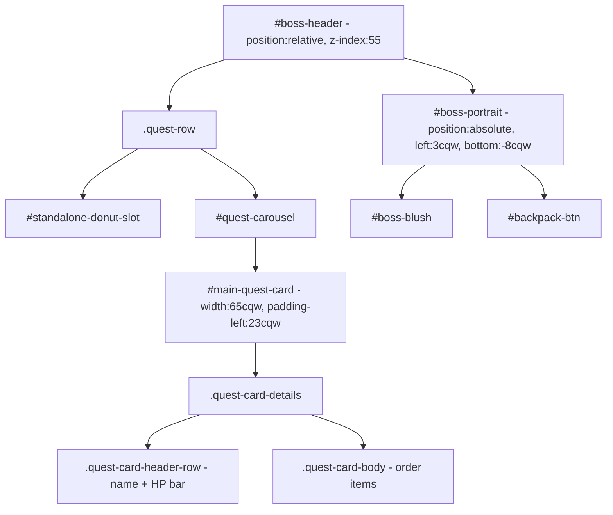
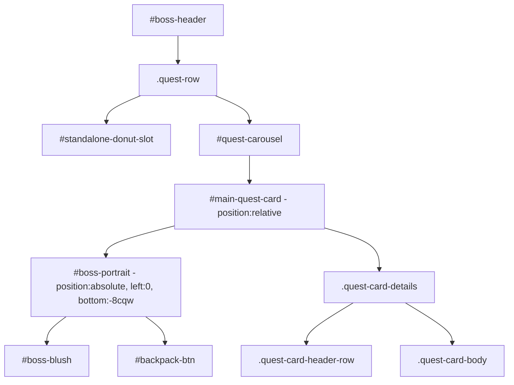

# Plan: Move Boss Portrait into Main Quest Card

## Goal

Move `#boss-portrait` from being a direct child of `#boss-header` into `#main-quest-card`, so the boss avatar visually and semantically belongs to the quest card.

---

## Current Structure



### Key CSS Facts

- `#boss-portrait` is `position: absolute` with `left: 3cqw; bottom: -8cqw;` — positioned relative to `#boss-header`
- `#main-quest-card` already has `padding-left: 23cqw` to reserve space for the portrait
- Portrait size: `width: 38cqw; height: 52cqw; z-index: 60`
- Portrait uses `pointer-events: none` so grid items behind it remain clickable

### JS References — All Safe

All JS uses `getElementById` so DOM re-parenting causes no breakage:

- [`bossPortraitEl`](js/boss.js:14) — `document.getElementById('boss-portrait')`
- [`_renderRewardPreview()`](js/boss.js:129) — `document.getElementById('boss-portrait')`
- [`heartFlyTo()`](js/effects.js:52) — `document.getElementById('boss-portrait')`
- [`bossHit()`](js/effects.js:75) — `document.getElementById('boss-portrait')`
- [`showDamagePopup()`](js/effects.js:88) — `document.getElementById('boss-portrait')`

---

## Target Structure



---

## Implementation Steps

### Step 1: Move `#boss-portrait` in [`index.html`](index.html:141)

Move the entire `#boss-portrait` block (lines 143–154) from inside `#boss-header` to inside `#main-quest-card`, as the **first child** before `.quest-card-details`.

**Before** (lines 141–197):

```html
<div id="boss-header">
  <div id="boss-portrait">
    <div id="boss-blush"></div>
    <button
      class="quest-carousel-backpack portrait-attached"
      id="backpack-btn"
      ...
    >
      <i data-lucide="package"></i>
    </button>
  </div>
  <div class="quest-row">
    ...
    <div id="quest-carousel">
      <div id="main-quest-card" class="quest-card">
        <div class="quest-card-details">...</div>
      </div>
    </div>
  </div>
</div>
```

**After**:

```html
<div id="boss-header">
  <div class="quest-row">
    ...
    <div id="quest-carousel">
      <div id="main-quest-card" class="quest-card">
        <div id="boss-portrait">
          <div id="boss-blush"></div>
          <button
            class="quest-carousel-backpack portrait-attached"
            id="backpack-btn"
            ...
          >
            <i data-lucide="package"></i>
          </button>
        </div>
        <div class="quest-card-details">...</div>
      </div>
    </div>
  </div>
</div>
```

### Step 2: Update CSS for `#main-quest-card` — add `position: relative`

In [`css/style.css`](css/style.css:3397), the `#main-quest-card` rule needs `position: relative` so it becomes the containing block for the absolutely-positioned portrait:

```css
#main-quest-card {
  width: 65cqw !important;
  min-height: 22cqw !important;
  padding-left: 23cqw !important;
  position: relative !important; /* NEW: containing block for #boss-portrait */
}
```

### Step 3: Adjust `#boss-portrait` CSS positioning

In [`css/style.css`](css/style.css:3408), update the `left` value. Currently `left: 3cqw` is relative to `#boss-header` (100cqw wide). Inside `#main-quest-card` (65cqw wide with 23cqw padding-left), the portrait should sit at the left edge of the card:

```css
#boss-portrait {
  position: absolute !important;
  left: 0 !important; /* CHANGED: was 3cqw, now 0 since card already has padding-left:23cqw */
  bottom: -8cqw !important; /* KEEP: same overlap behavior */
  width: 38cqw !important;
  height: 52cqw !important;
  z-index: 60 !important;
  /* ... rest unchanged ... */
}
```

> **Note:** The `bottom: -8cqw` makes the portrait extend below the card and overlap the board grid. This should remain the same since `#main-quest-card` sits at the same vertical position as before within `#quest-carousel`.

### Step 4: Verify — No JS changes needed

All JavaScript references use `document.getElementById('boss-portrait')` which works regardless of where the element sits in the DOM tree. No JS modifications required.

### Step 5: Visual verification checklist

- [ ] Boss portrait appears at the left side of the main quest card
- [ ] Portrait overlaps the board grid below (same as before)
- [ ] HP bar, boss name, and order items display correctly to the right
- [ ] Heart fly animation still targets the portrait correctly
- [ ] Damage popup still appears on the portrait
- [ ] Boss hit shake + blush still works
- [ ] Backpack button on portrait still functions
- [ ] Reward preview tooltip still renders near portrait
- [ ] Grid items behind the portrait are still clickable (pointer-events: none)

---

## Risk Assessment

| Risk                                                 | Likelihood | Mitigation                                                                                                            |
| ---------------------------------------------------- | ---------- | --------------------------------------------------------------------------------------------------------------------- |
| Portrait position shifts due to new containing block | Medium     | The card already has padding-left:23cqw reserving space; left:0 should place portrait correctly                       |
| z-index stacking changes                             | Low        | Portrait z-index:60 is already above card z-index; card gets position:relative which creates its own stacking context |
| Effects animations target wrong position             | Low        | getBoundingClientRect returns viewport coords regardless of DOM position                                              |
| Backpack button stops working                        | Low        | Uses getElementById, not affected by re-parenting                                                                     |
