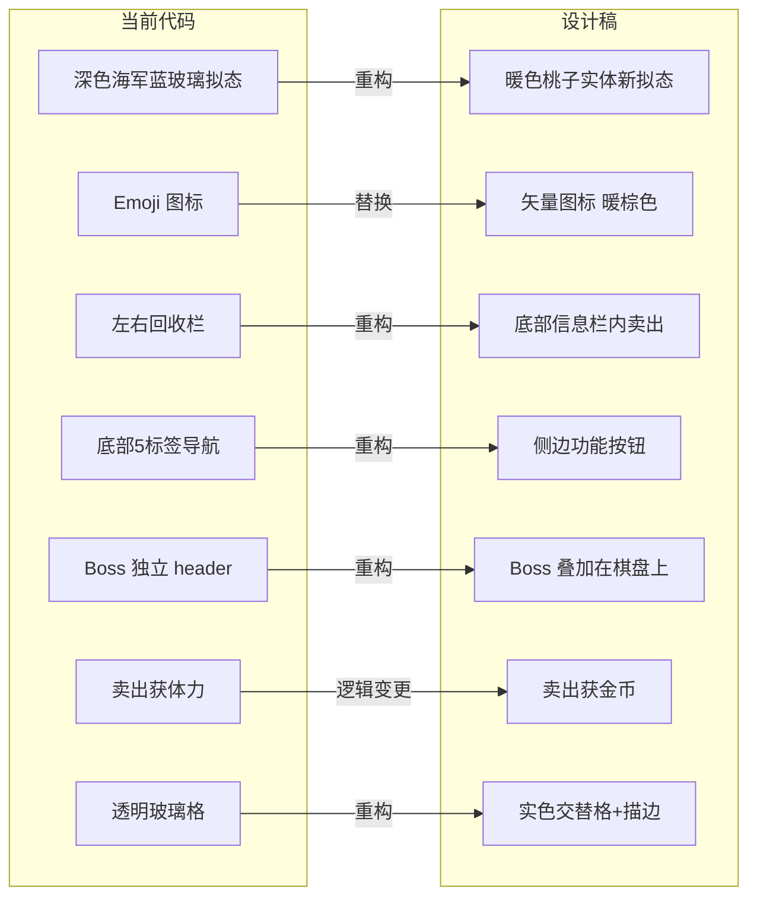
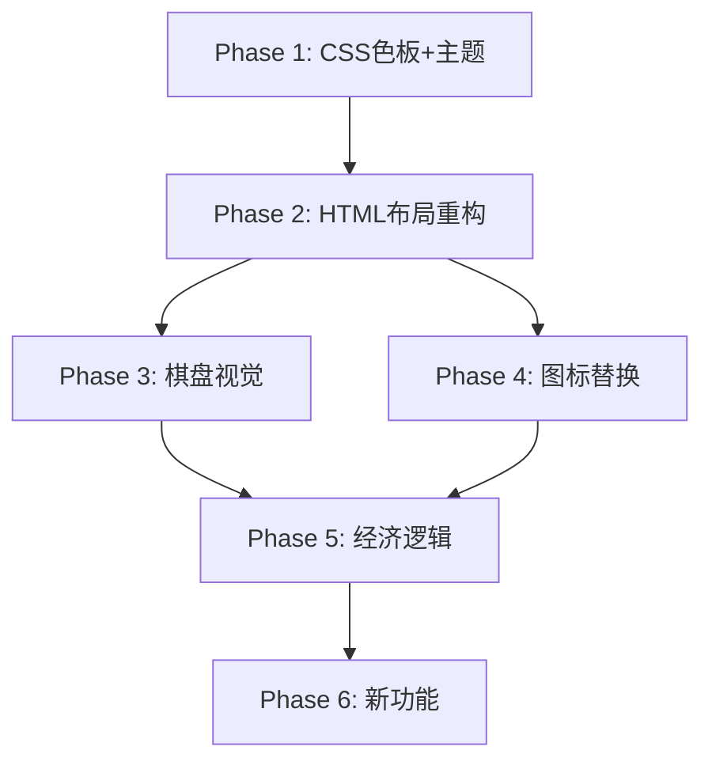

# 新 UI 设计稿完整应用方案

## 核心结论：技术栈不需要变更

当前技术栈 **vanilla HTML + CSS + JS** 完全可以实现新设计稿的所有视觉和交互要求。原因：

| 需求               | 当前技术                                   | 是否需要新框架 |
| ------------------ | ------------------------------------------ | -------------- |
| 暖色实体主题       | CSS custom properties + 渐变               | ❌ 纯 CSS      |
| 新拟态双阴影       | CSS `box-shadow` 多值                      | ❌ 纯 CSS      |
| 模糊图片背景       | CSS `backdrop-filter` + `background-image` | ❌ 纯 CSS      |
| 布局重构           | Flexbox / Grid                             | ❌ 纯 CSS      |
| SVG 图标替换 Emoji | `<svg>` 或 icon font                       | ❌ 纯 HTML/CSS |
| 经济逻辑重构       | JS class + EventBus                        | ❌ 纯 JS       |
| 卖出获金币         | CurrencyLogic 已有 `addGold`               | ❌ 纯 JS       |

**架构保留**：`EventBus` + `StateMachine` + `Logic/UI 分层` 架构不变，仅调整 UI 层和部分 Logic 层。

---

## 设计稿 vs 当前代码 差异全景



---

## 实施阶段

### Phase 1：视觉主题切换 — CSS 变量 + 色板

> 目标：将整体视觉从深色玻璃拟态切换到暖色桃子/焦糖风格

#### 1.1 替换 CSS 自定义属性色板

文件：[`css/style.css`](css/style.css:58)

| 变量                      | 当前值                   | 新值                    |
| ------------------------- | ------------------------ | ----------------------- |
| `--bg-game-start`         | `#E8F0FE`                | 模糊食物图片 + 渐变叠加 |
| `--bg-game-mid`           | `#B8D4F0`                | —                       |
| `--bg-game-end`           | `#8BB8E0`                | —                       |
| `--panel-bg`              | `rgba(255,255,255,0.12)` | `rgb(255,204,172)` 实色 |
| `--panel-border`          | `rgba(255,255,255,0.18)` | `rgb(254,218,178)`      |
| `--accent-pink`           | `#FF6B9D`                | `#F35683` 热粉          |
| `--accent-gold`           | `#FFD700`                | `#DDAA8B` 焦糖          |
| 新增 `--caramel`          | —                        | `#DDAA8B`               |
| 新增 `--peach-light`      | —                        | `#E9C3A8`               |
| 新增 `--salmon`           | —                        | `#FFCCAC`               |
| 新增 `--cream`            | —                        | `#FFE1CC`               |
| 新增 `--warm-brown`       | —                        | `#C99270`               |
| 新增 `--neumorphic-light` | —                        | `rgba(255,255,255,0.6)` |
| 新增 `--neumorphic-dark`  | —                        | `rgba(160,120,80,0.3)`  |

#### 1.2 新拟态双阴影 mixin

```css
/* 新拟态凸起效果 */
--shadow-neu-up:
  -5px -5px 10px var(--neumorphic-light), 5px 5px 10px var(--neumorphic-dark);
/* 新拟态凹陷效果 */
--shadow-neu-down:
  5px 5px 10px var(--neumorphic-light), -5px -5px 10px var(--neumorphic-dark);
```

#### 1.3 背景替换

- `#game-container` 背景：从蓝渐变 → 模糊食物图片 + 暖色渐变叠加
- 下载 Figma 中的 `Background 1` 和 `image 3` 图片资源放入 `assets/bg/`
- CSS 使用 `background-image: url()` + `backdrop-filter: blur()`

#### 1.4 面板/卡片样式

- 所有 `backdrop-filter: blur(12px)` + 半透明背景 → 实色 `rgb(255,204,172)` + 新拟态阴影
- Bottom sheet 背景：`rgb(255,225,204)` 奶油色
- 描边统一为 `rgb(221,170,139)` 焦糖色

---

### Phase 2：布局重构 — HTML + CSS

> 目标：将页面结构从当前布局改为设计稿布局

#### 2.1 移除左右回收栏

文件：[`index.html`](index.html:132)

- 删除 `#recycle-bin-left` 和 `#recycle-bin-right`
- 删除 `.grid-container` 的三栏布局
- `#game-grid` 直接全宽

#### 2.2 新增底部信息栏

```html
<!-- 替代回收栏：点击道具查看信息 + 卖出 -->
<div id="item-info-bar">
  <span id="item-info-text">点击道具，在这里查看它的信息</span>
  <button id="item-sell-btn" style="display:none">卖出</button>
</div>
```

- 尺寸：256×70，`rgb(255,225,204)` 填充，`rgb(221,170,139)` 描边，r:16
- 点击棋盘物品时显示物品信息 + 卖出按钮

#### 2.3 底部导航 → 侧边按钮

当前：5 个 emoji 标签的底部 nav
设计稿：4 个圆形新拟态按钮分布在左右两侧

```html
<!-- 左侧按钮 -->
<div class="side-buttons left">
  <button class="side-btn" data-tab="collection">🃏</button>
  <button class="side-btn" data-tab="heroine">👑</button>
</div>
<!-- 右侧按钮 -->
<div class="side-buttons right">
  <button class="side-btn" data-tab="achievement">🏆</button>
  <button class="side-btn" data-tab="collection">📖</button>
</div>
```

- 32×32，`rgb(250,245,248)` 填充，r:32，新拟态双阴影
- 图标颜色 `rgb(201,146,112)` 暖棕

#### 2.4 Boss 区域叠加在棋盘上

当前：`#boss-header` 独立区域
设计稿：Boss 立绘 + HP 条 + 计时器 浮在棋盘上方

- `#boss-header` 改为 `position: absolute`，叠加在 `#game-grid` 上方
- 角色立绘 143×143，r:12
- HP 条：白色轨道 `rgb(245,245,250)`，粉色填充 `rgb(243,86,131)`，r:13
- 名字徽章：紫色药丸 `rgb(163,140,204)`

#### 2.5 顶部状态栏重构

当前：能量条 + 金币 + 钻石文字
设计稿：头像按钮 + 128k标签 + ⚡圆形按钮 + 数值 + 💎圆形按钮 + 数值 + 绿色+按钮 + Rank

- 头像按钮：43×43，`rgb(245,245,250)` 填充，`rgb(221,170,139)` 描边，r:32
- ⚡/💎 按钮：32×32 圆形新拟态
- 绿色+按钮：16×16，`rgb(91,173,125)` 填充，白色描边
- 金币格式化：100/1k/2m/2b

---

### Phase 3：棋盘网格视觉重构

> 目标：棋盘从透明玻璃格变为实色交替格+描边

文件：[`css/style.css`](css/style.css) 棋盘相关部分

| 元素     | 当前     | 设计稿                                                                        |
| -------- | -------- | ----------------------------------------------------------------------------- |
| 外框     | 透明     | `rgb(255,204,172)` 填充，`rgb(254,218,178)` 描边，r:12，gap:10，pad:15/15/8/8 |
| 内网格   | 透明     | `rgb(221,170,139)` 填充，`rgb(227,176,132)` 描边，r:6，gap:1                  |
| 单元格   | 透明玻璃 | 交替色 `rgb(233,195,168)` / `rgb(221,170,139)`，描边 `rgb(255,211,180)`       |
| 高亮格   | 无       | `rgb(255,161,202)` 粉色                                                       |
| 合成徽章 | 无       | 绿色✓ `rgb(91,173,125)` 21×21 + 白色✓ 14×14                                   |
| 物品计数 | 无       | `rgb(221,170,139)` 背景 r:8，白色文字 x32                                     |

---

### Phase 4：图标系统替换

> 目标：Emoji 图标 → SVG 矢量图标，暖棕色

需要替换的图标清单：

| 当前 Emoji | 用途   | 新图标    |
| ---------- | ------ | --------- |
| 💰         | 金币   | 金币 SVG  |
| 💎         | 钻石   | 钻石 SVG  |
| ⚡         | 能量   | 闪电 SVG  |
| ♻️         | 回收   | 删除/移除 |
| 🎒         | 背包   | 背包 SVG  |
| 👑         | 养成   | 皇冠 SVG  |
| 🎁         | 扭蛋   | 礼物 SVG  |
| 📖         | 图鉴   | 书本 SVG  |
| 🏆         | 成就   | 奖杯 SVG  |
| 🃏         | 扑克牌 | 卡牌 SVG  |

方案：使用内联 SVG 或引入 Lucide/Tabler Icons 图标库（CDN），颜色统一 `rgb(201,146,112)`

---

### Phase 5：经济逻辑重构

> 目标：实现设计稿标注的新经济循环

#### 5.1 卖出获金币（非体力）

文件：[`js/board.js`](js/board.js:274) `handleRecycle` 方法

```
当前：drag to recycle bin → recover energy
新：click item → info bar shows → click sell → add gold
```

- 新增 `sellItemForGold(index)` 方法
- 金币数量 = 基于 item level 的金币价值表（类似现有 `RECYCLE_ENERGY_TABLE`）
- 移除 `handleRecycle` 中的 `energy.recover()`，改为 `currency.addGold()`

#### 5.2 新经济循环

```
体力 → 制造棋子 → 卖出获金币 → 金币推进剧情 → 钻石买体力
```

- 钻石购买体力：在能量+按钮点击时触发
- 金币推进剧情：Boss 击败奖励金币，剧情解锁消耗金币

#### 5.3 +按钮 = 广告

- 能量/钻石旁的绿色+按钮 → 点击观看广告获得资源
- 每日限 3 次

#### 5.4 金币格式化

```js
function formatGold(n) {
  if (n >= 1e9) return (n / 1e9).toFixed(1) + "b";
  if (n >= 1e6) return (n / 1e6).toFixed(1) + "m";
  if (n >= 1e3) return (n / 1e3).toFixed(1) + "k";
  return String(n);
}
```

#### 5.5 体力回复时间显示

- 在能量区域显示下次回复倒计时

#### 5.6 完成订单视觉

- 棋盘内已完成订单项显示选中色 + 对号
- 自动变为 `rgb(255,161,202)` 粉色高亮

---

### Phase 6：新功能实现

| 功能             | 说明                              | 涉及文件                                     |
| ---------------- | --------------------------------- | -------------------------------------------- |
| 底部信息栏       | 点击道具显示信息+卖出             | `index.html`, `css/style.css`, `js/board.js` |
| 商店独立         | 从 heroine sheet 分离为独立 sheet | `index.html`, `js/heroine.js`, `js/main.js`  |
| 日常订单NPC剪影  | 路人甲剪影立绘                    | `js/daily-orders.js`, `assets/avatar/`       |
| 每日 Buff        | 每日随机增益                      | 新文件 `js/daily-buff.js`                    |
| 钻石解锁仓库栏位 | 扩展背包容量                      | `js/inventory.js`                            |
| 剧情奖励         | 通关剧情获得奖励                  | `js/boss.js`, `js/logic/BossLogic.js`        |
| 体力瓶           | 道具：使用恢复体力                | `js/inventory.js`                            |
| 图鉴完成奖励     | 收集满一套给奖励                  | `js/collection.js`                           |
| 成就奖励多样化   | 不只钻石，也给体力                | `js/achievements.js`                         |

---

## 文件影响矩阵

| 文件                                               | 改动级别                   | Phase   |
| -------------------------------------------------- | -------------------------- | ------- |
| [`css/style.css`](css/style.css)                   | 🔴 重写色板+棋盘+面板+按钮 | 1, 2, 3 |
| [`index.html`](index.html)                         | 🔴 布局重构                | 2       |
| [`js/board.js`](js/board.js)                       | 🔴 卖出逻辑+信息栏         | 5       |
| [`js/main.js`](js/main.js)                         | 🟡 导航重构+商店独立       | 2, 6    |
| [`js/boss.js`](js/boss.js)                         | 🟡 Boss叠加布局            | 2       |
| [`js/currency.js`](js/currency.js)                 | 🟡 金币格式化              | 5       |
| [`js/energy.js`](js/energy.js)                     | 🟡 +按钮广告+回复时间      | 5       |
| [`js/heroine.js`](js/heroine.js)                   | 🟡 商店分离                | 6       |
| [`js/daily-orders.js`](js/daily-orders.js)         | 🟢 NPC剪影                 | 6       |
| [`js/collection.js`](js/collection.js)             | 🟢 完成奖励                | 6       |
| [`js/achievements.js`](js/achievements.js)         | 🟢 奖励多样化              | 6       |
| [`js/inventory.js`](js/inventory.js)               | 🟢 钻石解锁栏位            | 6       |
| [`assets/i18n/zh-CN.json`](assets/i18n/zh-CN.json) | 🟡 新文案                  | 2, 5, 6 |
| [`assets/i18n/en.json`](assets/i18n/en.json)       | 🟡 新文案                  | 2, 5, 6 |
| `assets/bg/*`                                      | 🆕 新背景图片              | 1       |
| `assets/icons/*`                                   | 🆕 SVG图标                 | 4       |

---

## 实施顺序建议



**Phase 1→2→3** 是视觉主线，先做可以看到效果。
**Phase 4** 可与 Phase 2/3 并行。
**Phase 5** 依赖布局完成后才能接入新的卖出交互。
**Phase 6** 是增量功能，最后实现。
