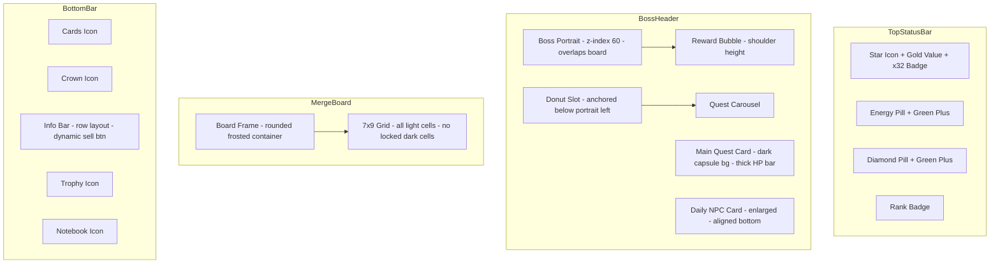
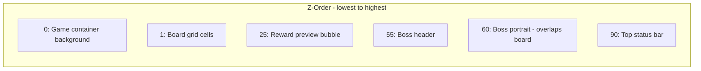

# UI Z-Index & Layout Correction Plan

## Overview

Five critical areas need correction to match the target Figma design: character layering, order area bubbles, top status bar, merge board container, and bottom operation area. The changes span [`css/style.css`](css/style.css), [`index.html`](index.html), and minor JS tweaks in [`js/boss.js`](js/boss.js), [`js/daily-orders.js`](js/daily-orders.js), and [`js/board.js`](js/board.js).

---

## 1. Character Portrait Z-Index & Position

### Current State

- [`#boss-portrait`](css/style.css:3399) is `position: absolute; left: -2cqw; bottom: -12cqw; z-index: 10` — it overlaps the grid but is clipped by parent overflow and visually feels buried under the board
- [`#standalone-donut-slot`](css/style.css:3671) sits inside `#boss-header` as a sibling of the portrait, floating into the top status bar area
- Portrait dimensions: `36cqw × 48cqw` — too far left and too small

### Changes

#### CSS — [`css/style.css`](css/style.css)

| Selector          | Property   | Current   | Target                                                        |
| ----------------- | ---------- | --------- | ------------------------------------------------------------- |
| `#boss-portrait`  | `z-index`  | `10`      | `60` — above board grid z:1 AND boss-header z:55              |
| `#boss-portrait`  | `left`     | `-2cqw`   | `3cqw` — shift right so body clears left edge                 |
| `#boss-portrait`  | `bottom`   | `-12cqw`  | `-8cqw` — shift up slightly so character stands on board edge |
| `#boss-portrait`  | `width`    | `36cqw`   | `38cqw` — slightly larger for presence                        |
| `#boss-portrait`  | `height`   | `48cqw`   | `52cqw` — taller to cover board top edge                      |
| `#boss-portrait`  | `overflow` | `visible` | `visible` — keep, ensure no clip                              |
| `#boss-header`    | `overflow` | `visible` | `visible` — keep, ensure portrait not clipped                 |
| `.grid-container` | `overflow` | `visible` | `visible` — ensure portrait can bleed into grid area          |

#### CSS — Donut Slot Relocation

Move `#standalone-donut-slot` from its current position inside `#boss-header` to be anchored at the left side of the quest row, below the portrait:

| Selector                 | Property  | Current                   | Target                                                                                         |
| ------------------------ | --------- | ------------------------- | ---------------------------------------------------------------------------------------------- |
| `#standalone-donut-slot` | position  | flex child in boss-header | `position: absolute; left: 1cqw; top: 40cqw` — anchored below portrait, left of quest carousel |
| `#standalone-donut-slot` | `z-index` | default                   | `56` — above board, below top bar                                                              |

#### HTML — [`index.html`](index.html:157)

Move the `#standalone-donut-slot` div from inside `#boss-header` to inside `.quest-row`, before `#quest-carousel`. This positions it logically next to the order cards rather than floating near the status bar.

---

## 2. Order Area & Reward Bubbles

### Current State

- [`.order-reward-preview`](css/style.css:3728) positioned at `top: 4cqw; left: 28cqw` — floats near character head/top
- [`.quest-card-body`](css/style.css:3546) uses glassmorphic `rgba(255,255,255,0.22)` — too transparent, no dark capsule
- [`.hp-bar-container`](css/style.css:3502) height `1.8cqw` — extremely thin
- [`.daily-quest-carousel-card`](css/style.css:3395) width `33cqw` — NPC cards too small
- [`.daily-npc-avatar`](css/style.css:3429) width `10cqw` — silhouette too tiny

### Changes

#### CSS — Reward Bubble Reposition

| Selector                | Property | Current | Target                                      |
| ----------------------- | -------- | ------- | ------------------------------------------- |
| `.order-reward-preview` | `top`    | `4cqw`  | `22cqw` — shoulder/chest height on portrait |
| `.order-reward-preview` | `left`   | `28cqw` | `30cqw` — right of portrait center          |

#### CSS — Capsule Background for Order Area

| Selector               | Property          | Current                              | Target                                                   |
| ---------------------- | ----------------- | ------------------------------------ | -------------------------------------------------------- |
| `.quest-card-body`     | `background`      | `rgba(255,255,255,0.22)`             | `rgba(30, 24, 38, 0.65)` — semi-transparent dark capsule |
| `.quest-card-body`     | `backdrop-filter` | `blur(10px)`                         | `blur(12px)` — slightly stronger blur                    |
| `.quest-card-body`     | `border`          | `1.2px solid rgba(255,255,255,0.32)` | `1px solid rgba(255,255,255,0.15)` — subtler border      |
| `.daily-carousel-body` | same as above     | same                                 | same changes                                             |

#### CSS — HP Bar Thickness

| Selector            | Property     | Current                                    | Target                                                           |
| ------------------- | ------------ | ------------------------------------------ | ---------------------------------------------------------------- |
| `.hp-bar-container` | `height`     | `1.8cqw`                                   | `3.5cqw` — thick pink progress bar                               |
| `#hp-bar-fill`      | `background` | `linear-gradient(90deg, #ff6584, #ff3c60)` | keep, but add `box-shadow: 0 0 6px rgba(255,60,96,0.4)` for glow |

#### CSS — Enlarge NPC Cards & Silhouettes

| Selector                     | Property       | Current | Target                                 |
| ---------------------------- | -------------- | ------- | -------------------------------------- |
| `.daily-quest-carousel-card` | `width`        | `33cqw` | `38cqw` — match main quest card height |
| `.daily-npc-avatar`          | `width`        | `10cqw` | `14cqw` — larger silhouette            |
| `.daily-npc-avatar`          | `height`       | `100%`  | `14cqw` — explicit height to match     |
| `.daily-npc-avatar svg`      | `width/height` | `6cqw`  | `8cqw` — larger icon inside            |

#### CSS — Align NPC Cards Horizontally

| Selector                                  | Property      | Current  | Target                           |
| ----------------------------------------- | ------------- | -------- | -------------------------------- |
| `#quest-carousel`                         | `align-items` | `center` | `flex-end` — align card bottoms  |
| `.quest-card, .daily-quest-carousel-card` | `min-height`  | none     | `22cqw` — unified minimum height |

---

## 3. Top Status Bar

### Current State

- [`#top-status-bar`](css/style.css:2975) uses `.top-bar-pill` with `background: #f5f5fa` and neumorphic shadows — looks like bulky white clouds
- [`#gold-label`](css/style.css:3055) / [`.composite-gold-pill`](css/style.css:3773) has a double-line layout with coin icon + value + multiplier — deviates from target star icon + value design
- Left side has both gold pill and energy pill, creating clutter

### Changes

#### CSS — Remove Bulky Pill Backgrounds

| Selector        | Property     | Current                  | Target                                        |
| --------------- | ------------ | ------------------------ | --------------------------------------------- |
| `.top-bar-pill` | `background` | `#f5f5fa`                | `rgba(255,255,255,0.35)` — light transparent  |
| `.top-bar-pill` | `box-shadow` | neumorphic double shadow | `0 1px 4px rgba(0,0,0,0.08)` — minimal shadow |
| `.top-bar-pill` | `height`     | `8.5cqw`                 | `7cqw` — more compact                         |
| `.top-bar-pill` | `padding`    | `0 2cqw`                 | `0 1.5cqw` — tighter                          |

#### CSS — Rebuild Left-Top Component

Replace the composite gold pill with a compact star-icon + value + multiplier capsule matching the target design:

| Selector                   | Property        | Current                           | Target                                |
| -------------------------- | --------------- | --------------------------------- | ------------------------------------- |
| `.composite-gold-pill`     | `background`    | `rgba(255,255,255,0.25)`          | `var(--caramel)` — solid warm capsule |
| `.composite-gold-pill`     | `border`        | `1px solid rgba(255,255,255,0.4)` | `none`                                |
| `.composite-gold-pill`     | `border-radius` | `3cqw`                            | `99px` — full pill shape              |
| `.composite-gold-pill`     | `min-height`    | `8.5cqw`                          | `7cqw`                                |
| `.composite-gold-icon svg` | stroke          | `var(--caramel)`                  | `#fff` — white icon on caramel bg     |
| `#gold-value`              | `color`         | `var(--caramel)`                  | `#fff` — white text on caramel bg     |
| `.gold-multiplier-badge`   | keep            | —                                 | stays as red badge on the pill        |

#### HTML — [`index.html`](index.html:79)

Change the Lucide icon inside `.composite-gold-icon` from `coins` to `star` to match the target star icon design:

```html
<div class="composite-gold-icon">
  <i data-lucide="star"></i>
  <!-- was "coins" -->
</div>
```

#### CSS — Energy & Diamond Pills: Compact Capsule with Green Plus

| Selector           | Property     | Current   | Target                                 |
| ------------------ | ------------ | --------- | -------------------------------------- |
| `#energy-pill`     | `background` | `#f5f5fa` | `rgba(255,255,255,0.35)` — transparent |
| `#diamond-pill`    | `background` | `#f5f5fa` | `rgba(255,255,255,0.35)` — transparent |
| `.plus-btn`        | `background` | `#5bad7d` | keep green — already matches target    |
| `.status-icon-btn` | `background` | `#f5f5fa` | `rgba(255,255,255,0.35)` — match pills |

---

## 4. Merge Board

### Current State

- [`.grid-cell.locked`](css/style.css:713) renders dark `rgba(0,0,0,0.25)` cells with dashed border — still visible
- [`.board-frame`](css/style.css:3157) has `background: transparent; border: none; border-radius: 0; box-shadow: none` — no unified container
- Locked cells are generated in [`js/board.js`](js/board.js:47) via `this.locked.has(i)` check

### Changes

#### JS — Remove Locked Cells from Rendering

In [`js/board.js`](js/board.js:35) `buildGrid()` method:

- Remove the line `if (this.locked.has(i)) cell.classList.add('locked');`
- In `renderCell()`, remove the locked class check: `if (this.locked.has(index)) { cellEl.classList.add('locked'); return; }`
- Keep the `this.locked` Set in logic for game state, but do NOT render locked cells visually — all cells render as normal alternating-color cells

#### CSS — Add Unified Board Container

| Selector              | Property          | Current       | Target                                                |
| --------------------- | ----------------- | ------------- | ----------------------------------------------------- |
| `.board-frame`        | `background`      | `transparent` | `rgba(255, 255, 255, 0.25)` — light frosted container |
| `.board-frame`        | `border`          | `none`        | `1.5px solid rgba(255,255,255,0.4)` — subtle border   |
| `.board-frame`        | `border-radius`   | `0`           | `3cqw` — large rounded corners                        |
| `.board-frame`        | `box-shadow`      | `none`        | `0 4px 20px rgba(0,0,0,0.08)` — soft drop shadow      |
| `.board-frame`        | `padding`         | `0`           | `1cqw` — slight inner padding                         |
| `.board-frame`        | `backdrop-filter` | none          | `blur(8px)` — frosted glass effect                    |
| `.board-frame::after` | `display`         | `none`        | keep `none` — no overlay needed                       |

#### CSS — Remove Locked Cell Styles

| Selector                         | Change                                                    |
| -------------------------------- | --------------------------------------------------------- |
| `.grid-cell.locked`              | Remove entire rule block or set `display: none` as safety |
| `.grid-cell.locked::after`       | Remove                                                    |
| `.grid-cell.locked:hover::after` | Remove                                                    |
| `.grid-cell.locked:hover`        | Remove                                                    |

#### CSS — Ensure All Cells Are Light Colored

| Selector              | Property     | Current                      | Target                       |
| --------------------- | ------------ | ---------------------------- | ---------------------------- |
| `.grid-cell`          | `background` | `var(--cell-bg)` #E9C3A8     | keep — light peach           |
| `.grid-cell.cell-alt` | `background` | `var(--cell-bg-alt)` #DDAA8B | keep — slightly darker peach |
| `--locked-bg`         | value        | `rgba(0,0,0,0.25)`           | Remove usage entirely        |

---

## 5. Bottom Operation Area

### Current State

- Bottom bar buttons use Lucide icons: `badge` gacha, `crown` heroine, `book-open` collection, `trophy` achievement
- Target design uses: card, crown, trophy, notebook
- [`#item-sell-btn`](css/style.css:3854) is already conditionally shown via `#item-info-bar.has-item`, but the info bar layout feels crowded when sell button appears

### Changes

#### HTML — Replace Bottom Bar Icons

In [`index.html`](index.html:209-241), update the Lucide icon names:

| Button             | Current Icon | Target Icon                      |
| ------------------ | ------------ | -------------------------------- |
| Gacha / 扭蛋       | `badge`      | `cards` — card deck icon         |
| Heroine / 养成     | `crown`      | `crown` — keep, already matches  |
| Collection / 图鉴  | `book-open`  | `notebook-pen` — notebook icon   |
| Achievement / 成就 | `trophy`     | `trophy` — keep, already matches |

Only two icons need changing: `badge` → `cards`, `book-open` → `notebook-pen`.

#### CSS — Optimize Info Bar Layout for Dynamic Sell Button

| Selector          | Property         | Current     | Target                                          |
| ----------------- | ---------------- | ----------- | ----------------------------------------------- |
| `#item-info-bar`  | `flex-direction` | `column`    | `row` — horizontal layout when sell btn visible |
| `#item-info-bar`  | `align-items`    | `center`    | `center`                                        |
| `#item-info-bar`  | `gap`            | none        | `1cqw` — space between text and button          |
| `#item-sell-btn`  | `margin-top`     | `1cqw`      | `0` — no extra margin in row layout             |
| `#item-sell-btn`  | `padding`        | `1cqw 3cqw` | `0.5cqw 2cqw` — more compact                    |
| `#item-info-text` | `font-size`      | `3cqw`      | `2.6cqw` — slightly smaller to fit row          |

#### CSS — Sell Button Animation

Add a subtle slide-in when the sell button appears:

```css
#item-sell-btn {
  transition:
    transform 0.2s ease,
    opacity 0.2s ease;
}
#item-info-bar:not(.has-item) #item-sell-btn {
  transform: translateX(10px);
  opacity: 0;
}
```

---

## File Change Summary

| File                                       | Changes                                                                |
| ------------------------------------------ | ---------------------------------------------------------------------- |
| [`css/style.css`](css/style.css)           | All 5 areas — Z-index, positions, backgrounds, borders, shadows, sizes |
| [`index.html`](index.html)                 | Move donut slot, change gold icon to star, change bottom bar icons     |
| [`js/board.js`](js/board.js)               | Remove locked cell rendering in `buildGrid()` and `renderCell()`       |
| [`js/boss.js`](js/boss.js)                 | No changes needed — reward preview positioning is CSS-driven           |
| [`js/daily-orders.js`](js/daily-orders.js) | No changes needed — card sizing is CSS-driven                          |

---

## Architecture Diagram



## Z-Index Stack


