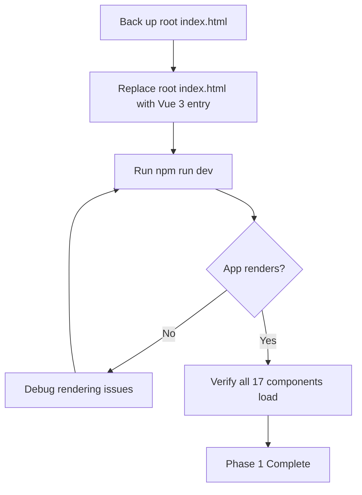

# Vue 3 Migration Architecture Assessment Report

**Project:** Merge Demo Game  
**Date:** 2026-06-04  
**Assessor:** Architecture Audit  
**Status:** ⚠️ Partially Migrated — Vue 3 Code Complete, Not Yet Active

---

## 1. Executive Summary

The Vue 3 migration has reached a **code-ready but not activated** state. All Vue 3 artifacts — 17 components, 20 Pinia stores, 9 composables, and 6 core logic modules — are fully written using modern Composition API patterns with zero Vue 2 remnants. The build toolchain (Vite 5, TypeScript 5, vue-tsc 2) is correctly configured. However, the **legacy vanilla JS application remains the active runtime**: the root [`index.html`](index.html) loads 33 `<script>` tags into a 715-line monolithic HTML file, while the Vue 3 entry at [`public/index.html`](public/index.html) sits dormant. The CSS system remains dual-tracked with a 5,370-line legacy stylesheet still governing the UI. Four legacy modules lack Vue 3 equivalents, and the cutover from legacy to Vue 3 has not been performed. **The migration is approximately 68% complete by weighted score — all new code is written, but activation, CSS consolidation, and legacy removal remain.**

---

## 2. Migration Completion Score

### Overall: 68%

| Category            | Weight   | Score | Weighted  | Status |
| ------------------- | -------- | ----- | --------- | ------ |
| Build Configuration | 10%      | 100%  | 10.0%     | ✅     |
| Entry Points        | 15%      | 30%   | 4.5%      | ⚠️     |
| Components          | 20%      | 100%  | 20.0%     | ✅     |
| Stores              | 15%      | 100%  | 15.0%     | ✅     |
| Composables         | 5%       | 100%  | 5.0%      | ✅     |
| Core / Logic        | 10%      | 95%   | 9.5%      | ✅     |
| Legacy Code Removal | 15%      | 10%   | 1.5%      | ❌     |
| CSS Migration       | 10%      | 25%   | 2.5%      | ⚠️     |
| **Total**           | **100%** | —     | **68.0%** | **⚠️** |

### Score Justification

- **Build Configuration (100%):** Vite 5 + Vue 3 plugin + TypeScript + Pinia — fully configured, no webpack/vue-cli remnants.
- **Entry Points (30%):** Vue 3 entry at [`public/index.html`](public/index.html) and [`src/main.ts`](src/main.ts:1) exist and are correct, but the **active** entry is the legacy [`index.html`](index.html) at the project root. The switch has not been performed.
- **Components (100%):** All 17 components use `<script setup lang="ts">` with Composition API. Zero Vue 2 patterns detected.
- **Stores (100%):** All 20 stores use Pinia `defineStore` with setup syntax (`ref()`/`computed()`). No Vuex, no `Vue.set`/`Vue.delete`.
- **Composables (100%):** All 9 composables follow Vue 3 Composition API conventions.
- **Core/Logic (95%):** All 6 logic modules ported to TypeScript. Minor gap: `vn-reader.js` has no `src/` equivalent.
- **Legacy Code Removal (10%):** Vue 3 equivalents exist for 29 of 33 legacy files, but the legacy app is still the **running** application. No legacy files have been removed or deactivated.
- **CSS Migration (25%):** Vue 3 styles exist in [`src/styles/`](src/styles/) and all components use `<style scoped>`, but the legacy [`css/style.css`](css/style.css) (5,370 lines) remains the active stylesheet. No consolidation has been performed.

---

## 3. Category-by-Category Assessment

### 3.1 Build Configuration ✅

| Item                               | Status | Details                                                                     |
| ---------------------------------- | ------ | --------------------------------------------------------------------------- |
| [`package.json`](package.json)     | ✅     | Vue `^3.4.21`, Pinia `^2.1.7`, Vite `^5.2.0`, `@vitejs/plugin-vue` `^5.0.4` |
| [`vite.config.ts`](vite.config.ts) | ✅     | Vue plugin, `@` alias → `src/`, port 3000, outDir `dist`                    |
| [`tsconfig.json`](tsconfig.json)   | ✅     | Strict mode, ES2020 target, bundler module resolution, `@/*` path alias     |
| [`src/env.d.ts`](src/env.d.ts)     | ✅     | Proper `*.vue` module type declarations                                     |
| Vue 2 dependencies                 | ✅     | None — no Vuex, no vue-cli, no webpack remnants                             |

**Verdict:** Fully Vue 3 compliant. No action needed.

---

### 3.2 Entry Points ⚠️ CRITICAL

| Item                                     | Status | Details                                                                                                    |
| ---------------------------------------- | ------ | ---------------------------------------------------------------------------------------------------------- |
| [`index.html`](index.html) — root        | ❌     | **ACTIVE entry.** 715-line monolithic HTML with all DOM templates + 33 `<script>` tags loading `js/` files |
| [`public/index.html`](public/index.html) | ✅     | Vue 3 entry — `<div id="app">` + `<script type="module" src="/src/main.ts">` — exists but **NOT active**   |
| [`src/main.ts`](src/main.ts)             | ✅     | `createApp(App)` + `createPinia()`, global styles imported                                                 |
| [`src/App.vue`](src/App.vue)             | ✅     | `<script setup lang="ts">`, renders `<GameView />`                                                         |

**Verdict:** The Vue 3 application is fully wired but **not running**. The legacy vanilla JS app is what the browser loads. This is the single most critical blocker.

---

### 3.3 Components ✅

All 17 components use `<script setup lang="ts">` with Composition API. Zero Vue 2 patterns.

| Category | Components                                                                                                                                                                                                                                                                                                                                                                                                                                                                                                                                                   | Status |
| -------- | ------------------------------------------------------------------------------------------------------------------------------------------------------------------------------------------------------------------------------------------------------------------------------------------------------------------------------------------------------------------------------------------------------------------------------------------------------------------------------------------------------------------------------------------------------------ | ------ |
| Board    | [`BoardGrid`](src/components/board/BoardGrid.vue), [`BoardItem`](src/components/board/BoardItem.vue), [`BossHeader`](src/components/board/BossHeader.vue), [`DailyOrderCard`](src/components/board/DailyOrderCard.vue), [`GridCell`](src/components/board/GridCell.vue), [`MainQuestCard`](src/components/board/MainQuestCard.vue)                                                                                                                                                                                                                           | ✅     |
| Overlays | [`DialogueOverlay`](src/components/overlays/DialogueOverlay.vue), [`GameCompleteOverlay`](src/components/overlays/GameCompleteOverlay.vue), [`LoopSummaryOverlay`](src/components/overlays/LoopSummaryOverlay.vue), [`ParadeOverlay`](src/components/overlays/ParadeOverlay.vue)                                                                                                                                                                                                                                                                             | ✅     |
| Sheets   | [`BaseBottomSheet`](src/components/sheets/BaseBottomSheet.vue), [`InventorySheet`](src/components/sheets/InventorySheet.vue), [`HeroineSheet`](src/components/sheets/HeroineSheet.vue), [`GachaSheet`](src/components/sheets/GachaSheet.vue), [`CollectionSheet`](src/components/sheets/CollectionSheet.vue), [`DailyOrderSheet`](src/components/sheets/DailyOrderSheet.vue), [`AchievementSheet`](src/components/sheets/AchievementSheet.vue), [`CGAlbumSheet`](src/components/sheets/CGAlbumSheet.vue), [`ShopSheet`](src/components/sheets/ShopSheet.vue) | ✅     |
| Common   | [`ParticleLayer`](src/components/common/ParticleLayer.vue), [`ToastRoot`](src/components/common/ToastRoot.vue)                                                                                                                                                                                                                                                                                                                                                                                                                                               | ✅     |
| View     | [`GameView`](src/components/view/GameView.vue)                                                                                                                                                                                                                                                                                                                                                                                                                                                                                                               | ✅     |

**Patterns verified absent:** Options API, `this.$emit`, `beforeDestroy`/`destroyed`, `$listeners`/`$children`, filters, `Vue.set`/`Vue.delete`.

**Verdict:** Complete. No migration debt in components.

---

### 3.4 Stores ✅

All 20 stores use Pinia `defineStore('name', () => {...})` setup syntax with `ref()`/`computed()`.

| Store       | File                                                    | Status |
| ----------- | ------------------------------------------------------- | ------ |
| config      | [`configStore.ts`](src/stores/configStore.ts)           | ✅     |
| i18n        | [`i18nStore.ts`](src/stores/i18nStore.ts)               | ✅     |
| board       | [`boardStore.ts`](src/stores/boardStore.ts)             | ✅     |
| boss        | [`bossStore.ts`](src/stores/bossStore.ts)               | ✅     |
| energy      | [`energyStore.ts`](src/stores/energyStore.ts)           | ✅     |
| currency    | [`currencyStore.ts`](src/stores/currencyStore.ts)       | ✅     |
| dialogue    | [`dialogueStore.ts`](src/stores/dialogueStore.ts)       | ✅     |
| dailyOrder  | [`dailyOrderStore.ts`](src/stores/dailyOrderStore.ts)   | ✅     |
| heroine     | [`heroineStore.ts`](src/stores/heroineStore.ts)         | ✅     |
| collection  | [`collectionStore.ts`](src/stores/collectionStore.ts)   | ✅     |
| achievement | [`achievementStore.ts`](src/stores/achievementStore.ts) | ✅     |
| inventory   | [`inventoryStore.ts`](src/stores/inventoryStore.ts)     | ✅     |
| gacha       | [`gachaStore.ts`](src/stores/gachaStore.ts)             | ✅     |
| fragment    | [`fragmentStore.ts`](src/stores/fragmentStore.ts)       | ✅     |
| cgAlbum     | [`cgAlbumStore.ts`](src/stores/cgAlbumStore.ts)         | ✅     |
| loop        | [`loopStore.ts`](src/stores/loopStore.ts)               | ✅     |
| ad          | [`adStore.ts`](src/stores/adStore.ts)                   | ✅     |
| dailyBuff   | [`dailyBuffStore.ts`](src/stores/dailyBuffStore.ts)     | ✅     |
| save        | [`saveStore.ts`](src/stores/saveStore.ts)               | ✅     |

**Verdict:** Complete. No Vuex, no `Vue.set`/`Vue.delete`, no Options-style stores.

---

### 3.5 Composables ✅

All 9 composables follow Vue 3 Composition API conventions.

| Composable      | File                                                       | Status |
| --------------- | ---------------------------------------------------------- | ------ |
| useAudio        | [`useAudio.ts`](src/composables/useAudio.ts)               | ✅     |
| useAutoSave     | [`useAutoSave.ts`](src/composables/useAutoSave.ts)         | ✅     |
| useDrag         | [`useDrag.ts`](src/composables/useDrag.ts)                 | ✅     |
| useEffects      | [`useEffects.ts`](src/composables/useEffects.ts)           | ✅     |
| useEventBus     | [`useEventBus.ts`](src/composables/useEventBus.ts)         | ✅     |
| useGameInit     | [`useGameInit.ts`](src/composables/useGameInit.ts)         | ✅     |
| useGameLoop     | [`useGameLoop.ts`](src/composables/useGameLoop.ts)         | ✅     |
| useSheet        | [`useSheet.ts`](src/composables/useSheet.ts)               | ✅     |
| useStateMachine | [`useStateMachine.ts`](src/composables/useStateMachine.ts) | ✅     |

**Verdict:** Complete. No migration debt in composables.

---

### 3.6 Core / Logic ✅

All 6 core/logic modules ported to TypeScript. Framework-agnostic pure logic.

| Module        | File                                             | Status |
| ------------- | ------------------------------------------------ | ------ |
| EventBus      | [`EventBus.ts`](src/core/EventBus.ts)            | ✅     |
| StateMachine  | [`StateMachine.ts`](src/core/StateMachine.ts)    | ✅     |
| BoardLogic    | [`BoardLogic.ts`](src/logic/BoardLogic.ts)       | ✅     |
| BossLogic     | [`BossLogic.ts`](src/logic/BossLogic.ts)         | ✅     |
| EnergyLogic   | [`EnergyLogic.ts`](src/logic/EnergyLogic.ts)     | ✅     |
| CurrencyLogic | [`CurrencyLogic.ts`](src/logic/CurrencyLogic.ts) | ✅     |
| GachaLogic    | [`GachaLogic.ts`](src/logic/GachaLogic.ts)       | ✅     |

**Verdict:** Complete. All logic is TypeScript, framework-agnostic, and testable.

---

### 3.7 Legacy Code ❌

The legacy vanilla JS application is **still the active runtime**. 33 `<script>` tags in [`index.html`](index.html) load files from the `js/` directory.

| Legacy File                 | Vue 3 Equivalent                                                   | Migration Status |
| --------------------------- | ------------------------------------------------------------------ | ---------------- |
| `js/i18n.js`                | [`i18nStore.ts`](src/stores/i18nStore.ts)                          | ✅ Migrated      |
| `js/config.js`              | [`configStore.ts`](src/stores/configStore.ts)                      | ✅ Migrated      |
| `js/core/EventBus.js`       | [`EventBus.ts`](src/core/EventBus.ts)                              | ✅ Migrated      |
| `js/core/StateMachine.js`   | [`StateMachine.ts`](src/core/StateMachine.ts)                      | ✅ Migrated      |
| `js/logic/CurrencyLogic.js` | [`CurrencyLogic.ts`](src/logic/CurrencyLogic.ts)                   | ✅ Migrated      |
| `js/logic/EnergyLogic.js`   | [`EnergyLogic.ts`](src/logic/EnergyLogic.ts)                       | ✅ Migrated      |
| `js/logic/BossLogic.js`     | [`BossLogic.ts`](src/logic/BossLogic.ts)                           | ✅ Migrated      |
| `js/logic/BoardLogic.js`    | [`BoardLogic.ts`](src/logic/BoardLogic.ts)                         | ✅ Migrated      |
| `js/logic/GachaLogic.js`    | [`GachaLogic.ts`](src/logic/GachaLogic.ts)                         | ✅ Migrated      |
| `js/ui/EnergyUI.js`         | Absorbed into Vue components                                       | ✅ Absorbed      |
| `js/ui/CurrencyUI.js`       | Absorbed into Vue components                                       | ✅ Absorbed      |
| `js/ui/ConfirmDialog.js`    | [`BaseBottomSheet.vue`](src/components/sheets/BaseBottomSheet.vue) | ✅ Absorbed      |
| `js/effects.js`             | [`useEffects.ts`](src/composables/useEffects.ts)                   | ✅ Migrated      |
| `js/audio.js`               | [`useAudio.ts`](src/composables/useAudio.ts)                       | ✅ Migrated      |
| `js/currency.js`            | [`currencyStore.ts`](src/stores/currencyStore.ts)                  | ✅ Migrated      |
| `js/dialogue.js`            | [`dialogueStore.ts`](src/stores/dialogueStore.ts)                  | ✅ Migrated      |
| `js/board.js`               | [`boardStore.ts`](src/stores/boardStore.ts)                        | ✅ Migrated      |
| `js/boss.js`                | [`bossStore.ts`](src/stores/bossStore.ts)                          | ✅ Migrated      |
| `js/daily-orders.js`        | [`dailyOrderStore.ts`](src/stores/dailyOrderStore.ts)              | ✅ Migrated      |
| `js/heroine.js`             | [`heroineStore.ts`](src/stores/heroineStore.ts)                    | ✅ Migrated      |
| `js/collection.js`          | [`collectionStore.ts`](src/stores/collectionStore.ts)              | ✅ Migrated      |
| `js/achievements.js`        | [`achievementStore.ts`](src/stores/achievementStore.ts)            | ✅ Migrated      |
| `js/inventory.js`           | [`inventoryStore.ts`](src/stores/inventoryStore.ts)                | ✅ Migrated      |
| `js/gacha.js`               | [`gachaStore.ts`](src/stores/gachaStore.ts)                        | ✅ Migrated      |
| `js/fragment.js`            | [`fragmentStore.ts`](src/stores/fragmentStore.ts)                  | ✅ Migrated      |
| `js/cg-album.js`            | [`cgAlbumStore.ts`](src/stores/cgAlbumStore.ts)                    | ✅ Migrated      |
| `js/loop.js`                | [`loopStore.ts`](src/stores/loopStore.ts)                          | ✅ Migrated      |
| `js/ad.js`                  | [`adStore.ts`](src/stores/adStore.ts)                              | ✅ Migrated      |
| `js/daily-buff.js`          | [`dailyBuffStore.ts`](src/stores/dailyBuffStore.ts)                | ✅ Migrated      |
| `js/save.js`                | [`saveStore.ts`](src/stores/saveStore.ts)                          | ✅ Migrated      |
| `js/energy.js`              | [`energyStore.ts`](src/stores/energyStore.ts)                      | ✅ Migrated      |
| `js/vn-reader.js`           | **NONE**                                                           | ❌ Not migrated  |
| `js/dev-panel.js`           | **NONE**                                                           | ⚠️ Low priority  |
| `js/main.js`                | [`src/main.ts`](src/main.ts)                                       | ✅ Migrated      |

**Summary:** 29/33 legacy files have Vue 3 equivalents. 3 UI helpers absorbed into components. 1 feature (`vn-reader.js`) has no migration. 1 dev tool (`dev-panel.js`) deferred.

**Verdict:** Code migration is functionally complete, but the legacy runtime has not been deactivated.

---

### 3.8 CSS ⚠️

Dual CSS system — both legacy and Vue 3 stylesheets exist simultaneously.

| System | Files                                                                                                                                                                                                                                                                      | Status                                            |
| ------ | -------------------------------------------------------------------------------------------------------------------------------------------------------------------------------------------------------------------------------------------------------------------------- | ------------------------------------------------- |
| Legacy | [`css/style.css`](css/style.css) — 5,370 lines, [`css/floating-ui.css`](css/floating-ui.css), [`css/fonts.css`](css/fonts.css), [`css/dev-panel.css`](css/dev-panel.css)                                                                                                   | ❌ Still active via `<link>` in root `index.html` |
| Vue 3  | [`src/styles/variables.css`](src/styles/variables.css), [`src/styles/global.css`](src/styles/global.css), [`src/styles/animations.css`](src/styles/animations.css), [`src/styles/fonts.css`](src/styles/fonts.css), [`src/styles/dev-panel.css`](src/styles/dev-panel.css) | ⚠️ Imported in `src/main.ts` but not governing    |
| Scoped | All 17 components use `<style scoped>`                                                                                                                                                                                                                                     | ✅ Correct pattern                                |

**Verdict:** The 5,370-line legacy [`css/style.css`](css/style.css) is still the governing stylesheet. Vue 3 styles exist but have not been consolidated or made primary. This is a significant remaining effort.

---

## 4. Critical Blockers

These issues **prevent the Vue 3 application from running as the active app**:

### BLK-1: Root `index.html` Points to Legacy App ❌

- **Current:** [`index.html`](index.html) is a 715-line monolith with inline DOM templates and 33 `<script>` tags
- **Required:** Root `index.html` must be replaced with the Vue 3 entry (`<div id="app">` + `<script type="module" src="/src/main.ts">`)
- **Impact:** Without this change, the browser loads the legacy app regardless of all Vue 3 code being present

### BLK-2: Legacy CSS Still Governs UI ⚠️

- **Current:** [`css/style.css`](css/style.css) — 5,370 lines — is loaded via `<link>` in the active `index.html`
- **Required:** CSS must be consolidated so Vue 3 components render correctly without the legacy stylesheet
- **Impact:** Even after switching the entry point, components may not render correctly if they depend on legacy CSS classes

### BLK-3: No Visual Novel Reader Component ❌

- **Current:** [`js/vn-reader.js`](js/vn-reader.js) has no Vue 3 equivalent
- **Required:** A `VnReader.vue` component or composable must be created
- **Impact:** Visual novel / story reading functionality will be missing from the Vue 3 app

---

## 5. Complete Remaining Issues List

### Critical

| ID    | Issue                                     | Details                                                                                                                 |
| ----- | ----------------------------------------- | ----------------------------------------------------------------------------------------------------------------------- |
| CRI-1 | Entry point not switched                  | Root [`index.html`](index.html) still loads legacy app; [`public/index.html`](public/index.html) Vue 3 entry is dormant |
| CRI-2 | Legacy DOM templates in root `index.html` | 715 lines of inline HTML templates must be removed once Vue 3 components take over                                      |
| CRI-3 | Legacy `<script>` tags still active       | 33 `<script>` tags in root [`index.html`](index.html) load `js/` files — must be removed after cutover                  |

### High

| ID    | Issue                               | Details                                                                                                                                    |
| ----- | ----------------------------------- | ------------------------------------------------------------------------------------------------------------------------------------------ |
| HIG-1 | CSS not consolidated                | 5,370-line [`css/style.css`](css/style.css) is still the active stylesheet; Vue 3 styles in [`src/styles/`](src/styles/) are not governing |
| HIG-2 | Legacy `js/` directory not removed  | All 33+ legacy JS files remain in the codebase after their Vue 3 equivalents are complete                                                  |
| HIG-3 | Legacy `css/` directory not removed | All legacy CSS files remain after Vue 3 styles are consolidated                                                                            |
| HIG-4 | No integration testing of Vue 3 app | The Vue 3 app has never been run as the active application; unknown runtime issues likely                                                  |

### Medium

| ID    | Issue                        | Details                                                                                           |
| ----- | ---------------------------- | ------------------------------------------------------------------------------------------------- |
| MED-1 | `vn-reader.js` not migrated  | Visual novel reader system has no Vue 3 component equivalent                                      |
| MED-2 | `src/data/` directory empty  | Planned data files like `shopItems.ts` not created                                                |
| MED-3 | `src/types/` directory empty | Planned TypeScript interfaces like `game.d.ts`, `items.d.ts` not created                          |
| MED-4 | ShopSheet may be incomplete  | No `src/data/shopItems.ts` config to drive [`ShopSheet.vue`](src/components/sheets/ShopSheet.vue) |

### Low

| ID    | Issue                                        | Details                                                                               |
| ----- | -------------------------------------------- | ------------------------------------------------------------------------------------- |
| LOW-1 | `dev-panel.js` not migrated                  | Developer debug panel — conditional dev feature, low priority                         |
| LOW-2 | Legacy global scope pollution                | Legacy JS files use global scope; no module system — cleanup needed after removal     |
| LOW-3 | `js/ui/EnergyUI.js` verification needed      | Marked as absorbed into Vue components, but should verify no edge-case logic was lost |
| LOW-4 | `js/ui/CurrencyUI.js` verification needed    | Same as LOW-3 for currency UI                                                         |
| LOW-5 | `js/ui/ConfirmDialog.js` verification needed | Same as LOW-3 for confirm dialog                                                      |

---

## 6. Recommended Action Plan

### Phase 1: Activate Vue 3 App



| Step | Action                     | Details                                                                                                                              |
| ---- | -------------------------- | ------------------------------------------------------------------------------------------------------------------------------------ |
| 1.1  | Back up legacy entry       | Rename [`index.html`](index.html) to `index.legacy.html.bak` for rollback                                                            |
| 1.2  | Replace root `index.html`  | Copy content of [`public/index.html`](public/index.html) to root `index.html` — minimal HTML with `<div id="app">` and module script |
| 1.3  | Remove `public/index.html` | No longer needed once root entry is the Vue 3 entry                                                                                  |
| 1.4  | Run and verify             | `npm run dev` — confirm app mounts, components render, no console errors                                                             |
| 1.5  | Fix runtime issues         | Iterate on any missing imports, broken template refs, or store initialization issues                                                 |

### Phase 2: Consolidate CSS

| Step | Action                          | Details                                                                                                                                                           |
| ---- | ------------------------------- | ----------------------------------------------------------------------------------------------------------------------------------------------------------------- |
| 2.1  | Audit legacy CSS class usage    | Search all Vue 3 component templates for classes defined in [`css/style.css`](css/style.css)                                                                      |
| 2.2  | Migrate required styles         | Move needed legacy styles into [`src/styles/global.css`](src/styles/global.css) or component `<style scoped>` blocks                                              |
| 2.3  | Remove legacy CSS `<link>` tags | Delete from root `index.html` after styles are consolidated                                                                                                       |
| 2.4  | Delete `css/` directory         | Remove [`css/style.css`](css/style.css), [`css/floating-ui.css`](css/floating-ui.css), [`css/fonts.css`](css/fonts.css), [`css/dev-panel.css`](css/dev-panel.css) |
| 2.5  | Visual regression test          | Verify all UI elements render correctly without legacy CSS                                                                                                        |

### Phase 3: Complete Missing Migrations

| Step | Action                         | Details                                                                                                                  |
| ---- | ------------------------------ | ------------------------------------------------------------------------------------------------------------------------ |
| 3.1  | Create `VnReader` component    | Port [`js/vn-reader.js`](js/vn-reader.js) to a Vue 3 component with `<script setup lang="ts">`                           |
| 3.2  | Create `src/data/shopItems.ts` | Define shop configuration data                                                                                           |
| 3.3  | Create `src/types/game.d.ts`   | Define core game TypeScript interfaces                                                                                   |
| 3.4  | Create `src/types/items.d.ts`  | Define item-related TypeScript interfaces                                                                                |
| 3.5  | Port `dev-panel`               | Create [`src/components/common/DevPanel.vue`](src/components/common/DevPanel.vue) — conditional on `import.meta.env.DEV` |

### Phase 4: Remove Legacy Code

| Step | Action                         | Details                                                    |
| ---- | ------------------------------ | ---------------------------------------------------------- |
| 4.1  | Delete `js/` directory         | Remove all 33+ legacy JavaScript files                     |
| 4.2  | Delete `index.legacy.html.bak` | Remove the backed-up legacy entry point                    |
| 4.3  | Clean up any legacy references | Search for any remaining imports/references to `js/` paths |
| 4.4  | Verify clean build             | `npm run build` — ensure no references to deleted files    |

### Phase 5: Hardening

| Step | Action                   | Details                                                                            |
| ---- | ------------------------ | ---------------------------------------------------------------------------------- |
| 5.1  | Full integration test    | Play through all game features in Vue 3 app                                        |
| 5.2  | Verify absorbed UI logic | Confirm EnergyUI, CurrencyUI, ConfirmDialog logic fully captured in Vue components |
| 5.3  | Performance audit        | Compare Vue 3 app performance vs. legacy baseline                                  |
| 5.4  | Update documentation     | Update README and any dev docs to reflect Vue 3 architecture                       |

---

## 7. Risk Assessment

### High Risk

| Risk                            | Impact                                                                                                                                                           | Mitigation                                                                                                                           |
| ------------------------------- | ---------------------------------------------------------------------------------------------------------------------------------------------------------------- | ------------------------------------------------------------------------------------------------------------------------------------ |
| **CSS consolidation breaks UI** | The 5,370-line legacy stylesheet likely contains styles that Vue 3 components depend on implicitly. Removing it may cause widespread visual regressions.         | Perform class-by-class audit before removal. Use incremental migration — move styles one section at a time with visual verification. |
| **Store initialization order**  | The legacy app initializes modules in a specific sequence via `<script>` tag order. Pinia stores may initialize in a different order, causing dependency errors. | Audit store cross-dependencies. Use `storeToRefs` and lazy store access. Add initialization guards where needed.                     |
| **Global scope assumptions**    | Legacy JS files communicate via global scope. Vue 3 stores/composables use module scope. Any missed global dependency will cause runtime errors.                 | Search for `window.*` references in legacy code. Ensure all cross-module communication goes through Pinia stores or the EventBus.    |

### Medium Risk

| Risk                                | Impact                                                                                                                                            | Mitigation                                                                                                                    |
| ----------------------------------- | ------------------------------------------------------------------------------------------------------------------------------------------------- | ----------------------------------------------------------------------------------------------------------------------------- |
| **VnReader migration complexity**   | The visual novel reader may have complex DOM manipulation that does not map cleanly to Vue reactivity.                                            | Read [`js/vn-reader.js`](js/vn-reader.js) thoroughly before porting. Consider a composable + component split for testability. |
| **Missing TypeScript types**        | Empty `src/types/` directory means stores and logic may use `any` or implicit types, reducing type safety.                                        | Create type definitions early in Phase 3. Run `vue-tsc --noEmit` to surface type errors.                                      |
| **EventBus behavioral differences** | The TypeScript [`EventBus.ts`](src/core/EventBus.ts) may have subtle behavioral differences from the legacy [`EventBus.js`](js/core/EventBus.js). | Write unit tests comparing both implementations. Verify event names and payload shapes match.                                 |

### Low Risk

| Risk                      | Impact                                                                         | Mitigation                                                                              |
| ------------------------- | ------------------------------------------------------------------------------ | --------------------------------------------------------------------------------------- |
| **Dev panel regression**  | Low-priority feature; only used in development.                                | Port last; gate behind `import.meta.env.DEV`.                                           |
| **Build size increase**   | Vue 3 runtime + Pinia adds bundle size vs. vanilla JS.                         | Monitor bundle size with `vite-plugin-visualizer`. Tree-shaking should minimize impact. |
| **Browser compatibility** | Vue 3 drops IE11 support. Legacy vanilla JS may have worked in older browsers. | Verify target browsers. ES2020 target in tsconfig is appropriate for modern browsers.   |

---

## Appendix: Migration Status at a Glance

```
Build Configuration  ████████████████████ 100%  ✅
Entry Points         ██████░░░░░░░░░░░░░░  30%  ⚠️
Components           ████████████████████ 100%  ✅
Stores               ████████████████████ 100%  ✅
Composables          ████████████████████ 100%  ✅
Core / Logic         ███████████████████░  95%  ✅
Legacy Code Removal  ██░░░░░░░░░░░░░░░░░░  10%  ❌
CSS Migration        █████░░░░░░░░░░░░░░░  25%  ⚠️
                     ─────────────────────────
OVERALL              ██████████████░░░░░░  68%  ⚠️
```
