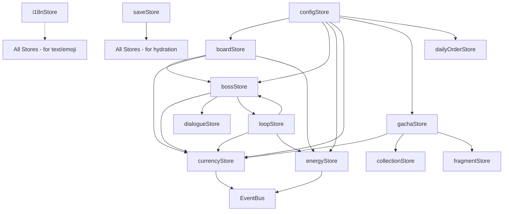

# Vue 3 Migration Plan — 心动合成 (Heartbeat Merge)

## Overview

Migrate the current vanilla JS frontend (25+ global script files, 715-line monolithic HTML, 5370-line CSS) to a **Vue 3 + Pinia + Vite** architecture with a full rewrite strategy, keeping the existing visual style and all game functionality intact.

---

## Current Architecture Summary

| Aspect           | Current State                                          |
| ---------------- | ------------------------------------------------------ |
| Build System     | None — `<script>` tags in HTML                         |
| Module System    | None — global scope, load-order dependent              |
| HTML             | 715-line monolithic `index.html` with inline templates |
| CSS              | 5370-line `style.css` + 3 smaller CSS files            |
| JS Classes       | 29 ES6 classes, no imports/exports                     |
| State Management | Global variables + EventBus singleton                  |
| DOM Manipulation | Direct `document.getElementById()` / `createElement()` |
| I18n             | Custom `I18n` object with `data-i18n` DOM attributes   |
| Save System      | `localStorage` with meta/run split                     |
| Audio            | Custom `AudioManager` singleton                        |
| Effects          | Custom `Effects` singleton for particles/toasts        |

---

## Target Architecture

```mermaid
graph TB
    subgraph Vite Build
        App[App.vue] --> GameView[GameView.vue]
    end

    subgraph Pinia Stores
        ConfigStore[configStore]
        I18nStore[i18nStore]
        BoardStore[boardStore]
        BossStore[bossStore]
        EnergyStore[energyStore]
        CurrencyStore[currencyStore]
        DialogueStore[dialogueStore]
        DailyOrderStore[dailyOrderStore]
        HeroineStore[heroineStore]
        CollectionStore[collectionStore]
        AchievementStore[achievementStore]
        InventoryStore[inventoryStore]
        GachaStore[gachaStore]
        FragmentStore[fragmentStore]
        CGAlbumStore[cgAlbumStore]
        LoopStore[loopStore]
        AdStore[adStore]
        DailyBuffStore[dailyBuffStore]
        SaveStore[saveStore]
    end

    subgraph Composables
        useAudio[useAudio]
        useEffects[useEffects]
        useEventBus[useEventBus]
        useStateMachine[useStateMachine]
    end

    subgraph Pure Logic
        BoardLogic[BoardLogic.ts]
        BossLogic[BossLogic.ts]
        EnergyLogic[EnergyLogic.ts]
        CurrencyLogic[CurrencyLogic.ts]
        GachaLogic[GachaLogic.ts]
    end

    GameView --> Pinia Stores
    GameView --> Composables
    Pinia Stores --> Pure Logic
    Composables --> Pinia Stores
```

---

## Target Directory Structure

```
src/
├── main.ts                    # Vue app entry point
├── App.vue                    # Root component
├── views/
│   └── GameView.vue           # Main game view - replaces index.html body
│
├── components/
│   ├── layout/
│   │   ├── LoadingOverlay.vue
│   │   ├── LangSelectOverlay.vue
│   │   ├── LandscapeWarning.vue
│   │   ├── GameContainer.vue
│   │   ├── TopStatusBar.vue
│   │   └── BottomBar.vue
│   │
│   ├── board/
│   │   ├── BoardGrid.vue
│   │   ├── GridCell.vue
│   │   ├── BoardItem.vue
│   │   ├── BossHeader.vue
│   │   ├── QuestCarousel.vue
│   │   ├── MainQuestCard.vue
│   │   └── DailyOrderCard.vue
│   │
│   ├── overlays/
│   │   ├── DialogueOverlay.vue
│   │   ├── ParadeOverlay.vue
│   │   ├── LoopSummaryOverlay.vue
│   │   └── GameCompleteOverlay.vue
│   │
│   ├── sheets/
│   │   ├── BaseBottomSheet.vue
│   │   ├── InventorySheet.vue
│   │   ├── HeroineSheet.vue
│   │   ├── ShopSheet.vue
│   │   ├── DailyOrderSheet.vue
│   │   ├── GachaSheet.vue
│   │   ├── CollectionSheet.vue
│   │   ├── CGAlbumSheet.vue
│   │   └── AchievementSheet.vue
│   │
│   └── common/
│       ├── ConfirmDialog.vue
│       ├── ToastRoot.vue
│       └── ParticleLayer.vue
│
├── stores/
│   ├── configStore.ts         # Game config, ITEMS, GENERATORS, etc.
│   ├── i18nStore.ts           # I18n state + t/emoji/config helpers
│   ├── boardStore.ts          # Board state + BoardLogic integration
│   ├── bossStore.ts           # Boss state + BossLogic/FSM
│   ├── energyStore.ts         # Energy state + EnergyLogic/FSM
│   ├── currencyStore.ts       # Gold/Diamond state + CurrencyLogic
│   ├── dialogueStore.ts       # Dialogue queue + typewriter state
│   ├── dailyOrderStore.ts     # Daily orders state
│   ├── heroineStore.ts        # Heroine upgrades
│   ├── collectionStore.ts     # Discovered items/gacha/fragments
│   ├── achievementStore.ts    # Achievement tracking
│   ├── inventoryStore.ts      # Inventory grid
│   ├── gachaStore.ts          # Gacha pool + pity + GachaLogic
│   ├── fragmentStore.ts       # SSR fragment system
│   ├── cgAlbumStore.ts        # CG album data
│   ├── loopStore.ts           # Loop/meta progression
│   ├── adStore.ts             # Ad system
│   ├── dailyBuffStore.ts      # Daily buff system
│   └── saveStore.ts           # Save/load orchestration
│
├── logic/
│   ├── BoardLogic.ts          # Pure board logic - ported from js/logic/
│   ├── BossLogic.ts           # Pure boss logic + FSM
│   ├── EnergyLogic.ts         # Pure energy logic + FSM
│   ├── CurrencyLogic.ts       # Pure currency logic
│   └── GachaLogic.ts          # Pure gacha logic
│
├── core/
│   ├── EventBus.ts            # Typed event bus
│   └── StateMachine.ts        # Generic FSM class
│
├── composables/
│   ├── useAudio.ts            # Audio playback composable
│   ├── useEffects.ts          # Particles/toasts composable
│   ├── useEventBus.ts         # EventBus hook for components
│   ├── useStateMachine.ts     # FSM hook for stores
│   └── useI18n.ts             # I18n helper composable
│
├── styles/
│   ├── variables.css          # CSS custom properties - colors, spacing
│   ├── global.css             # Reset + global styles
│   ├── fonts.css              # Font face declarations
│   ├── animations.css         # Keyframe animations
│   └── dev-panel.css          # Dev mode styles
│
├── data/
│   └── shopItems.ts           # SHOP_ITEMS config - from config.js
│
└── types/
    ├── game.d.ts              # Shared TypeScript interfaces
    └── items.d.ts             # Item/Generator type definitions

public/
├── assets/                    # Copied as-is from current assets/
│   ├── audio/
│   ├── avatar/
│   ├── bg/
│   ├── constants/
│   ├── data/
│   ├── fonts/
│   ├── i18n/
│   ├── items/
│   └── ui/
└── favicon.ico
```

---

## Phase 1: Project Scaffolding

### 1.1 Initialize Vite + Vue 3 project

```bash
npm create vite@latest . -- --template vue-ts
npm install pinia
```

### 1.2 Configure Vite

- Set `base` for deployment
- Configure `publicDir` for static assets
- Add CSS import support
- Configure dev server port

### 1.3 Migrate static assets

- Copy entire `assets/` directory to `public/assets/`
- Copy `css/fonts.css` to `src/styles/fonts.css`
- Verify all asset paths remain valid since `public/` maps to `/`

### 1.4 Create `tsconfig.json`

- Strict mode enabled
- Path aliases: `@/` maps to `src/`
- Include Pinia types

---

## Phase 2: Core Infrastructure

### 2.1 EventBus to TypeScript module

The current `EventBus` in `js/core/EventBus.js` is a global singleton. In Vue 3:

- Port as a typed `EventBus` class with generic event types
- Create `useEventBus()` composable that provides `on/off/emit` with auto-cleanup on component unmount
- Pinia stores will use the EventBus directly, not through composable

### 2.2 StateMachine to TypeScript class

Port `StateMachine` from `js/core/StateMachine.js` with TypeScript types:

```typescript
interface StateMachineConfig {
  name: string;
  initial: string;
  states: Record<string, { on: Record<string, string> }>;
  actions?: Record<string, Function>;
}
```

- Integrate with Pinia: FSM state changes trigger Pinia store updates
- Create `useStateMachine()` composable for reactive FSM in components

### 2.3 I18n Store

Convert the `I18n` singleton from `js/i18n.js` to a Pinia store:

```typescript
// stores/i18nStore.ts
export const useI18nStore = defineStore("i18n", () => {
  const locale = ref("zh-CN");
  const texts = ref({});
  const emojis = ref({});
  const uiConfig = ref({});
  const loaded = ref(false);

  async function init(locale?: string) {
    /* ... */
  }
  function t(key: string, params?: Record<string, any>): string {
    /* ... */
  }
  function emoji(key: string): string {
    /* ... */
  }
  function getConfig(key: string): any {
    /* ... */
  }
  function setLocale(newLocale: string): Promise<void> {
    /* ... */
  }

  return {
    locale,
    texts,
    emojis,
    uiConfig,
    loaded,
    init,
    t,
    emoji,
    getConfig,
    setLocale,
  };
});
```

**Key change**: Instead of `data-i18n` DOM attributes, use Vue template binding:

```vue
<!-- Before: <span data-i18n="achievement.panelTitle"></span> -->
<!-- After: -->
<span>{{ i18n.t('achievement.panelTitle') }}</span>
```

### 2.4 Config Store

Convert the global config variables from `js/config.js` to a Pinia store:

```typescript
// stores/configStore.ts
export const useConfigStore = defineStore("config", () => {
  const gameConfig = ref({});
  const items = ref({});
  const generators = ref({});
  const levels = ref([]);
  // ... all other config globals

  async function loadGameData(): Promise<void> {
    /* ... */
  }
  return { gameConfig, items, generators, levels, loadGameData };
});
```

### 2.5 Audio Composable

Convert `AudioManager` from `js/audio.js` to a composable with singleton state:

```typescript
// composables/useAudio.ts
const sharedState = { ctx: null, muted: false, bgmVolume: 0.3 /* ... */ };

export function useAudio() {
  async function preloadAll(): Promise<void> {
    /* ... */
  }
  function playSound(name: string): void {
    /* ... */
  }
  function playBGM(name: string): void {
    /* ... */
  }
  function pauseBGM(fadeMs?: number): void {
    /* ... */
  }
  function tryResumeBGM(): void {
    /* ... */
  }
  return { preloadAll, playSound, playBGM, pauseBGM, tryResumeBGM };
}
```

### 2.6 Effects Composable

Convert `Effects` from `js/effects.js` to a composable:

```typescript
// composables/useEffects.ts
export function useEffects() {
  function showToast(message: string, type?: string): void {
    /* ... */
  }
  function mergePopAt(cellEl: HTMLElement): void {
    /* ... */
  }
  function spawnParticles(
    anchorEl: HTMLElement,
    count: number,
    emoji: string,
  ): void {
    /* ... */
  }
  function heartFlyTo(sourceEl: HTMLElement): void {
    /* ... */
  }
  return { showToast, mergePopAt, spawnParticles, heartFlyTo };
}
```

---

## Phase 3: Game Logic Layer

Port the pure logic classes from `js/logic/` to TypeScript ES modules. These have **no DOM dependencies** and are the easiest to port:

| Source                      | Target                       | Notes                                              |
| --------------------------- | ---------------------------- | -------------------------------------------------- |
| `js/logic/BoardLogic.js`    | `src/logic/BoardLogic.ts`    | Add TypeScript interfaces for cells, merge results |
| `js/logic/BossLogic.js`     | `src/logic/BossLogic.ts`     | Integrate StateMachine, add type-safe FSM events   |
| `js/logic/EnergyLogic.js`   | `src/logic/EnergyLogic.ts`   | Integrate StateMachine for regen FSM               |
| `js/logic/CurrencyLogic.js` | `src/logic/CurrencyLogic.ts` | Pure math, straightforward port                    |
| `js/logic/GachaLogic.js`    | `src/logic/GachaLogic.ts`    | Random/pity logic, straightforward port            |

**Key principle**: Logic classes remain framework-agnostic. They take config as constructor params and emit events via EventBus. They do NOT import Pinia stores.

---

## Phase 4: Pinia Stores

Each game system becomes a Pinia store that:

1. Holds reactive state
2. Instantiates and delegates to a Logic class
3. Subscribes to EventBus events from Logic
4. Exposes actions for UI components to call

### Store Design Pattern

```typescript
// Example: stores/bossStore.ts
export const useBossStore = defineStore("boss", () => {
  // --- State ---
  const currentLevelIdx = ref(-1);
  const currentHp = ref(0);
  const totalHp = ref(0);
  const bossName = ref("");
  const fsmState = ref("IDLE");

  // --- Logic instance - non-reactive ---
  const logic = new BossLogic();

  // --- Subscribe to logic events ---
  const bus = useEventBus();
  bus.on("bossfsm:stateChanged", (data) => {
    fsmState.value = data.to;
  });

  // --- Actions ---
  function loadLevel(idx: number) {
    logic.loadLevel(idx, configStore.items, configStore.levels);
    currentLevelIdx.value = idx;
  }

  function submitOrder(items: string[]) {
    const result = logic.trySubmit(items);
    // update reactive state based on result
  }

  return {
    currentLevelIdx,
    currentHp,
    totalHp,
    bossName,
    fsmState,
    loadLevel,
    submitOrder,
  };
});
```

### Store Dependency Graph



### Complete Store List

| Store              | Source Class               | Key State                                                      | Key Actions                                                    |
| ------------------ | -------------------------- | -------------------------------------------------------------- | -------------------------------------------------------------- |
| `configStore`      | Global vars in `config.js` | `gameConfig`, `items`, `generators`, `levels`                  | `loadGameData()`                                               |
| `i18nStore`        | `I18n` object              | `locale`, `texts`, `emojis`, `uiConfig`                        | `init()`, `t()`, `emoji()`, `setLocale()`                      |
| `boardStore`       | `Board` class              | `cells`, `locked`, `generatorStates`, `selectedCell`           | `placeItem()`, `merge()`, `renderAll()`                        |
| `bossStore`        | `BossSystem` class         | `currentHp`, `totalHp`, `bossName`, `fsmState`, `orders`       | `loadLevel()`, `submitOrder()`, `nextLevel()`                  |
| `energyStore`      | `EnergySystem` class       | `current`, `max`, `regenInterval`, `fsmState`                  | `spend()`, `add()`, `startRegen()`, `stopRegen()`              |
| `currencyStore`    | `CurrencyManager` class    | `gold`, `diamonds`                                             | `addGold()`, `spendGold()`, `addDiamonds()`, `spendDiamonds()` |
| `dialogueStore`    | `DialogueSystem` class     | `isOpen`, `npcName`, `npcText`, `playerText`, `isTyping`       | `show()`, `close()`, `skip()`                                  |
| `dailyOrderStore`  | `DailyOrderSystem` class   | `activeOrders`, `completedCount`                               | `init()`, `rollNewOrders()`, `fulfillOrder()`                  |
| `heroineStore`     | `HeroineSystem` class      | `upgrades`, `upgradeList`                                      | `purchaseUpgrade()`, `getEffectValue()`                        |
| `collectionStore`  | `CollectionSystem` class   | `discovered`, `gachaCollected`, `completedChains`              | `discover()`, `checkCompletion()`                              |
| `achievementStore` | `AchievementSystem` class  | `unlocked`, `completed`, `stats`                               | `checkAll()`, `unlock()`, `complete()`                         |
| `inventoryStore`   | `InventorySystem` class    | `slots`, `maxSlots`                                            | `addItem()`, `removeItem()`, `useItem()`                       |
| `gachaStore`       | `GachaSystem` class        | `ssrOwned`, `pityCount`, `freePullsLeft`                       | `singlePull()`, `tenPull()`, `freePull()`                      |
| `fragmentStore`    | `FragmentSystem` class     | `fragments`, `fragmentCounts`                                  | `addFragment()`, `exchangeFragment()`                          |
| `cgAlbumStore`     | `CGAlbumSystem` class      | `cgData`, `unlockedCGs`                                        | `unlockCG()`, `readCG()`                                       |
| `loopStore`        | `LoopLogic` class          | `loopIndex`, `loopTokens`, `metaUpgrades`, `currentLoopConfig` | `buildLoopConfig()`, `applyLoopConfig()`, `completeLoop()`     |
| `adStore`          | `AdSystem` class           | `dailyAdCounts`, `lastResetDate`                               | `watchAd()`, `canWatchAd()`                                    |
| `dailyBuffStore`   | `DailyBuffSystem` class    | `activeBuffs`, `lastRollDate`                                  | `rollDailyBuff()`, `hasBuff()`                                 |
| `saveStore`        | `SaveSystem` class         | `hasSave`                                                      | `saveAll()`, `loadAll()`, `saveMeta()`, `clearRun()`           |

---

## Phase 5: Layout Components

### 5.1 App.vue

Root component that initializes the app:

```vue
<template>
  <LoadingOverlay v-if="!gameReady" />
  <LangSelectOverlay v-if="showLangSelect" @select="onLangSelect" />
  <LandscapeWarning />
  <GameView v-if="gameReady" />
</template>
```

### 5.2 GameView.vue

Main game view replacing the `#game-container` section of `index.html`:

```vue
<template>
  <div id="game-container">
    <TopStatusBar />
    <BossHeader />
    <BoardGrid />
    <BottomBar />
  </div>
  <!-- Overlays -->
  <DialogueOverlay />
  <ParadeOverlay />
  <LoopSummaryOverlay />
  <GameCompleteOverlay />
  <!-- Bottom Sheets -->
  <InventorySheet />
  <HeroineSheet />
  <ShopSheet />
  <DailyOrderSheet />
  <GachaSheet />
  <CollectionSheet />
  <CGAlbumSheet />
  <AchievementSheet />
  <!-- Common -->
  <ParticleLayer />
  <ToastRoot />
  <ConfirmDialog />
</template>
```

### 5.3 TopStatusBar.vue

Replaces `#top-status-bar` from `index.html` lines 83-152:

```vue
<template>
  <div id="top-status-bar">
    <div id="avatar-container">
      <button id="avatar-btn" @click="onAvatarClick">
        
      </button>
      <div id="gold-label" class="top-bar-pill composite-gold-pill">
        <div class="composite-gold-icon"><i data-lucide="star"></i></div>
        <div class="composite-gold-text">
          <span>{{ formatGold(currencyStore.gold) }}</span>
        </div>
      </div>
    </div>
    <div id="energy-pill" class="top-bar-pill">
      <i data-lucide="zap"></i>
      <span class="status-value">{{ energyStore.current }}</span>
      <span class="status-value">{{ energyStore.regenTimer }}</span>
      <button class="plus-btn" @click="onEnergyPlus">
        <i data-lucide="plus"></i>
      </button>
    </div>
    <!-- Diamond pill, shop btn, loop badge, rank badge, daily buff indicator -->
  </div>
</template>
```

### 5.4 BottomBar.vue

Replaces `#bottom-bar` from `index.html` lines 217-248.

### 5.5 LoadingOverlay / LangSelectOverlay / LandscapeWarning

Simple state-driven overlays with transitions.

---

## Phase 6: Board Components

### 6.1 BoardGrid.vue

The core game board. Replaces `Board` class DOM logic from `js/board.js`:

```vue
<template>
  <div class="grid-container">
    <div class="board-frame">
      <div id="game-grid" :style="gridStyle">
        <GridCell
          v-for="(cell, index) in boardStore.cells"
          :key="index"
          :index="index"
          :item-id="cell"
          :locked="boardStore.isLocked(index)"
          @pointerdown="onPointerDown(index, $event)"
          @pointermove="onPointerMove(index, $event)"
          @pointerup="onPointerUp(index, $event)"
        />
      </div>
    </div>
  </div>
</template>
```

**Key change**: Instead of `Board.buildGrid()` creating DOM elements imperatively, Vue renders cells reactively from `boardStore.cells` array.

### 6.2 GridCell.vue

```vue
<template>
  <div
    class="grid-cell"
    :class="{ 'cell-alt': isAlt, locked: locked, 'merge-pop': mergePop }"
    :data-index="index"
  >
    <BoardItem v-if="itemId" :item-id="itemId" />
  </div>
</template>
```

### 6.3 BoardItem.vue

```vue
<template>
  <div
    class="item"
    :class="itemClasses"
    :data-level="itemData.level"
    :data-chain="itemData.chain"
  >
    <span class="item-emoji">{{ itemData.emoji }}</span>
    <span class="item-level">Lv.{{ itemData.level }}</span>
    <span v-if="itemData.type === 'GENERATOR'" class="gen-timer">{{
      timerText
    }}</span>
  </div>
</template>
```

### 6.4 Drag and Drop

The current drag system in `js/board.js` uses `pointerdown/pointermove/pointerup` events. This will be extracted into a `useDrag` composable:

```typescript
// composables/useDrag.ts
export function useDrag(options: {
  onDragStart?: (index: number) => void;
  onDragMove?: (deltaX: number, deltaY: number) => void;
  onDragEnd?: (fromIndex: number, toIndex: number) => void;
}) {
  /* ... */
}
```

### 6.5 BossHeader / QuestCarousel / MainQuestCard / DailyOrderCard

These replace the `#boss-header` section from `index.html` lines 157-205. Data comes from `bossStore` and `dailyOrderStore`.

---

## Phase 7: Overlay Components

### 7.1 DialogueOverlay.vue

Replaces `DialogueSystem` from `js/dialogue.js`. Key changes:

- State comes from `dialogueStore` instead of direct DOM manipulation
- Typewriter effect implemented with `watchEffect` + `setTimeout`
- Promise-based `show()` becomes store action + `watch` for close

```vue
<template>
  <Transition name="fade">
    <div
      v-if="dialogueStore.isOpen"
      id="dialogue-overlay"
      class="active"
      @click="dialogueStore.close()"
    >
      <div class="dialogue-box" @click.stop>
        <div id="dialogue-portrait" :style="portraitStyle">
          {{ portraitEmoji }}
        </div>
        <div id="dialogue-npc-name">{{ dialogueStore.npcName }}</div>
        <div id="dialogue-npc-text">
          {{ displayedNpcText }}<span v-if="isTyping" class="cursor">_</span>
        </div>
        <div v-if="dialogueStore.playerText" id="dialogue-player-text">
          {{ dialogueStore.playerText }}
        </div>
        <button v-if="isTyping" id="dialogue-skip-btn" @click="skipTyping">
          {{ i18n.t("dialogueSkip") }}
        </button>
        <button id="dialogue-close-btn" @click="dialogueStore.close()">
          {{ i18n.t("dialogue.tapContinue") }}
        </button>
      </div>
    </div>
  </Transition>
</template>
```

### 7.2 ParadeOverlay / LoopSummaryOverlay / GameCompleteOverlay

Similar pattern: state in stores, template in Vue, transitions via `<Transition>`.

---

## Phase 8: Bottom Sheet Components

### 8.1 BaseBottomSheet.vue

Shared base component for all bottom sheets. Handles:

- Slide-up animation
- Drag handle + swipe-to-close
- Backdrop click to close
- Body scroll lock

```vue
<template>
  <Teleport to="body">
    <Transition name="sheet-backdrop">
      <div v-if="modelValue" class="bottom-sheet-backdrop" @click="close" />
    </Transition>
    <Transition name="sheet-slide">
      <div
        v-if="modelValue"
        :id="sheetId"
        class="bottom-sheet"
        @touchstart="onTouchStart"
        @touchmove="onTouchMove"
        @touchend="onTouchEnd"
      >
        <div class="sheet-drag-handle" />
        <div class="sheet-header">
          <div class="sheet-header-left">
            <i :data-lucide="icon" class="sheet-header-icon"></i>
            <span>{{ title }}</span>
          </div>
          <button class="sheet-close" @click="close">✕</button>
        </div>
        <div v-if="subtitle" class="sheet-sub">{{ subtitle }}</div>
        <div class="sheet-body">
          <slot />
        </div>
      </div>
    </Transition>
  </Teleport>
</template>
```

### 8.2 Individual Sheet Components

Each sheet wraps `BaseBottomSheet` with its own content:

| Component              | Store              | Content                               |
| ---------------------- | ------------------ | ------------------------------------- |
| `InventorySheet.vue`   | `inventoryStore`   | Grid of inventory slots               |
| `HeroineSheet.vue`     | `heroineStore`     | Upgrade list with purchase buttons    |
| `ShopSheet.vue`        | `configStore`      | Gold shop items                       |
| `DailyOrderSheet.vue`  | `dailyOrderStore`  | Active daily orders                   |
| `GachaSheet.vue`       | `gachaStore`       | Gacha pull UI with results            |
| `CollectionSheet.vue`  | `collectionStore`  | Tabbed item/gacha/fragment collection |
| `CGAlbumSheet.vue`     | `cgAlbumStore`     | CG gallery                            |
| `AchievementSheet.vue` | `achievementStore` | Achievement list                      |

### 8.3 Sheet State Management

Use a dedicated `sheetStore` or a simple reactive map to track which sheet is open:

```typescript
// composables/useSheet.ts
export function useSheet(sheetId: string) {
  const isOpen = computed(() => activeSheet.value === sheetId);
  function open() {
    activeSheet.value = sheetId;
  }
  function close() {
    activeSheet.value = null;
  }
  return { isOpen, open, close };
}
```

---

## Phase 9: CSS Migration

### 9.1 Extract CSS Variables

From the existing `css/style.css`, extract all repeated values into CSS custom properties:

```css
/* styles/variables.css */
:root {
  --caramel: #c99270;
  --salmon: #ffccac;
  --warm-bg: #fff5eb;
  /* ... all other colors, spacing, timing values */
}
```

### 9.2 Split into Scoped Component Styles

Each Vue component gets a `<style scoped>` section containing only its own styles. The 5370-line `style.css` will be split:

| CSS Section                         | Target Component                                 |
| ----------------------------------- | ------------------------------------------------ |
| `#lang-select-overlay`              | `LangSelectOverlay.vue`                          |
| `#top-status-bar`                   | `TopStatusBar.vue`                               |
| `#game-grid`, `.grid-cell`, `.item` | `BoardGrid.vue`, `GridCell.vue`, `BoardItem.vue` |
| `#boss-header`                      | `BossHeader.vue`                                 |
| `#bottom-bar`                       | `BottomBar.vue`                                  |
| `.bottom-sheet`                     | `BaseBottomSheet.vue`                            |
| `#dialogue-overlay`                 | `DialogueOverlay.vue`                            |
| `#parade-overlay`                   | `ParadeOverlay.vue`                              |
| `#loop-summary-overlay`             | `LoopSummaryOverlay.vue`                         |
| `#gacha-sheet`                      | `GachaSheet.vue`                                 |
| etc.                                | etc.                                             |

### 9.3 Global Styles

Some styles remain global:

- CSS reset / base styles
- CSS variables
- Animation keyframes
- Font declarations
- Utility classes used across components

### 9.4 Floating UI CSS

The `css/floating-ui.css` will be split into the components that use floating UI elements.

---

## Phase 10: Save System Integration

### 10.1 SaveStore Design

The `SaveSystem` from `js/save.js` becomes `saveStore` that orchestrates serialization/deserialization across all other stores:

```typescript
// stores/saveStore.ts
export const useSaveStore = defineStore("save", () => {
  const SAVE_KEY_META = "heartbeat_merge_meta";
  const SAVE_KEY_RUN = "heartbeat_merge_run";

  function saveAll() {
    saveMeta();
    saveRun();
  }

  function saveMeta() {
    const data = {
      version: 4,
      timestamp: Date.now(),
      loop: loopStore.serialize(),
      heroine: heroineStore.serialize(),
      gacha: gachaStore.serialize(),
      fragments: fragmentStore.serialize(),
      cgAlbum: cgAlbumStore.serialize(),
      collection: collectionStore.serialize(),
      achievements: achievementStore.serialize(),
      diamonds: currencyStore.diamonds,
      ad: adStore.serialize(),
      dailyBuff: dailyBuffStore.serialize(),
    };
    localStorage.setItem(SAVE_KEY_META, JSON.stringify(data));
  }

  function saveRun() {
    const data = {
      board: boardStore.serialize(),
      boss: bossStore.serialize(),
      energy: energyStore.serialize(),
      currency: { gold: currencyStore.gold },
      dailyOrders: dailyOrderStore.serialize(),
      inventory: inventoryStore.serialize(),
      // ...
    };
    localStorage.setItem(SAVE_KEY_RUN, JSON.stringify(data));
  }

  function loadAll(): boolean {
    const meta = loadMeta();
    const run = loadRun();
    if (!meta) return false;
    // Hydrate all stores from saved data
    loopStore.deserialize(meta.loop);
    heroineStore.deserialize(meta.heroine);
    // ...
    return true;
  }

  return {
    saveAll,
    saveMeta,
    saveRun,
    loadAll,
    hasSave,
    clearRun,
    migrateLegacySave,
  };
});
```

### 10.2 Store Serialization Pattern

Each store implements `serialize()` and `deserialize()` methods:

```typescript
// In each store:
function serialize() {
  return { currentHp: currentHp.value, totalHp: totalHp.value /* ... */ };
}
function deserialize(data: BossSaveData) {
  currentHp.value = data.currentHp;
  totalHp.value = data.totalHp;
  // ...
}
```

### 10.3 Auto-save

Use Vue's `watchEffect` or a periodic timer to auto-save:

```typescript
// In GameView.vue or App.vue
const saveStore = useSaveStore();
let autoSaveTimer: number | null = null;

onMounted(() => {
  autoSaveTimer = window.setInterval(() => {
    if (gameReady.value) saveStore.saveAll();
  }, 30000); // Save every 30 seconds
});

onUnmounted(() => {
  if (autoSaveTimer) clearInterval(autoSaveTimer);
});
```

---

## Phase 11: Game Lifecycle Wiring

### 11.1 Initialization Sequence

The current `Game.init()` from `js/main.js` becomes a composable or is wired in `GameView.vue`:

```typescript
// composables/useGameInit.ts
export function useGameInit() {
  const i18nStore = useI18nStore();
  const configStore = useConfigStore();
  const boardStore = useBoardStore();
  // ... all stores

  const gameReady = ref(false);

  async function init() {
    // 1. Language selection
    const savedLocale = localStorage.getItem("i18n_locale");
    if (!savedLocale) {
      // Show lang select overlay
      showLangSelect.value = true;
      return; // Wait for user selection
    }

    // 2. Init I18n
    await i18nStore.init();

    // 3. Load game data
    await configStore.loadGameData();

    // 4. Init audio
    const audio = useAudio();
    audio.preloadAll();

    // 5. Try loading save
    const saveStore = useSaveStore();
    if (saveStore.hasSave()) {
      saveStore.migrateLegacySave();
      const loaded = saveStore.loadAll();
      if (loaded) {
        gameReady.value = true;
        return;
      }
    }

    // 6. Fresh start
    startNewMetaGame();
    gameReady.value = true;
  }

  async function startNewMetaGame() {
    loopStore.buildAndApplyConfig(1);
    boardStore.initGrid();
    boardStore.placeInitialGenerators();
    bossStore.loadLevel(0);
    await showIntro();
    await showLoopIntro();
    loopStore.updateUI();
    saveStore.saveAll();
  }

  return { gameReady, init, startNewMetaGame };
}
```

### 11.2 Cross-Store Communication

Replace direct method calls between systems with:

1. **Pinia store actions** for synchronous calls
2. **EventBus** for decoupled async events
3. **Watchers** for reactive side effects

Example — Boss defeated triggers loop check:

```typescript
// In bossStore
watch(fsmState, (newState) => {
  if (newState === "DEFEATED") {
    const loopStore = useLoopStore();
    if (bossStore.currentLevelIdx >= 3) {
      loopStore.completeCurrentLoop();
    } else {
      bossStore.nextLevel();
    }
  }
});
```

### 11.3 Lucide Icons Integration

Replace the Lucide CDN script with the Vue Lucide package:

```bash
npm install lucide-vue-next
```

```vue
<!-- Before: <i data-lucide="star"></i> + lucide.createIcons() -->
<!-- After: -->
<Star :size="14" />
```

---

## Phase 12: Testing and Polish

### 12.1 Functional Verification Checklist

- [ ] Language selection overlay works
- [ ] Game board renders correctly with items
- [ ] Drag and drop merge works
- [ ] Generator timer ticks and produces items
- [ ] Boss HP bar updates on submit
- [ ] Energy regen works with timer display
- [ ] Gold/Diamond values update correctly
- [ ] All bottom sheets open/close with swipe
- [ ] Gacha single/ten pull works
- [ ] Collection tabs switch correctly
- [ ] Achievement unlock toast appears
- [ ] Dialogue typewriter effect works
- [ ] Loop summary shows after 4th boss
- [ ] Parade overlay plays correctly
- [ ] Save/Load preserves all state
- [ ] Daily orders roll and fulfill
- [ ] Daily buff indicator shows
- [ ] Ad system buttons work
- [ ] Dev panel loads with ?dev flag
- [ ] I18n locale switch works

### 12.2 Visual Regression

- Compare side-by-side with original on mobile viewport
- Verify all CSS animations still work
- Check z-index stacking for overlays/sheets
- Verify touch interactions on mobile

### 12.3 Performance Optimization

- Use `v-memo` for grid cells that don't change frequently
- Use `shallowRef` for large data structures like `cells` array
- Lazy-load bottom sheet components with `defineAsyncComponent`
- Audit bundle size with `vite-plugin-visualizer`

---

## Migration Risk Assessment

| Risk                                   | Mitigation                                                                          |
| -------------------------------------- | ----------------------------------------------------------------------------------- |
| Drag-and-drop behavior differs         | Port `useDrag` composable with same threshold/ghost logic                           |
| Save format incompatibility            | Keep same serialization format, add version check                                   |
| CSS scoping breaks global styles       | Use `:deep()` for child component styling where needed                              |
| EventBus memory leaks                  | `useEventBus` composable auto-cleans on unmount                                     |
| Performance regression from reactivity | Use `shallowRef`/`markRaw` for logic instances and large arrays                     |
| Lucide icon migration                  | Use `lucide-vue-next` package instead of CDN + `createIcons()`                      |
| Mobile touch events                    | Test thoroughly on real devices, keep same `touchstart/touchmove/touchend` handlers |

---

## Implementation Order Summary

```mermaid
graph LR
    P1[Phase 1: Scaffolding] --> P2[Phase 2: Core Infra]
    P2 --> P3[Phase 3: Logic Layer]
    P3 --> P4[Phase 4: Pinia Stores]
    P4 --> P5[Phase 5: Layout Components]
    P5 --> P6[Phase 6: Board Components]
    P6 --> P7[Phase 7: Overlay Components]
    P7 --> P8[Phase 8: Sheet Components]
    P8 --> P9[Phase 9: CSS Migration]
    P9 --> P10[Phase 10: Save System]
    P10 --> P11[Phase 11: Lifecycle Wiring]
    P11 --> P12[Phase 12: Testing]
```



Each phase should be **completed and verified** before moving to the next, as later phases depend on earlier ones.
